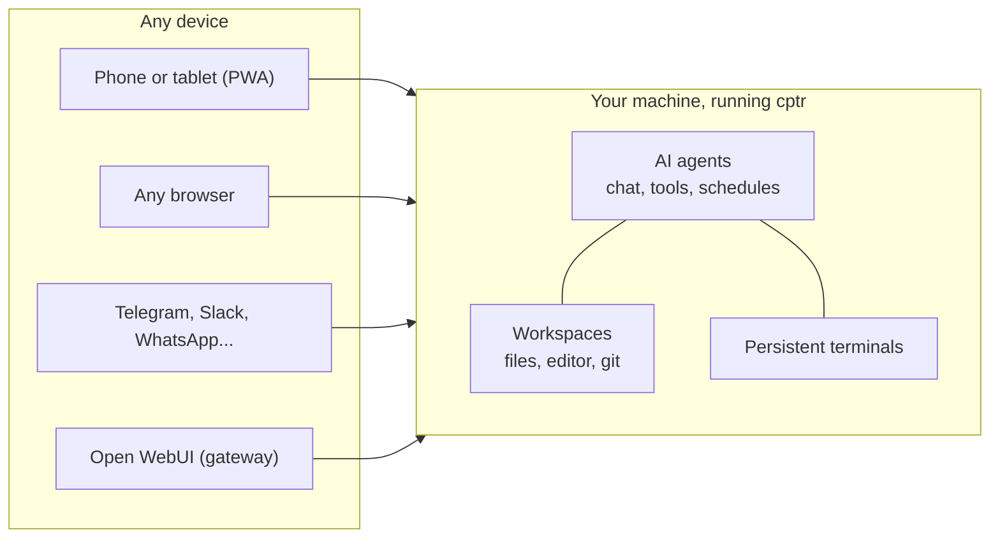

# What is Computer?

Your computer has always been a *place*. You go to it, sit down, work, walk away, and everything on it sits frozen until you come back.

Computer changes what your computer *is*. Install one app on it, and that same machine becomes three new things at once:

- **somewhere you can be from anywhere**: your files, editor, and terminal in a web page, on your phone or any browser
- **someone you can message**: connect Telegram or WhatsApp and you text your computer, and it texts you back
- **something you can hand work to**: add AI (an API key, a local model, or a coding-agent subscription you already have) and it works on the same files you're looking at, with your approval

Your work doesn't move anywhere to make this happen. Everything runs on your machine; nothing is hosted anywhere else.

## One machine, one truth

Those three faces share one property, and it's the whole product: **they all open onto the same state.** The file the AI edited is the file in your editor is the file on disk. The terminal you started at your desk is the one on your phone on the train. The chat where you decided something is a file in the project folder, findable next year. There is no sync, no copy, no "connected account." One machine, one truth, three ways in.

And because everything is plain files on a machine you own, the whole system stays inspectable: chats, skills, memory, artifacts. Nothing is trapped in an app.

## The moment it clicks

Definitions only get you so far. These are the four moments where people actually get it. Pick the nearest one and go have it:

1. Your terminal, still running, on your phone, on the train: [ship a fix from your phone](/ecosystem/computer/use-cases/fix-from-your-phone)
2. An AI reorganized your files and asked permission for every single move: [clean up a messy folder](/ecosystem/computer/use-cases/clean-up-a-messy-folder)
3. Your own computer texted you the morning brief before you asked: [an assistant that texts you first](/ecosystem/computer/use-cases/an-assistant-that-texts-first)
4. You handed over a whole research job and came back to finished files: [delegate a whole job](/ecosystem/computer/use-cases/delegate-a-whole-job)

## Coming from another world

If you already live in one of these categories, here's the shortest honest bridge:

| Coming from... | Keep this expectation | Update this one |
| --- | --- | --- |
| A remote desktop or SSH (VNC, RDP, tmux over SSH) | You reach your real machine from anywhere | It's structured (files, git, editor as first-class mobile UI), sessions survive disconnects, and an AI can work the machine too |
| A browser IDE (Codespaces, code-server) | A full workstation in a browser tab; code-server even self-hosts like Computer does | The phone is a first-class screen, not a desktop UI squeezed smaller; AI with approvals, messaging bots, and scheduled tasks are built in rather than bolted on; and it isn't code-only: PDFs, notes, and voice memos are equal citizens |
| A chat assistant (ChatGPT, Open WebUI) | A conversation with a capable model | The conversation gets hands and a home: real files, real commands, and the chat itself becomes part of the project, on your disk |
| A personal AI agent (OpenClaw, Hermes Agent) | Always-on and messaging-native, with memory, schedules, and full access to files and shell, on your own hardware | The difference is your side of the glass: there, the agent gets the machine and you get a chat. Computer gives you the machine too: file browser, editor, diffs, and terminals in your browser, so you watch, review, and take over in the same place the agent works. And it's a complete workstation even with no AI at all |
| A terminal coding agent (Claude Code, Codex, Cursor) | Serious agents on real repos | Computer is a home for it, not a replacement: your existing subscription becomes a chat backend with approvals and cross-device resume, and any CLI still runs in the terminal |

## How much machine you give it is your call

Run `cptr` directly on the host and it serves the whole machine. That's the point for a personal workstation: the value is precisely that nothing is walled off from you.

Run it in [Docker](/ecosystem/computer/install/docker) and it serves exactly what you mount and nothing else: a bounded workstation with only the projects you chose to expose. Same product, different blast radius; the boundary is a decision you make at install time, not a limitation you discover later.

What stays true either way: everyone you let sign in shares the same access inside that boundary. It's one trust domain, like SSH, so keep it private and read the [security model](/ecosystem/computer/phone-and-remote/security) before sharing it.

## What it is not

- **Not a cloud service.** No account with anyone, nothing hosted, nothing phoning home. Unplug the network and the workstation still works.
- **Not a model.** It ships no AI of its own. Bring any provider, local or hosted, or none: files, terminal, and git are fully useful with zero AI configured.
- **Not multi-tenant.** Accounts exist; per-user isolation doesn't. Share it like you'd share SSH keys, which is to say: barely, and only inside one trust domain.

## How to say it in one sentence

- To a developer: "Your dev machine in a browser tab, with your coding-agent subscription living inside it."
- To a self-hoster: "Cloud-agent delegation, except it's your hardware and your data."
- To a student: "Your school folder and an AI tutor on your own laptop, reachable from your phone."
- To anyone: "Your computer, from anywhere, with an AI that works inside it."
