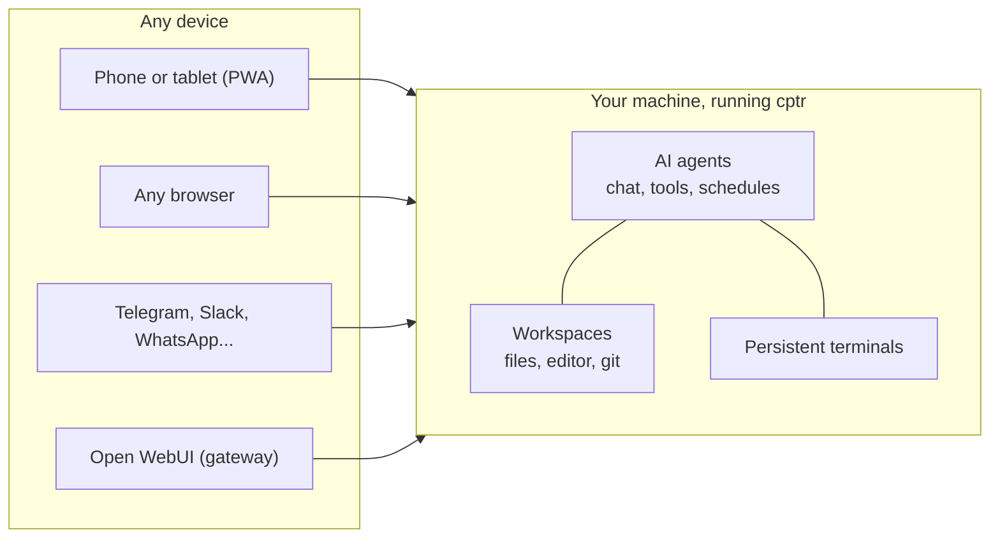

# What is Computer?

Computer (`cptr`) is one process that runs on the machine where your work already lives and serves the whole thing: to any browser you own, to your chat apps, and to an AI working inside it.

All of it is self-hosted. The workstation, the agent loop, the chat history, the memory, the schedules run right there with your work. The only thing that ever leaves is the model calls you choose to send; with a local model, not even that.

## One machine, three doors

Your computer already has everything that matters: the files, the projects, a shell, git state, logins, running services. Computer opens three doors into that one machine:

**Door 1: you, at any screen.** A browser or the home-screen app gets the full workstation: file browser, editor, persistent terminals, git panel, live previews. Not streamed pixels; the real interfaces, built for the phone first. Close the tab on one device, open it on another, everything is where you left it.

**Door 2: you, by message.** Connect Telegram, Discord, Slack, WhatsApp, or Signal and the machine becomes something you text, and something that texts you: scheduled tasks run on their own, results get delivered, webhooks let the outside world wake it up.

**Door 3: an AI, inside.** Plug in an API key, a local model, or the coding-agent subscription you already pay for, and the AI works behind the same doors you do: same files, same shell, same git, gated by approval controls you set per chat.

The trick, and really the whole product: **all three doors open onto the same state.** The file the agent edited is the file in your editor is the file on disk. The terminal you started at your desk is the one on your phone on the train. The chat where you decided something is a file in the project folder, greppable next year. There is no sync, no copy, no "connected account." One machine, one truth, three ways in.

And because everything is plain files on a machine you own, the whole system stays inspectable: chats, skills, memory, artifacts. Nothing is trapped in an app.

## The moment it clicks

Definitions only get you so far. These are the four moments where people actually get it. Pick the nearest one and go have it:

1. Your terminal, still running, on your phone, on the train: [ship a fix from your phone](/ecosystem/computer/use-cases/fix-from-your-phone)
2. An AI reorganized your files and asked permission for every single move: [clean up a messy folder](/ecosystem/computer/use-cases/clean-up-a-messy-folder)
3. Your own computer texted you the morning brief before you asked: [an assistant that texts you first](/ecosystem/computer/use-cases/an-assistant-that-texts-first)
4. You handed over a whole research job and came back to finished files: [delegate a whole job](/ecosystem/computer/use-cases/delegate-a-whole-job)

## Coming from another world

If you already live in one of these categories, here's the shortest honest bridge:

| Coming from... | Keep this expectation | Update this one |
| --- | --- | --- |
| A remote desktop or SSH (VNC, RDP, tmux over SSH) | You reach your real machine from anywhere | It's structured (files, git, editor as first-class mobile UI), sessions survive disconnects, and an AI can work the machine too |
| A cloud IDE (Codespaces, code-server) | A full workstation in a browser tab | The machine is yours: real state, real logins, no cloud copy. And it isn't only for code; folders of PDFs and notes are equal citizens |
| A chat assistant (ChatGPT, Open WebUI) | A conversation with a capable model | The conversation gets hands and a home: real files, real commands, and the chat itself becomes part of the project, on your disk |
| A cloud agent that does whole tasks (e.g. Manus) | Delegate a goal, get a finished deliverable | The agent system itself runs on your hardware with your data, every step is replayable, and the wheel is always grabbable: terminal and editor are one tab away |
| A terminal coding agent (Claude Code, Codex, Cursor) | Serious agents on real repos | Computer is a home for it, not a replacement: your existing subscription becomes a chat backend with approvals and cross-device resume, and any CLI still runs in the terminal |

## How much machine you give it is your call

Run `cptr` directly on the host and it serves the whole machine. That's the point for a personal workstation: the value is precisely that nothing is walled off from you.

Run it in [Docker](/ecosystem/computer/install/docker) and it serves exactly what you mount and nothing else: a bounded workstation with only the projects you chose to expose. Same product, different blast radius; the boundary is a decision you make at install time, not a limitation you discover later.

What stays true either way: everyone you let sign in shares the same access inside that boundary. It's one trust domain, like SSH, so keep it private and read the [security model](/ecosystem/computer/phone-and-remote/security) before sharing it.

## What it is not

- **Not a cloud service.** No account with anyone, nothing hosted, nothing phoning home. Unplug the network and the workstation still works.
- **Not a model.** It ships no AI of its own. Bring any provider, local or hosted, or none: files, terminal, and git are fully useful with zero AI configured.
- **Not multi-tenant.** Accounts exist; per-user isolation doesn't. Share it like you'd share SSH keys, which is to say: barely, and only inside one trust domain.

## How to say it in one sentence

- To a developer: "Your dev machine in a browser tab, with your coding-agent subscription living inside it."
- To a self-hoster: "Cloud-agent delegation, except it's your hardware and your data."
- To a student: "Your school folder and an AI tutor on your own laptop, reachable from your phone."
- To anyone: "Your computer, from anywhere, with an AI that works inside it."
