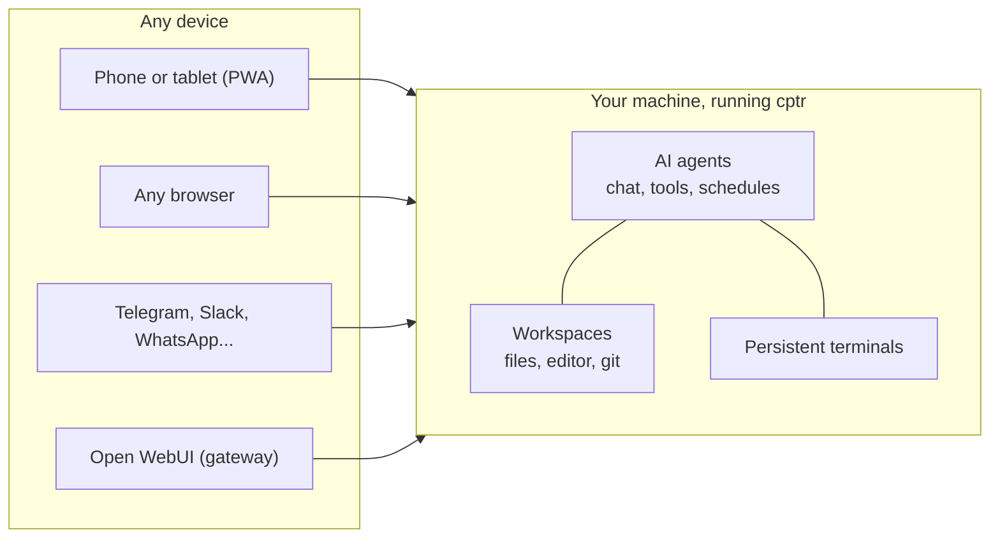

# What is Computer?

Is it a remote desktop? A web IDE? A chat app? One of those personal AI agents everyone's running? People ask because it genuinely doesn't fit one shelf, and every answer that starts from one shelf ("it's like VS Code in the browser, but...") undersells the rest. So here's the actual mental model.

## One machine, three doors

Your computer already has everything that matters: your files, your projects, a shell, git state, logins, running services. Open WebUI Computer (`cptr`) is one process that takes that machine and opens three doors into it:

**Door 1: you, at any screen.** A browser (or the home-screen PWA) gets the full workstation: file browser, editor, persistent terminals, git panel, previews. Not streamed pixels like a remote desktop; the real interfaces, built mobile-first. Close the tab on one device, open it on another, everything is where you left it.

**Door 2: you, by message.** Connect Telegram, Discord, Slack, WhatsApp, or Signal and the machine becomes something you text, and something that texts you: scheduled tasks run on their own, notifications deliver results, webhook triggers let the outside world wake it up.

**Door 3: an AI, inside.** Plug in an API key, Ollama, or the coding-agent subscription you already pay for, and the AI works behind the same doors you do: same files, same shell, same git, gated by approval modes you set per chat.

The entire trick is that all three doors open onto the **same state**. The file the agent edited is the file in your editor is the file on disk. The terminal you started at your desk is the one on your phone. The chat is a file in the project folder. One machine, one truth, three ways in.

## "So it's like X?"

Whatever you already use, Computer probably overlaps it in one direction and breaks the category in another:

| If you're thinking of... | What's the same | What's different |
| --- | --- | --- |
| **SSH / VNC / remote desktop** | Reach your real machine from anywhere | Structured, not raw: files, git, and editor as first-class mobile UI; sessions persist across disconnects; an AI can work the machine too |
| **code-server / cloud IDEs** | A workstation in a browser tab | The machine is *yours*: real state, real logins, real data, no cloud copy. And it's not only for code; folders, notes, and PDFs are equal citizens |
| **ChatGPT / a chat UI** | A chat with a capable model | The model has hands and a home: it reads and edits real files, runs real commands, and the conversation itself is a file in your project, searchable forever |
| **OpenClaw-style personal assistants** | Always-on, messaging-native, memory, proactive schedules | The full workstation is attached. When the assistant does something, you can open the diff, the terminal, and the file it touched, and take over yourself at any point |
| **Manus-style cloud agents** | Delegate a whole job, get a finished deliverable | It runs on your hardware with your data (nothing uploaded), every step is replayable, and the wheel is always grabbable: the terminal and editor are one tab away |
| **Claude Code / Codex / Cursor** | Serious coding agents on real repos | Not a competitor, a *home*: your existing subscriptions plug in as native backends with streaming, approvals, and cross-device session resume. Any other CLI still runs in the terminal |

Notice the pattern: tools either give you **the machine without intelligence** (SSH, VNC, code-server) or **intelligence without your machine** (ChatGPT, cloud agents). Computer is the intersection, and the intersection is the product.

## What it is not

- **Not a cloud service.** There is no account with anyone, no hosted anything. `pip install cptr` and it's yours; unplug the network and the core still works.
- **Not multi-tenant.** Accounts exist, isolation doesn't. Every signed-in user has the run of the machine. One trust domain, like SSH. ([Security model](/ecosystem/computer/phone-and-remote/security))
- **Not a sandbox.** It's deliberately your real machine; that's the value. If you want a disposable isolated environment, that's [Open Terminal](/ecosystem/computer/choose).
- **Not a model.** It ships no AI of its own. Bring any provider, local or hosted, or none at all: the workstation is fully useful with zero AI configured.

## Where it clicks

Reading definitions only gets you so far. These four moments are where the model snaps into place, pick the nearest one:

1. Your terminal, still running, on your phone, on the train: [Ship a fix from your phone](/ecosystem/computer/use-cases/fix-from-your-phone)
2. An AI reorganized your files and asked permission for every single move: [Clean up a messy folder](/ecosystem/computer/use-cases/clean-up-a-messy-folder)
3. Your own computer texted you the morning brief before you asked: [An assistant that texts you first](/ecosystem/computer/use-cases/an-assistant-that-texts-first)
4. You handed over a whole research job and came back to finished files: [Delegate a whole job](/ecosystem/computer/use-cases/delegate-a-whole-job)

## How to say it in one sentence

- To a developer: "Your dev machine in a browser tab, with your coding-agent subscription living inside it."
- To a self-hoster: "The self-hosted answer to cloud AI agents: same delegation, your hardware, your data."
- To a student: "Your school folder and an AI tutor, on your laptop at home, reachable from your phone."
- To anyone: "Your computer, from anywhere, with an AI that works inside it."
