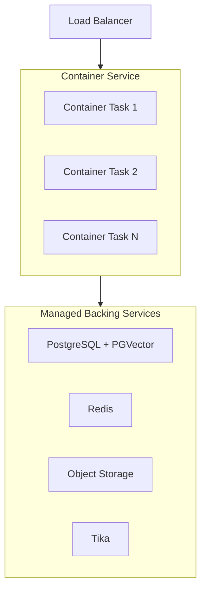

# Container Service

Run the official `ghcr.io/open-webui/open-webui` image on a managed container platform such as AWS ECS/Fargate, Azure Container Apps, or Google Cloud Run.

:::info Prerequisites
Before proceeding, ensure you have configured the [shared infrastructure requirements](/enterprise/deployment#shared-infrastructure-requirements) — PostgreSQL, Redis, a vector database, shared storage, and content extraction.
:::

## When to Choose This Pattern

- You want container benefits (immutable images, versioned deployments, no OS management) without Kubernetes complexity
- Your organization already uses a managed container platform
- You need fast scaling with minimal operational overhead
- You prefer managed infrastructure with platform-native auto-scaling

## Architecture



## Image Selection

Use **versioned tags** for production stability:

```
ghcr.io/open-webui/open-webui:v0.x.x
```

Avoid the `:main` tag in production — it tracks the latest development build and can introduce breaking changes without warning. Check the [Open WebUI releases](https://github.com/open-webui/open-webui/releases) for the latest stable version.

## Scaling Strategy

- **Platform-native auto-scaling**: Configure your container service to scale on CPU utilization, memory, or request count.
- **Health checks**: Use the `/health` endpoint for both liveness and readiness probes.
- **Task-level env vars**: Pass all shared infrastructure configuration as environment variables or secrets in your task definition.
- **Session affinity**: Enable sticky sessions on your load balancer for WebSocket stability. While Redis handles cross-instance coordination, session affinity reduces unnecessary session handoffs.

## Key Considerations

| Consideration | Detail |
| :--- | :--- |
| **Storage** | Use object storage (S3, GCS, Azure Blob) or a shared filesystem (such as EFS). Container-local storage is ephemeral and not shared across tasks. |
| **Tika sidecar** | Run Tika as a sidecar container in the same task definition, or as a separate service. Sidecar pattern keeps extraction traffic local. |
| **Secrets management** | Use your platform's secrets manager (AWS Secrets Manager, Azure Key Vault, GCP Secret Manager) for `DATABASE_URL`, `REDIS_URL`, and `WEBUI_SECRET_KEY`. |
| **Updates** | Perform a rolling deployment with a single task first — this task runs migrations (`ENABLE_DB_MIGRATIONS=true`). Once healthy, scale the remaining tasks with `ENABLE_DB_MIGRATIONS=false`. |

## Anti-Patterns to Avoid

| Anti-Pattern | Impact | Fix |
| :--- | :--- | :--- |
| Using local SQLite | Data loss on task restart, database locks with multiple tasks | Set `DATABASE_URL` to PostgreSQL |
| Default ChromaDB | SQLite-backed vector DB crashes under multi-process access | Set `VECTOR_DB=pgvector` (or Milvus/Qdrant) |
| Inconsistent `WEBUI_SECRET_KEY` | Login loops, 401 errors, sessions that don't persist across tasks | Set the same key on every task via secrets manager |
| No Redis | WebSocket failures, config not syncing, "Model Not Found" errors | Set `REDIS_URL` and `WEBSOCKET_MANAGER=redis` |

For container basics, see the [Quick Start guide](/getting-started/quick-start).

---

**Need help planning your enterprise deployment?** Our team works with organizations worldwide to design and implement production Open WebUI environments.

[**Contact Enterprise Sales → sales@openwebui.com**](mailto:sales@openwebui.com)


---

*This content is for informational purposes only and does not constitute a warranty, guarantee, or contractual commitment. Open WebUI is provided "as is." See your [license](/license) for applicable terms.*
