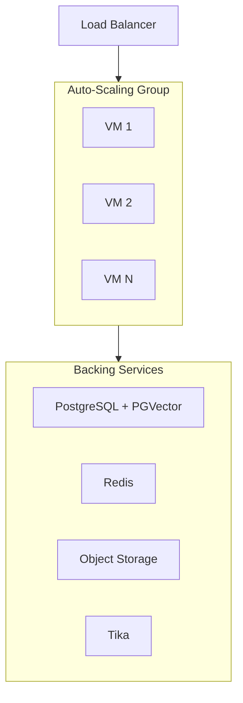

# Python / Pip on Auto-Scaling VMs

Deploy `open-webui serve` as a systemd-managed process on virtual machines in a cloud auto-scaling group (AWS ASG, Azure VMSS, GCP MIG).

:::info Prerequisites
Before proceeding, ensure you have configured the [shared infrastructure requirements](/enterprise/deployment#shared-infrastructure-requirements) — PostgreSQL, Redis, a vector database, shared storage, and content extraction.
:::

## When to Choose This Pattern

- Your organization has established VM-based infrastructure and operational practices
- Regulatory or compliance requirements mandate direct OS-level control
- Your team has limited container expertise but strong Linux administration skills
- You want a straightforward deployment without container orchestration overhead

## Architecture



## Installation

Install on each VM using pip with the `[all]` extra (includes PostgreSQL drivers):

```bash
pip install open-webui[all]
```

Create a systemd unit to manage the process:

```ini
[Unit]
Description=Open WebUI
After=network.target

[Service]
Type=simple
User=openwebui
EnvironmentFile=/etc/open-webui/env
ExecStart=/usr/local/bin/open-webui serve
Restart=always
RestartSec=5

[Install]
WantedBy=multi-user.target
```

Place your environment variables in `/etc/open-webui/env` (see [Critical Configuration](/enterprise/deployment#critical-configuration)).

## Scaling Strategy

- **Horizontal scaling**: Configure your auto-scaling group to add or remove VMs based on CPU utilization or request count.
- **Health checks**: Point your load balancer health check at the `/health` endpoint (HTTP 200 when healthy).
- **One process per VM**: Keep `UVICORN_WORKERS=1` and let the auto-scaler manage capacity. This simplifies memory accounting and avoids fork-safety issues with the default vector database.
- **Sticky sessions**: Configure your load balancer for cookie-based session affinity to ensure WebSocket connections remain routed to the same instance.

## Key Considerations

| Consideration | Detail |
| :--- | :--- |
| **OS patching** | You are responsible for OS updates, security patches, and Python runtime management. |
| **Python environment** | Pin your Python version (3.11 recommended) and use a virtual environment or system-level install. |
| **Storage** | Use object storage (such as S3) or a shared filesystem (such as NFS) since VMs in an auto-scaling group do not share a local filesystem. |
| **Tika sidecar** | Run a Tika server on each VM or as a shared service. A shared instance simplifies management. |
| **Updates** | Scale the group to 1 instance, update the package (`pip install --upgrade open-webui`), wait for database migrations to complete, then scale back up. |

For pip installation basics, see the [Quick Start guide](/getting-started/quick-start).

---

**Need help planning your enterprise deployment?** Our team works with organizations worldwide to design and implement production Open WebUI environments.

[**Contact Enterprise Sales → sales@openwebui.com**](mailto:sales@openwebui.com)
