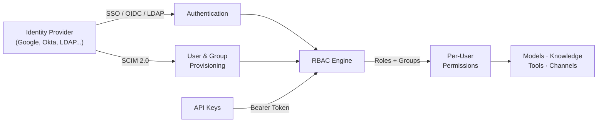

# 🔐 Authentication & Access

**Control who gets in, what they can do, and how your instance integrates with your identity stack.**

Open WebUI is multi-user from day one. Whether you're running a personal instance or managing thousands of seats across an organization, you have full control over authentication, authorization, and programmatic access. Connect your identity provider, define granular permissions, and automate user lifecycle management, all without touching a line of code.

---

## What's In This Section

| | |
| :--- | :--- |
| 👥 **[RBAC](./rbac)** | Roles, groups, and per-resource permissions. Define who can access what |
| 🔑 **[SSO / OIDC](./auth/sso)** | Federated authentication with Google, Microsoft, Okta, Keycloak, or any OIDC provider |
| 📂 **[LDAP](./auth/ldap)** | Authenticate against your existing directory service |
| 📋 **[SCIM 2.0](./auth/scim)** | Automated user and group provisioning and deprovisioning from your IdP |
| 🔐 **[API Keys](./api-keys)** | Programmatic access for scripts, bots, pipelines, and integrations |

---

## How It Fits Together

1. **Users authenticate** via SSO, OIDC, LDAP, or local credentials.
2. **SCIM provisions** users and groups automatically from your identity provider.
3. **RBAC determines access** based on roles (Admin, User) and group memberships.
4. **Permissions are additive**: each group membership adds capabilities, never removes them.
5. **API keys** inherit the creating user's full permissions for programmatic access.

---

## Quick Start

### Solo or small team? Start simple

Open WebUI works out of the box with local email/password authentication. No external identity provider required. Create accounts, assign admin or user roles, and you're done.

### Organization? Layer in SSO and SCIM

1. **[Set up SSO](./auth/sso)**: Configure your identity provider for single sign-on
2. **[Configure RBAC](./rbac)**: Create groups, assign permissions, and set up access control lists
3. **[Enable SCIM](./auth/scim)** *(optional)*: Automate user lifecycle from your IdP
4. **[Generate API keys](./api-keys)** *(optional)*: Enable programmatic access for automation

---

## Key Concepts

### Additive permissions

Open WebUI's security model is **additive**. Users start with their role's default permissions, and group memberships only ever *add* capabilities. A user's effective permissions are the union of everything granted by their role and all their groups.

### Per-resource access control

Models, Knowledge bases, Tools, and Skills all support fine-grained access control. Resources are **private by default**. The creator controls who can see and use them via user grants, group grants, or public visibility.

### Admin vs. User

There are two primary roles. **Admins** have full system access. **Users** have capabilities defined by default permissions plus group memberships. A third role, **Pending**, holds new sign-ups in a queue for admin approval.

[**Roles →**](./rbac/roles) · [**Permissions →**](./rbac/permissions) · [**Groups →**](./rbac/groups)
