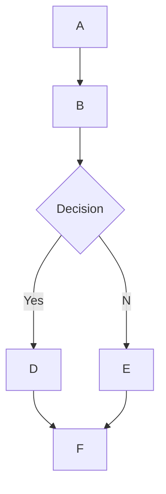

## 🌊 MermaidJS Rendering Support in Open WebUI

## Overview

Open WebUI supports rendering of visually appealing MermaidJS diagrams, flowcharts, pie charts and more, directly within the chat interface. MermaidJS is a powerful tool for visualizing complex information and ideas, and when paired with the capabilities of a large language model (LLM), it can be a powerful tool for generating and exploring new ideas.

## Using MermaidJS in Open WebUI

To generate a MermaidJS diagram, simply ask an LLM within any chat to create a diagram or chart using MermaidJS. For example, you can ask the LLM to:

- "Create a flowchart for a simple decision-making process for me using Mermaid. Explain how the flowchart works."
- "Use Mermaid to visualize a decision tree to determine whether it's suitable to go for a walk outside."

Note that for the LLM's response to be rendered correctly, it must begin with the word `mermaid` followed by the MermaidJS code. You can reference the [MermaidJS documentation](https://mermaid.js.org/intro/) to ensure the syntax is correct and provide structured prompts to the LLM to guide it towards generating better MermaidJS syntax.

## Visualizing MermaidJS Code Directly in the Chat

When you request a MermaidJS visualization, the Large Language Model (LLM) will generate the necessary code. Open WebUI will automatically render the visualization directly within the chat interface, as long as the code uses valid MermaidJS syntax.

If the model generates MermaidJS syntax, but the visualization does not render, it usually indicates a syntax error in the code. Don't worry – you'll be notified of any errors once the response has been fully generated. If this happens, try referencing the [MermaidJS documentation](https://mermaid.js.org/intro/) to identify the issue and revise the prompt accordingly.

## Interacting with Your Visualization

Once your visualization is displayed, you can:

- Zoom in and out to examine it more closely.
- Copy the original MermaidJS code used to generate the visualization by clicking the copy button at the top-right corner of the display area.

### Example



This will generate a flowchart like the following:

```markdown
 startAncestor [ start ]
A[A] --> B[B]
B --> C[Decision]
C -->| Yes | D[D]
C -->| No  | E[E]
D --> F[F]
E --> F[F]
```

Experimenting with different types of diagrams and charts can help you develop a more nuanced understanding of how to effectively leverage MermaidJS within Open WebUI. For smaller models, consider referencing the [MermaidJS documentation](https://mermaid.js.org/intro/) to provide guidance for the LLM, or have it summarize the documentation into comprehensive notes or a system prompt. By following these guidelines and exploring the capabilities of MermaidJS, you can unlock the full potential of this powerful tool in Open WebUI.
