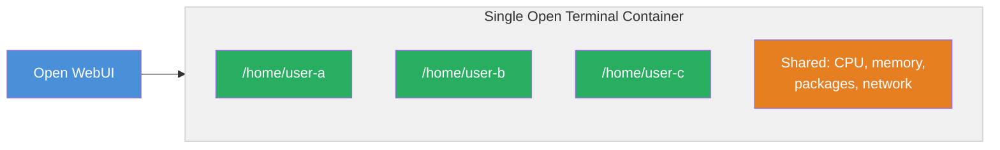
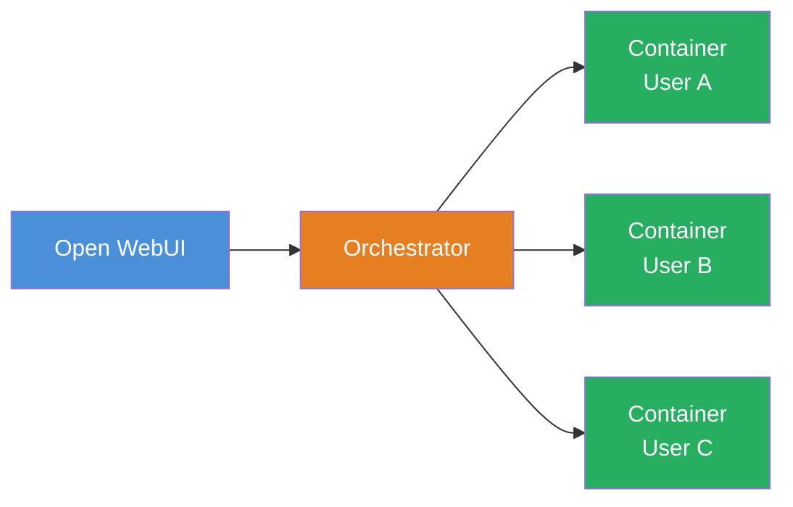

# Setting Up Open Terminal for a Team

When multiple people on your team need terminal access through Open WebUI, you have two options.

| | Single Container | Per-User Containers |
| :--- | :--- | :--- |
| **How** | One container, separate accounts inside | Each user gets their own container |
| **Isolation** | Files are separate, but they share the same system | Fully isolated — separate everything |
| **Setup** | One extra setting | Additional orchestration service |
| **Best for** | Small teams you trust | Production, larger teams, untrusted users |
| **Included in** | Open Terminal (free) | [Terminals](https://github.com/open-webui/terminals) (enterprise) |

---

## Option 1: Built-in multi-user mode

The simplest approach. Add one setting and each person automatically gets a separate workspace.

```bash
docker run -d --name open-terminal -p 8000:8000 \
  -v open-terminal:/home \
  -e OPEN_TERMINAL_MULTI_USER=true \
  -e OPEN_TERMINAL_API_KEY=your-secret-key \
  ghcr.io/open-webui/open-terminal
```

{/* TODO: Screenshot — Docker run command in terminal with the MULTI_USER=true flag highlighted. */}

### What happens

When someone uses the terminal through Open WebUI, Open Terminal automatically:

1. Creates a personal account for that user (based on their Open WebUI user ID)
2. Sets up a private home folder at `/home/{user-id}`
3. Runs all their commands under their own account
4. Restricts their file access to their own folder

Each user sees only their own files in the file browser.

{/* TODO: Screenshot — Two views side by side: User A's file browser showing /home/user-a/ with their files, and User B's file browser showing /home/user-b/ with completely different files. */}

### What's shared vs. separate

| | Separate per user | Shared |
| :--- | :--- | :--- |
| Home folder and files | ✔ | |
| Running commands | ✔ | |
| System packages | | ✔ |
| CPU and memory | | ✔ |
| Network access | | ✔ |

:::warning Good for small teams, not production
This mode gives everyone their own workspace, but they're all running inside the same container. If one user runs a script that uses too much memory, it can slow things down for everyone. Use this for small, trusted groups — not for wide-open deployments.
:::



---

## Option 2: Per-user containers with Terminals

For larger deployments or when you need real isolation, [**Terminals**](./terminals/) gives each user their own container, completely separate from everyone else.

- **Full isolation** — each user's container is independent with its own files, processes, and resources
- **On-demand provisioning** — containers are created when users start a session and cleaned up when idle
- **Resource controls** — set CPU, memory, and storage limits per user or per environment
- **Multiple environments** — different setups for different teams (e.g., data science, development)
- **Kubernetes support** — works with Docker, Kubernetes, and k3s



Two deployment backends are available:

- **[Docker Backend](./terminals/docker-backend)** — runs on a single Docker host. Best for small-to-medium teams or environments without Kubernetes.
- **[Kubernetes Operator](./terminals/kubernetes-operator)** — production-grade deployment using a CRD-based operator. Deploys alongside Open WebUI via the Helm chart.

:::info Enterprise license required
Terminals requires an [Open WebUI Enterprise License](https://openwebui.com/enterprise). See the [Terminals repository](https://github.com/open-webui/terminals) for license details.
:::

## Related

- [Terminals overview →](./terminals/)
- [Terminals: Docker Backend →](./terminals/docker-backend)
- [Terminals: Kubernetes Operator →](./terminals/kubernetes-operator)
- [Security best practices →](./security)
- [All configuration options →](./configuration)
