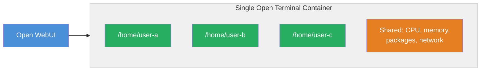
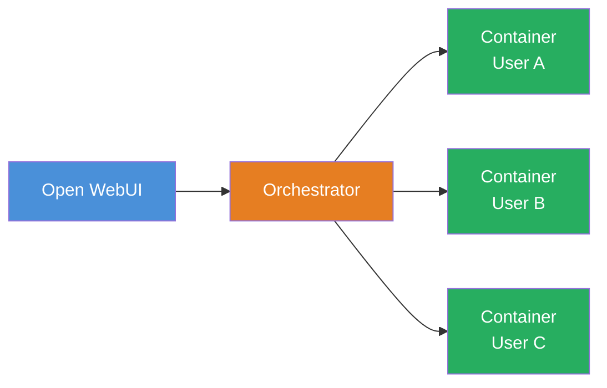

# Setting Up Open Terminal for a Team

When multiple people on your team need terminal access through Open WebUI, you have two options.

| | Single Container | Per-User Containers |
| :--- | :--- | :--- |
| **How** | One container, separate accounts inside | Each user gets their own container |
| **Isolation** | Separate workspaces inside one shared container | A separate container per user, isolated from each other |
| **Setup** | One extra setting | Additional orchestration service |
| **Best for** | Small teams where everyone is trusted equally | Production, larger teams, untrusted users |
| **Included in** | Open Terminal (free) | [Terminals](https://github.com/open-webui/terminals) (enterprise) |

:::danger Required for multi-user Open WebUI deployments
If your Open WebUI instance has **more than one user account** and the same terminal-server connection is shared across users, you **must** use one of the two options below. A single Open Terminal container without `OPEN_TERMINAL_MULTI_USER=true` (or without per-user containers via Terminals) places every user inside the same shell, the same filesystem, and the same network namespace, which means any user can read, modify, or replace any other user's files, run commands as the shared user, and bind shared ports. This is not a supported configuration for multi-user Open WebUI.

**Option 1 separates workspaces. It is not a security boundary between users.** Everyone still shares one kernel, one process list, one network namespace and one set of system resources, and provisioning the per-user accounts requires elevated privileges inside that container, so a user who sets out to reach root inside it will get there. Run it where every user on the instance is trusted at the same level.

For deployments with **untrusted users** (open signup, public-facing portals, users who are not trusted with each other's data), use **Option 2 (per-user containers via Terminals)**, which is the option that puts a real boundary between users. Layering `TERMINAL_PROXY_HEADERS` on top of Option 1 restricts what a proxied response can do in the user's browser, and it changes nothing about the shared container itself.
:::

---

## Option 1: Built-in multi-user mode

The simplest approach. Add one setting and each person automatically gets a separate workspace.

```bash
docker run -d --name open-terminal -p 8000:8000 \
  -v open-terminal:/home \
  -e OPEN_TERMINAL_MULTI_USER=true \
  -e OPEN_TERMINAL_API_KEY=your-secret-key \
  ghcr.io/open-webui/open-terminal
```

{/* TODO: Screenshot: Docker run command in terminal with the MULTI_USER=true flag highlighted. */}

### What happens

When someone uses the terminal through Open WebUI, Open Terminal automatically:

1. Creates a personal account for that user (based on their Open WebUI user ID)
2. Sets up a private home folder at `/home/{user-id}`
3. Runs all their commands under their own account
4. Keeps each user's files under their own folder

Each user sees only their own files in the file browser.

{/* TODO: Screenshot: Two views side by side: User A's file browser showing /home/user-a/ with their files, and User B's file browser showing /home/user-b/ with completely different files. */}

### What's shared vs. separate

| | Separate per user | Shared |
| :--- | :--- | :--- |
| Home folder and files | ✔ | |
| Running commands | ✔ | |
| System packages | | ✔ |
| CPU and memory | | ✔ |
| Network access | | ✔ |
| Process list and command lines | | ✔ |
| System state and root inside the container | | ✔ |

:::warning Good for small trusted teams, not production
This mode gives everyone their own workspace, and they all run inside the same container. Resource pressure (memory, CPU) is shared. The network namespace is shared, so a port one user binds (e.g. `python -m http.server 8080`) is reachable from any other user's shell on that container. The port listing and the port proxy are scoped to the user who owns the port, so the port stays out of other users' file navigators, and reaching it takes a direct request from a shell. The process list is shared, so users can watch each other's running commands. Root inside the container is reachable from any account, because provisioning the accounts needs those privileges in the first place.

Treat every user on one instance as equally trusted, and use **Option 2 (per-user containers)** below when users have to be protected from each other. Layering the [`TERMINAL_PROXY_HEADERS`](/reference/env-configuration#terminal_proxy_headers) configuration on top locks proxied responses into a sandbox CSP in the browser, which is worth doing and does not change what happens inside the container.
:::


```mermaid
flowchart LR
    OW["Open WebUI"]

    subgraph container ["Single Open Terminal Container"]
        direction TB
        UA["/home/user-a"]
        UB["/home/user-b"]
        UC["/home/user-c"]
        SH["Shared: CPU, memory,<br/>packages, network"]
    end

    OW --> container

    style OW fill:#4a90d9,color:#fff
    style UA fill:#27ae60,color:#fff
    style UB fill:#27ae60,color:#fff
    style UC fill:#27ae60,color:#fff
    style SH fill:#e67e22,color:#fff
    style container fill:#f0f0f0,stroke:#ccc
```

---

## Option 2: Per-user containers with Terminals

For larger deployments or when you need real isolation, [**Terminals**](../terminals/) gives each user their own container, completely separate from everyone else.

- **Full isolation**: each user's container is independent with its own files, processes, and resources
- **On-demand provisioning**: containers are created when users start a session and cleaned up when idle
- **Resource controls**: set CPU, memory, and storage limits per user or per environment
- **Multiple environments**: different setups for different teams (e.g., data science, development)
- **Kubernetes support**: works with Docker, Kubernetes, and k3s
- **Scoped workspaces**: optionally give each saved chat or each automation its own workspace instead of one per user, via [Terminal Contexts](/features/open-terminal/terminals/orchestration/contexts)


```mermaid
flowchart LR
    OW["Open WebUI"]
    OR["Orchestrator"]
    OW --> OR
    OR --> CA["Container<br/>User A"]
    OR --> CB["Container<br/>User B"]
    OR --> CC["Container<br/>User C"]

    style OW fill:#4a90d9,color:#fff
    style OR fill:#e67e22,color:#fff
    style CA fill:#27ae60,color:#fff
    style CB fill:#27ae60,color:#fff
    style CC fill:#27ae60,color:#fff
```

Two deployment backends are available:

- **[Docker Backend](../terminals/)**: runs on a single Docker host. Best for small-to-medium teams or environments without Kubernetes.
- **[Kubernetes Operator](../terminals/)**: production-grade deployment using a CRD-based operator. Deploys alongside Open WebUI via the Helm chart.

:::info Enterprise license required
Terminals requires an [Open WebUI Enterprise License](https://docs.openwebui.com/enterprise). See the [Terminals repository](https://github.com/open-webui/terminals) for license details.
:::

## Related

- [Terminals overview →](../terminals/)
- [Terminals: Docker Backend →](../terminals/)
- [Terminals: Kubernetes Operator →](../terminals/)
- [Security best practices →](./security.md)
- [All configuration options →](./configuration.md)
