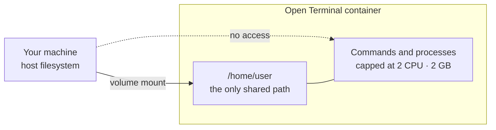
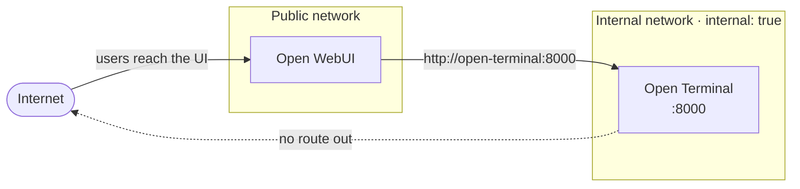
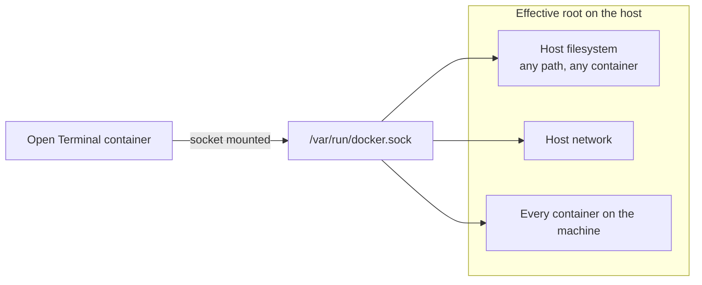

# Security Best Practices

Open Terminal gives AI real power to run commands and manage files. Here's how to make sure that power is used safely.

---

## Use Docker

**Always use Docker** unless you specifically need direct access to your machine. Docker isolates Open Terminal in its own container: it has its own filesystem, its own processes, and can't access anything on your host computer unless you explicitly allow it.

```bash
docker run -d --name open-terminal -p 8000:8000 \
  --memory 2g --cpus 2 \
  -v open-terminal:/home/user \
  -e OPEN_TERMINAL_API_KEY=your-secret-key \
  ghcr.io/open-webui/open-terminal
```

The `--memory 2g` and `--cpus 2` flags prevent runaway processes from consuming all your machine's resources.



The container reaches exactly one path on your machine, the volume you mounted. Everything else on the host filesystem is outside it, and the resource flags stop a runaway process taking the machine down with it.

:::warning Running without Docker
Without Docker (bare metal mode), the AI can run any command with your user's permissions, including deleting files, installing software, or accessing anything your account can access. Only use bare metal on your own personal machine for personal projects.
:::

---

## Always set a password

An API key gates all access: anyone who can reach the port and present the key can run commands, read files, and control the terminal. Keyless operation is no longer possible. As of v0.11.30 the server refuses to start without a key: running `uvicorn` directly requires `OPEN_TERMINAL_API_KEY` to be set (it exits otherwise), and the CLI auto-generates one for you when you don't supply your own. The protection is now enforced at startup, so set a strong key of your own rather than relying on the generated one.

```bash
-e OPEN_TERMINAL_API_KEY=a-strong-password-here
```

For production, use a [config file](./configuration#config-file) or [Docker secrets](./configuration#docker-secrets) instead of putting the key on the command line.

When you do not supply a key, the server generates one and prints it at startup:

```bash
docker logs open-terminal
```

```
  Local:    http://localhost:8000
  Network:  http://172.17.0.2:8000

  API Key:  <auto-generated key appears here>
```

Treat that generated value as a starting point, not a password. Replace it with a strong key of your own and keep it out of the command line in production.

---

## Use admin connections (not user connections)

When connecting to Open WebUI, prefer the **admin-configured** approach:

| | Admin-configured | User-configured |
| :--- | :--- | :--- |
| API key visibility | Hidden on the server | Stored in the user's browser |
| Requests go through | Open WebUI's backend | Directly from the browser |
| Terminal network access needed from | Just the Open WebUI server | Every user's computer |

Admin-configured connections keep the API key out of users' browsers and let you control who has access.


---

## Limit resources

Prevent a runaway script from consuming all available CPU and memory:

```yaml title="docker-compose.yml"
deploy:
  resources:
    limits:
      memory: 2G
      cpus: "2.0"
```

If a process exceeds these limits, Docker throttles it (CPU) or kills it (memory). Your server stays healthy.

Check what a container is actually using with `docker stats`:

```bash
docker stats --no-stream open-terminal
```

```
NAME             CPU %     MEM USAGE / LIMIT   MEM %
open-terminal    0.04%     67.57MiB / 2GiB     3.30%
```

The limit column reflects the flags you set, so you can confirm the cap is in force rather than assuming it.

---

## Network isolation

For the most secure setup, put Open Terminal on a **private Docker network** that only Open WebUI can reach:

```yaml title="docker-compose.yml"
services:
  open-webui:
    image: ghcr.io/open-webui/open-webui:latest
    ports:
      - "3000:8080"
    networks:
      - public
      - internal

  open-terminal:
    image: ghcr.io/open-webui/open-terminal
    # Notice: no ports exposed to the outside
    networks:
      - internal

networks:
  public:
  internal:
    internal: true   # No internet access from this network
```

This means:
- Open WebUI can reach Open Terminal at `http://open-terminal:8000`
- Open Terminal is **not accessible** from the internet
- Open Terminal **cannot make outbound internet requests**



Open WebUI sits on both networks, so it can serve users and still reach the terminal. The terminal sits only on the internal one, which is why nothing on the internet can reach it and it cannot call out.

---

## Egress filtering

If Open Terminal needs *some* internet access (to install packages, for example), you can restrict it to specific domains:

```bash
-e OPEN_TERMINAL_ALLOWED_DOMAINS="pypi.org,github.com,*.npmjs.org"
```

Only these domains will be reachable. Everything else is blocked. This prevents:
- Unauthorized data leaving the container
- Downloading unexpected software
- Accessing internal services you didn't intend

At startup the server confirms which domains it resolved and that the firewall is up:

```
Egress: DNS whitelist — pypi.org,github.com
  ✓ pypi.org (+ subdomains)
  ✓ github.com (+ subdomains)
dnsmasq started (upstream: 1.1.1.1)
Egress firewall active — dropping CAP_NET_ADMIN permanently
```

From inside the container, an allowed host resolves and a blocked one does not:

```bash
curl https://github.com/        # allowed by the list above
curl https://example.com/       # not on the list, DNS resolution fails
```

:::note Requires added capabilities
Egress filtering sets up `dnsmasq` and `iptables` inside the container, so it needs `--cap-add NET_ADMIN`. On hosts where the container cannot drop `CAP_NET_ADMIN` afterwards it will exit at startup with `unable to raise CAP_SETPCAP for BSET changes`. If you hit that, check your host's seccomp and capability settings before relying on this mode.
:::

---

## Docker socket warning

The Docker container can optionally access your host's Docker (to let the AI build images, run containers, etc.):

```bash
-v /var/run/docker.sock:/var/run/docker.sock
```

:::danger Only for trusted environments
Mounting the Docker socket gives the container **full control** over your host's Docker. This is effectively root access on your machine. Anyone with terminal access could:
- Run containers that mount your entire filesystem
- Access your host's network
- Manage every container on your machine

Only do this if you fully trust everyone who has access to the terminal.
:::



Mounting the socket is not a narrow permission. It hands the container the same control over Docker that you have, which is why the guidance is to do it only when you trust everyone who can reach the terminal.

---

## Port previews run sandboxed

When the agent starts a server, the port preview shows it inside a sandboxed frame. Scripts, forms, popups, modals and downloads are permitted, so an ordinary app behaves normally, but the frame is treated as a separate origin from Open WebUI by default, which keeps whatever is running in the terminal away from your session.

**Settings > Interface > Terminal Preview Allow Same Origin** relaxes that, and it is off unless you turn it on. Switch it on only for something you wrote and trust that genuinely needs same-origin browser APIs, such as storage or cookies, and remember that the code being previewed is often code the agent has just written.

## Security checklist

| ✅ | Recommendation |
| :--- | :--- |
| ☐ | Use Docker, not bare metal |
| ☐ | Set a strong API key |
| ☐ | Use admin-configured connections |
| ☐ | Set memory and CPU limits |
| ☐ | Use network isolation (internal Docker network) |
| ☐ | Enable egress filtering if internet access isn't needed |
| ☐ | Don't mount the Docker socket unless necessary |
| ☐ | Use `slim` or `alpine` images if you don't need runtime package installs |
| ☐ | Leave **Terminal Preview Allow Same Origin** off unless a preview genuinely needs it |

## Related

- [All configuration options →](./configuration)
- [Multi-user setup →](./multi-user)
