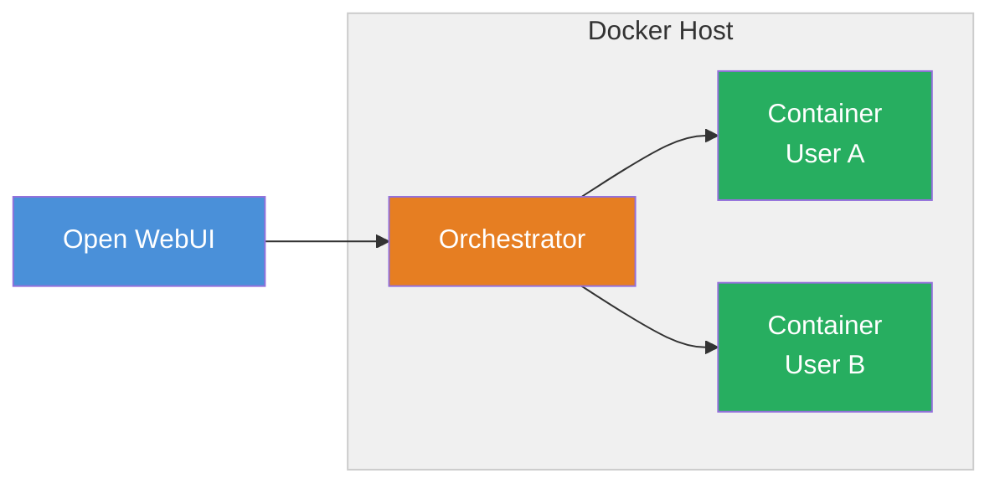

# Docker Backend

Terminals with the Docker backend runs on a single Docker host and provisions an isolated [Open Terminal](/features/open-terminal) container for every user. Each person gets their own filesystem, processes, and resource limits — without needing Kubernetes.



---

## How it works

1. A user opens a terminal in Open WebUI.
2. Open WebUI proxies the request to the **Terminals orchestrator**.
3. The orchestrator checks if the user already has a running container.
   - If not, it pulls the Open Terminal image and creates a new container for that user.
   - If the container exists but is stopped, it starts it back up.
4. Once the container is healthy (responds to `/health`), the orchestrator proxies all traffic to it.
5. A background cleanup loop tears down containers that have been idle longer than the configured timeout.

On restart, the orchestrator **reconciles** — it rediscovers existing containers by label so no work is lost.

---

## Prerequisites

- Docker Engine installed
- Open WebUI running (or ready to deploy alongside)
- [Open WebUI Enterprise License](https://openwebui.com/enterprise)

---

## Quick start with Docker Compose

This Compose file deploys Open WebUI and the Terminals orchestrator together. The orchestrator manages per-user Open Terminal containers automatically.

```yaml
services:
  open-webui:
    image: ghcr.io/open-webui/open-webui:main
    ports:
      - "3000:8080"
    environment:
      # Point Open WebUI at the orchestrator.
      # This is auto-detected as an orchestrator connection.
      - TERMINAL_SERVER_CONNECTIONS=[{"id":"terminals","name":"Terminals","enabled":true,"url":"http://terminals:3000","key":"${TERMINALS_API_KEY}","auth_type":"bearer","config":{"access_grants":[{"principal_type":"user","principal_id":"*","permission":"read"}]}}]
    volumes:
      - open-webui:/app/backend/data
    networks:
      - webui
    depends_on:
      - terminals

  terminals:
    image: ghcr.io/open-webui/terminals:latest
    environment:
      - TERMINALS_BACKEND=docker
      - TERMINALS_API_KEY=${TERMINALS_API_KEY}
      - TERMINALS_IMAGE=ghcr.io/open-webui/open-terminal:latest
      - TERMINALS_NETWORK=open-webui-network
      - TERMINALS_IDLE_TIMEOUT_MINUTES=30
    volumes:
      # The orchestrator needs Docker socket access to manage containers.
      - /var/run/docker.sock:/var/run/docker.sock
      # Persistent data for terminal workspaces.
      - terminals-data:/app/data
    networks:
      - webui

volumes:
  open-webui:
  terminals-data:

networks:
  webui:
    name: open-webui-network
```

:::warning Docker socket access
The orchestrator mounts the Docker socket so it can create and manage containers. This grants broad control over the Docker daemon. In production, consider using a Docker socket proxy like [Tecnativa/docker-socket-proxy](https://github.com/Tecnativa/docker-socket-proxy) to restrict which API calls are allowed.
:::

Set the shared API key in a `.env` file next to your Compose file:

```env
TERMINALS_API_KEY=change-me-to-a-strong-random-value
```

Then start everything:

```bash
docker compose up -d
```

Open WebUI will be available at `http://localhost:3000`. When any user activates a terminal in chat, the orchestrator provisions their personal container automatically.

---

## Configuration reference

All orchestrator settings are configured via environment variables prefixed with `TERMINALS_`.

### Core settings

| Variable | Default | Description |
| :--- | :--- | :--- |
| `TERMINALS_BACKEND` | `docker` | Backend type. Set to `docker` for this deployment mode. |
| `TERMINALS_API_KEY` | (empty) | Shared secret for authenticating requests from Open WebUI. Required. |
| `TERMINALS_IMAGE` | `ghcr.io/open-webui/open-terminal:latest` | Default Open Terminal container image for user instances. |
| `TERMINALS_PORT` | `3000` | Port the orchestrator listens on. |
| `TERMINALS_HOST` | `0.0.0.0` | Address the orchestrator binds to. |

### Docker-specific settings

| Variable | Default | Description |
| :--- | :--- | :--- |
| `TERMINALS_NETWORK` | (empty) | Docker network to attach user containers to. When set, containers communicate by name instead of published ports. |
| `TERMINALS_DOCKER_HOST` | `127.0.0.1` | Address used to reach published container ports. Only relevant when `TERMINALS_NETWORK` is not set. |
| `TERMINALS_DATA_DIR` | `data/terminals` | Host directory where per-user workspace data is stored. Each user gets a subdirectory mounted to `/home/user` inside their container. |

### Lifecycle

| Variable | Default | Description |
| :--- | :--- | :--- |
| `TERMINALS_IDLE_TIMEOUT_MINUTES` | `0` (disabled) | Minutes of inactivity before a user's container is stopped and removed. Set to `30` for typical usage. |

### Resource limits

| Variable | Default | Description |
| :--- | :--- | :--- |
| `TERMINALS_MAX_CPU` | (empty) | Hard cap on CPU for user containers (e.g., `2`). |
| `TERMINALS_MAX_MEMORY` | (empty) | Hard cap on memory for user containers (e.g., `4Gi`). |

### Authentication

| Variable | Default | Description |
| :--- | :--- | :--- |
| `TERMINALS_OPEN_WEBUI_URL` | (empty) | If set, validates incoming JWTs against this Open WebUI instance instead of using `TERMINALS_API_KEY`. |

---

## Policies

The orchestrator supports **policies** — named environment configurations that let you offer different setups to different teams. For example, a `data-science` policy might use a larger image with pre-installed Python packages, while a `development` policy uses the default slim image.

Policies are managed via the orchestrator's REST API (`/api/v1/policies`). Each policy is then referenced by a terminal connection in Open WebUI under **Settings → Connections**.

When a policy is configured, requests are routed through `/p/{policy_id}/` — for example, `/p/data-science/execute`.

👉 **[See the Policies guide for full details →](./policies.md)**

---

## Container lifecycle details

### Naming

Containers are named `terminals-{policy_id}-{user_id}`, which makes them easy to identify:

```bash
docker ps --filter "label=app.kubernetes.io/managed-by=terminals"
```

### Health checks

After creating a container, the orchestrator polls its `/health` endpoint until it returns HTTP 200 (up to 15 seconds). Only then does it start proxying traffic.

### Reconciliation

If the orchestrator restarts, it rediscovers existing running containers by their labels and recovers their API keys from the container configuration. This prevents duplicate containers from being created.

### Conflict handling

If a container with the same name already exists (e.g., from a previous failed cleanup), the orchestrator force-removes the old container and retries up to 3 times.

---

## Limitations

- **Single host** — all user containers run on one Docker host. For high availability or larger teams, use the [Kubernetes Operator](./kubernetes-operator).
- **No built-in HA** — if the orchestrator goes down, active terminal sessions are interrupted (though containers keep running and are reconciled on restart).
- **Docker socket required** — the orchestrator needs access to the Docker socket to manage containers.

---

## Next steps

- [Kubernetes Operator](./kubernetes-operator) — production-grade deployment with CRD-based lifecycle management
- [Multi-User Setup](../advanced/multi-user) — comparison of isolation approaches
- [Security best practices](../advanced/security)
- [Configuration reference](../advanced/configuration) — all Open Terminal container settings

:::info Enterprise license required
Terminals requires an [Open WebUI Enterprise License](https://openwebui.com/enterprise). See the [Terminals repository](https://github.com/open-webui/terminals) for license details.
:::
