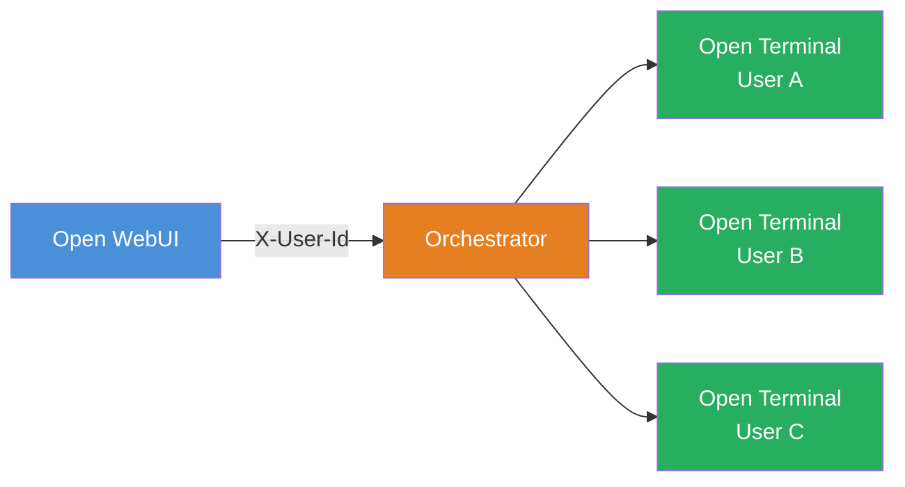

# Terminals

**Terminals** is an enterprise orchestration layer for [Open Terminal](/features/open-terminal) that provisions a fully isolated terminal container for every user. Instead of sharing a single container, each person gets their own — with separate files, processes, resource limits, and network isolation.

:::tip Quick navigation
- **Just want to try it?** → [Docker Compose quickstart](./docker-backend)
- **Running Kubernetes?** → [Helm chart deployment](./kubernetes-operator)
- **Need different environments per team?** → [Policies guide](./policies)
:::

---

## Why Terminals?

Open Terminal's [built-in multi-user mode](../multi-user#option-1-built-in-multi-user-mode) works well for small, trusted teams — but everyone shares the same container, CPU, memory, and network. This approach does not scale well beyond a few users, or enable multi-team approaches. Terminals solves these issues by giving each user a dedicated container:

| | Built-in multi-user | Terminals |
| :--- | :--- | :--- |
| **Isolation** | Separate files, shared system | Fully separate containers |
| **Resources** | Shared CPU, memory, network | Per-user CPU, memory, and storage limits |
| **Provisioning** | Always running | On-demand. Created on first use, cleaned up when idle |
| **Environments** | One setup for everyone | Multiple policies for different teams |
| **Infrastructure** | Single container | Docker host or Kubernetes cluster |
| **Best for** | Small trusted teams | Production, larger teams, untrusted users |

:::info Key concepts
If you're new to containers and orchestration, here's a quick glossary:

- **Container** — a lightweight, isolated environment that packages an application and its dependencies. Think of it as a mini virtual machine.
- **Docker** — a tool for running containers on a single machine.
- **Kubernetes (K8s)** — a platform for running and managing containers across a cluster of machines. Used for production-scale deployments.
- **Helm chart** — a package format for Kubernetes. Similar to `docker-compose.yaml` but for Kubernetes clusters.
- **CRD (Custom Resource Definition)** — a way to extend Kubernetes with new object types. Terminals defines a `Terminal` CRD so Kubernetes can manage terminal instances natively.
- **API key** — a secret token used to authenticate requests between services.
:::

---

## How it works

Terminals sits between Open WebUI and the Open Terminal instances:

1. A user activates a terminal in Open WebUI.
2. Open WebUI proxies the request to the **Terminals orchestrator** — a service that manages the lifecycle of terminal containers.
3. The orchestrator provisions a personal Open Terminal container for that user (or reconnects to an existing one).
4. All traffic is proxied through the orchestrator. The user never connects to their container directly.
5. Idle containers are automatically cleaned up after a configurable timeout. Data optionally persists across sessions.

The orchestrator also exposes the same OpenAPI-based tool interface as Open Terminal, so the AI can execute commands, read files, and run code — all scoped to the requesting user's container.

The [Docker Backend](./docker-backend) and [Kubernetes Operator](./kubernetes-operator) pages cover backend-specific details of how provisioning works in each environment.

---

## Policies

Policies let you define different terminal environments for different teams or use cases. Each policy can specify:

- **Container image** — use a custom image with pre-installed tools for data science, web development, etc.
- **Resource limits** — set CPU, memory, and storage caps per policy
- **Environment variables** — inject API keys, egress filtering rules, or custom configuration into terminal containers
- **Persistent storage** — choose per-user or shared volumes with configurable size
- **Idle timeout** — automatically reclaim resources after a period of inactivity

Policies are managed via the orchestrator's REST API. Each policy is then wired to a terminal connection in Open WebUI under **Settings → Connections**, where you can also restrict access by group.

When multiple policies are configured, Open WebUI shows them as separate terminal connections that users (or groups) can be granted access to.

👉 **[Policies deep-dive →](./policies.md)**

---

## Deployment options

Terminals supports two deployment backends:

### [Docker Backend](./docker-backend)

Runs on a single Docker host. The orchestrator uses the Docker API to create and manage containers. Best for:

- Small-to-medium teams
- Environments without Kubernetes
- Quick evaluation and development

Includes a ready-to-use Docker Compose file. **[Get started →](./docker-backend)**

### [Kubernetes Operator](./kubernetes-operator)

Production-grade deployment using a Kubernetes operator. Deploys alongside Open WebUI via the Helm chart. Best for:

- Production environments
- Larger teams requiring scalability
- Organizations already running Kubernetes

Integrates as a subchart of the Open WebUI Helm chart — enable with `terminals.enabled: true`. **[Get started →](./kubernetes-operator)**

---

## Authentication

The orchestrator supports three authentication modes:

| Mode | When to use | How to configure |
| :--- | :--- | :--- |
| **Open WebUI JWT** | Production. The orchestrator validates tokens against your Open WebUI instance. | Set `TERMINALS_OPEN_WEBUI_URL` on the orchestrator to your Open WebUI URL. |
| **Shared API key** | Standard. Open WebUI includes a shared secret in every request. | Set `TERMINALS_API_KEY` to the same value on both Open WebUI and the orchestrator. |
| **Open** | Development only. No auth — do not use in production. | Leave both `TERMINALS_OPEN_WEBUI_URL` and `TERMINALS_API_KEY` unset. |

When deployed via Docker Compose or Helm, the shared API key is configured automatically between Open WebUI and the orchestrator.

---

## Troubleshooting

### Terminal won't start

1. **Check orchestrator logs** — the orchestrator logs the full provisioning flow, including image pull and container creation. Look for errors related to image availability or resource limits.
2. **Verify the API key** — ensure `TERMINALS_API_KEY` matches between Open WebUI and the orchestrator. A mismatch causes silent auth failures.
3. **Check image pull access** — if using a private container registry, make sure the orchestrator (Docker) or cluster (Kubernetes) has pull credentials configured.

### Authentication failures

- If using **JWT mode**, confirm `TERMINALS_OPEN_WEBUI_URL` points to a reachable Open WebUI instance.
- If using **API key mode**, confirm the key is set identically on both sides. Check for extra whitespace or newlines.
- Check the orchestrator logs for `401` or `403` responses.

### Container is reaped too quickly

Increase `TERMINALS_IDLE_TIMEOUT_MINUTES` (or `idle_timeout_minutes` in a policy). The default is `0` (disabled), but if set too low, containers may be cleaned up while users are still working. A value of `30` is typical.

### Connection refused

- **Docker:** ensure `TERMINALS_NETWORK` is set so containers can communicate by name. Without it, containers use published ports and the `TERMINALS_DOCKER_HOST` address must be reachable.
- **Kubernetes:** verify the orchestrator Service is accessible from the Open WebUI Pod. Run `kubectl get svc -n open-webui` to confirm the service exists.

---

## Further reading

- [Multi-User Setup](../multi-user) — comparison of isolation approaches
- [Security best practices](../security)
- [Configuration reference](../configuration) — all Open Terminal container settings

---

## License

Terminals requires an [Open WebUI Enterprise License](https://openwebui.com/enterprise). See the [Terminals repository](https://github.com/open-webui/terminals) for details.
