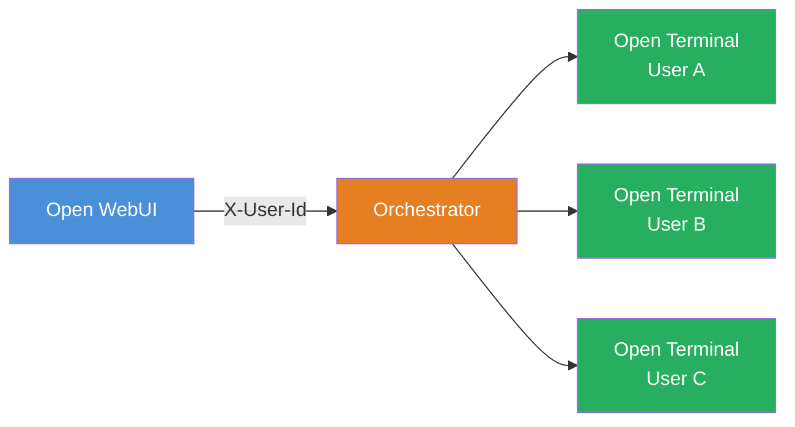

# Terminals

**Terminals** is an enterprise orchestration layer for [Open Terminal](/features/open-terminal) that provisions a fully isolated terminal container for every user. Instead of sharing a single container, each person gets their own — with separate files, processes, resource limits, and network isolation.

---

## Why Terminals?

Open Terminal's [built-in multi-user mode](../multi-user#option-1-built-in-multi-user-mode) works well for small, trusted teams — but everyone shares the same container, CPU, memory, and network. This approach does not scale well beyond a few users, or enable multi-team approaches. Terminals solves these issues by giving each user a dedicated container:

| | Built-in multi-user | Terminals |
| :--- | :--- | :--- |
| **Isolation** | Separate files, shared system | Fully separate containers |
| **Resources** | Shared CPU, memory, network | Per-user CPU, memory, and storage limits |
| **Provisioning** | Always running | On-demand. Created on first use, cleaned up when idle |
| **Environments** | One setup for everyone | Multiple policies for different teams |
| **Infrastructure** | Single container | Docker host or Kubernetes cluster |
| **Best for** | Small trusted teams | Production, larger teams, untrusted users |

---

## How it works

Terminals sits between Open WebUI and the Open Terminal instances:

1. A user activates a terminal in Open WebUI.
2. Open WebUI proxies the request to the **Terminals orchestrator**.
3. The orchestrator provisions a personal Open Terminal container for that user (or reconnects to an existing one).
4. All traffic is proxied through the orchestrator. The user never connects to their container directly.
5. Idle containers are automatically cleaned up after a configurable timeout. Data optionally persists across sessions.

The orchestrator also exposes the same OpenAPI-based tool interface as Open Terminal, so the AI can execute commands, read files, and run code — all scoped to the requesting user's container.

---

## Policies

Policies let you define different terminal environments for different teams or use cases. Each policy can specify:

- **Container image** — use a custom image with pre-installed tools for data science, web development, etc.
- **Resource limits** — set CPU, memory, and storage caps per policy
- **Environment variables** — inject API keys, egress filtering rules, or custom configuration into terminal containers
- **Persistent storage** — choose per-user or shared volumes with configurable size
- **Idle timeout** — automatically reclaim resources after a period of inactivity

Policies are managed via the orchestrator's REST API. Each policy is then wired to a terminal connection in Open WebUI under **Settings → Connections**, where you can also restrict access by group.

When multiple policies are configured, Open WebUI shows them as separate terminal connections that users (or groups) can be granted access to.

👉 **[Policies deep-dive →](./policies.md)**

---

## Deployment options

Terminals supports two deployment backends:

### [Docker Backend](./docker-backend)

Runs on a single Docker host. The orchestrator uses the Docker API to create and manage containers. Best for:

- Small-to-medium teams
- Environments without Kubernetes
- Quick evaluation and development

Includes a ready-to-use Docker Compose file. **[Get started →](./docker-backend)**

### [Kubernetes Operator](./kubernetes-operator)

Production-grade deployment using a CRD-based Kopf operator. Deploys alongside Open WebUI via the Helm chart. Best for:

- Production environments
- Larger teams requiring scalability
- Organizations already running Kubernetes

Integrates as a subchart of the Open WebUI Helm chart — enable with `terminals.enabled: true`. **[Get started →](./kubernetes-operator)**

---

## Authentication

The orchestrator supports three authentication modes:

| Mode | When to use |
| :--- | :--- |
| **Open WebUI JWT** | Production. Set `TERMINALS_OPEN_WEBUI_URL` and the orchestrator validates tokens against your Open WebUI instance. |
| **Shared API key** | Standard. Set `TERMINALS_API_KEY` to a shared secret that Open WebUI includes in requests. |
| **Open** | Development only. No auth — do not use in production. |

When deployed via Docker Compose or Helm, the shared API key is configured automatically between Open WebUI and the orchestrator.

---

## License

Terminals requires an [Open WebUI Enterprise License](https://openwebui.com/enterprise). See the [Terminals repository](https://github.com/open-webui/terminals) for details.
