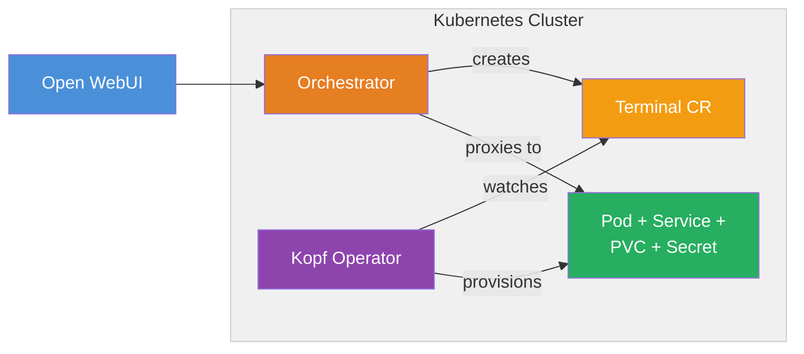

# Kubernetes Operator

Terminals with the Kubernetes Operator backend is the production-grade deployment for multi-tenant terminals on Kubernetes. A [Kopf](https://kopf.readthedocs.io/)-based operator watches `Terminal` custom resources and manages the full lifecycle of per-user Pods, Services, PVCs, and Secrets.



---

## Architecture

The Kubernetes deployment includes three components:

| Component | Role |
| :--- | :--- |
| **Orchestrator** | FastAPI service that receives requests from Open WebUI, creates `Terminal` custom resources, and proxies traffic to user Pods once they're running. |
| **Operator** | Kopf controller that watches `Terminal` CRs and reconciles the underlying infrastructure — creates Pods, Services, Secrets, and PVCs for each terminal. |
| **Terminal CRD** | A `Terminal` custom resource (`terminals.openwebui.com/v1alpha1`) that declaratively represents a user's terminal instance. |

When a user opens a terminal in Open WebUI:

1. Open WebUI proxies the request to the **orchestrator**.
2. The orchestrator creates a `Terminal` CR in the cluster.
3. The **operator** detects the new CR and provisions a Pod, Service, Secret (API key), and optionally a PVC.
4. Once the Pod passes readiness checks, the operator updates the CR's status to `Running`.
5. The orchestrator reads the service URL and API key from the CR status, then proxies all traffic.
6. When the terminal is idle past the configured timeout, the operator deletes the Pod (the PVC and Secret survive so the workspace persists).
7. On the next request, the orchestrator creates a new CR and the cycle repeats — the existing PVC is reattached.

---

## Deployment with Helm

The recommended deployment method is through the **Open WebUI Helm chart**, which includes Terminals as an optional subchart.

### 1. Enable Terminals in your values

Add a `terminals` section to your Helm values file:

```yaml
# values.yaml
terminals:
  enabled: true

  # Shared API key between Open WebUI, orchestrator, and terminal Pods.
  # If left empty, the chart auto-generates a random key.
  apiKey: ""

  # Or reference a pre-existing Secret:
  # existingSecret: "my-terminals-secret"  # must contain key: api-key

  crd:
    install: true  # Set false if the CRD is already installed cluster-wide

  operator:
    image:
      repository: ghcr.io/open-webui/terminals-operator
      tag: latest
    resources:
      requests:
        cpu: 50m
        memory: 64Mi
      limits:
        cpu: 200m
        memory: 256Mi

  orchestrator:
    image:
      repository: ghcr.io/open-webui/terminals
      tag: latest
    backend: kubernetes-operator
    terminalImage: "ghcr.io/open-webui/open-terminal:latest"
    idleTimeoutMinutes: 30
    service:
      type: ClusterIP
      port: 8080
    resources:
      requests:
        cpu: 50m
        memory: 128Mi
      limits:
        cpu: 200m
        memory: 256Mi
```

### 2. Install or upgrade

```bash
helm upgrade --install open-webui open-webui/open-webui \
  -f values.yaml \
  --namespace open-webui --create-namespace
```

:::tip Auto-configured connection
When `terminals.enabled` is `true`, the Open WebUI chart automatically sets the `TERMINAL_SERVER_CONNECTIONS` environment variable to point at the orchestrator's in-cluster service. No manual connection setup is needed — terminals appear in the UI immediately.
:::

### 3. Verify

```bash
# Check that all pods are running
kubectl get pods -n open-webui -l app.kubernetes.io/part-of=open-terminal

# Check that the CRD is installed
kubectl get crd terminals.openwebui.com
```

---

## What gets deployed

When `terminals.enabled: true`, the Helm chart creates the following Kubernetes resources:

| Resource | Name | Purpose |
| :--- | :--- | :--- |
| **CustomResourceDefinition** | `terminals.openwebui.com` | Defines the `Terminal` CR schema |
| **Deployment** | `{release}-terminals-operator` | Runs the Kopf operator |
| **Deployment** | `{release}-terminals-orchestrator` | Runs the FastAPI orchestrator |
| **Service** | `{release}-terminals-orchestrator` | Exposes the orchestrator to Open WebUI |
| **ServiceAccount** | `{release}-terminals-operator` | Identity for the operator |
| **ClusterRole / ClusterRoleBinding** | `{release}-terminals-operator` | RBAC permissions for the operator |
| **Secret** | `{release}-terminals-api-key` | Shared API key (auto-generated if not provided) |

Additionally, for **each user terminal** the operator creates:

| Resource | Name | Purpose |
| :--- | :--- | :--- |
| **Pod** | `{terminal-name}-pod` | The user's Open Terminal instance |
| **Service** | `{terminal-name}-svc` | ClusterIP service for the Pod |
| **Secret** | `{terminal-name}-apikey` | Per-terminal API key |
| **PersistentVolumeClaim** | `{terminal-name}-pvc` | Workspace storage (if persistence is enabled). Intentionally survives terminal deletion so data is retained. |

---

## Terminal CRD reference

The `Terminal` custom resource is the declarative API for managing terminal instances.

### Spec fields

| Field | Type | Default | Description |
| :--- | :--- | :--- | :--- |
| `userId` | string | *(required)* | Open WebUI user ID that owns this terminal |
| `image` | string | `ghcr.io/open-webui/open-terminal:latest` | Container image for the terminal Pod |
| `resources.requests.cpu` | string | `100m` | CPU request |
| `resources.requests.memory` | string | `256Mi` | Memory request |
| `resources.limits.cpu` | string | `1` | CPU limit |
| `resources.limits.memory` | string | `1Gi` | Memory limit |
| `idleTimeoutMinutes` | integer | `30` | Minutes of inactivity before the Pod is stopped |
| `packages` | array | `[]` | Apt packages to pre-install in the terminal |
| `pipPackages` | array | `[]` | Pip packages to pre-install in the terminal |
| `persistence.enabled` | boolean | `true` | Enable persistent storage via PVC |
| `persistence.size` | string | `1Gi` | PVC size |
| `persistence.storageClass` | string | *(cluster default)* | Storage class for the PVC |

### Status fields

| Field | Description |
| :--- | :--- |
| `phase` | Current lifecycle phase: `Pending`, `Provisioning`, `Running`, `Idle`, `Error` |
| `podName` | Name of the terminal Pod |
| `serviceName` | Name of the terminal Service |
| `serviceUrl` | Full in-cluster URL (e.g., `http://terminal-abc123-svc.terminals.svc:8000`) |
| `apiKeySecret` | Name of the Secret holding the terminal's API key |
| `lastActivityAt` | ISO 8601 timestamp of the last proxied request |
| `message` | Human-readable status message |
| `conditions` | Array of condition objects (`Ready`, with reason and message) |

### Printer columns

```bash
kubectl get terminals -n open-webui -o wide
```

```
NAME                        USER      PHASE     SERVICE URL                                                  LAST ACTIVITY   AGE
terminal-a1b2c3-default     user-123  Running   http://terminal-a1b2c3-default-svc.open-webui.svc:8000       5m              5m
terminal-d4e5f6-datascience  user-456  Idle      http://terminal-d4e5f6-datascience-svc.open-webui.svc:8000   1h              1h
```

---

## Lifecycle

### Provisioning

```
User request → Orchestrator creates Terminal CR
                    ↓
              Operator detects new CR
                    ↓
              Creates Secret (API key)
              Creates Service (ClusterIP)
              Creates PVC (if persistence enabled)
              Creates Pod (with probes, resource limits, env vars)
                    ↓
              Pod passes readiness check
                    ↓
              Operator sets status.phase = Running
                    ↓
              Orchestrator reads serviceUrl + apiKeySecret
              Proxies traffic to Pod
```

### Idle cleanup

The operator checks terminal activity every 60 seconds. If a terminal has been idle longer than `spec.idleTimeoutMinutes`:

1. The operator **deletes the Pod** (not the CR, PVC, or Secret).
2. The status is set to `phase: Idle`.
3. On the next user request, the orchestrator creates a new Terminal CR, and the operator provisions a fresh Pod with the same PVC reattached.

This means **user data persists** across idle cycles while cluster resources are reclaimed.

### Manual management

```bash
# List all terminals
kubectl get terminals -n open-webui

# Inspect a specific terminal
kubectl describe terminal terminal-a1b2c3-default -n open-webui

# Delete a terminal (Pod, Service, and Secret are garbage-collected via ownerReferences)
kubectl delete terminal terminal-a1b2c3-default -n open-webui
```

---

## Helm values reference

All configurable values under the `terminals` key:

### Top-level

| Key | Default | Description |
| :--- | :--- | :--- |
| `terminals.enabled` | `false` | Enable the Terminals subchart |
| `terminals.apiKey` | (empty) | Shared API key. Auto-generated if not set. |
| `terminals.existingSecret` | (empty) | Name of a pre-existing Secret containing the API key (key: `api-key`) |
| `terminals.crd.install` | `true` | Install the Terminal CRD. Set `false` if already installed cluster-wide. |

### Operator

| Key | Default | Description |
| :--- | :--- | :--- |
| `terminals.operator.image.repository` | `ghcr.io/open-webui/terminals-operator` | Operator container image |
| `terminals.operator.image.tag` | `latest` | Image tag |
| `terminals.operator.image.pullPolicy` | `IfNotPresent` | Pull policy |
| `terminals.operator.replicaCount` | `1` | Number of operator replicas |
| `terminals.operator.resources` | 50m/64Mi → 200m/256Mi | CPU and memory requests/limits |

### Orchestrator

| Key | Default | Description |
| :--- | :--- | :--- |
| `terminals.orchestrator.image.repository` | `ghcr.io/open-webui/terminals` | Orchestrator container image |
| `terminals.orchestrator.image.tag` | `latest` | Image tag |
| `terminals.orchestrator.image.pullPolicy` | `IfNotPresent` | Pull policy |
| `terminals.orchestrator.replicaCount` | `1` | Number of orchestrator replicas |
| `terminals.orchestrator.backend` | `kubernetes-operator` | Backend type |
| `terminals.orchestrator.terminalImage` | `ghcr.io/open-webui/open-terminal:latest` | Default image for spawned terminal Pods |
| `terminals.orchestrator.terminalImagePullPolicy` | `IfNotPresent` | Pull policy for terminal Pods |
| `terminals.orchestrator.idleTimeoutMinutes` | `30` | Idle timeout for spawned terminals (minutes) |
| `terminals.orchestrator.service.type` | `ClusterIP` | Orchestrator Service type |
| `terminals.orchestrator.service.port` | `8080` | Orchestrator Service port |
| `terminals.orchestrator.resources` | 50m/128Mi → 200m/256Mi | CPU and memory requests/limits |

---

## RBAC requirements

If you're not using the Helm chart, the operator's ServiceAccount needs a ClusterRole with these permissions:

| Resource | Verbs |
| :--- | :--- |
| `terminals.openwebui.com` (CRD instances) | get, list, watch, create, update, patch, delete |
| `pods`, `services`, `persistentvolumeclaims`, `secrets` | get, list, watch, create, update, patch, delete |
| `events` | create |
| `configmaps`, `leases` | get, list, watch, create, update, patch *(Kopf leader election)* |

---

## Monitoring

### Terminal status

```bash
# Overview of all terminals
kubectl get terminals -n open-webui

# Detailed status with conditions
kubectl describe terminal <name> -n open-webui

# Watch for changes
kubectl get terminals -n open-webui -w
```

### Operator logs

```bash
kubectl logs -n open-webui deployment/<release>-terminals-operator --tail=50
```

### Orchestrator logs

```bash
kubectl logs -n open-webui deployment/<release>-terminals-orchestrator --tail=50
```

---

## Next steps

- [Docker Backend](./docker-backend) — simpler single-host deployment without Kubernetes
- [Multi-User Setup](../multi-user) — comparison of isolation approaches
- [Security best practices](../security)
- [Configuration reference](../configuration) — all Open Terminal container settings

:::info Enterprise license required
Terminals requires an [Open WebUI Enterprise License](https://openwebui.com/enterprise). See the [Terminals repository](https://github.com/open-webui/terminals) for license details.
:::
