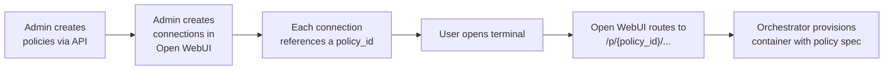

# Policies

Policies are named environment profiles that define what a terminal container looks like — its image, resource limits, storage, environment variables, and idle timeout. They let you offer different terminal environments to different teams from a single orchestrator.

For example, you might create a `data-science` policy with a large image, 4 CPU cores, and 16 GiB of memory, while a `development` policy uses the default slim image with 1 CPU and 2 GiB.

---

## How policies work



1. **Admin creates policies** on the orchestrator via its REST API (see [API reference](#api-reference) below).
2. **Admin creates terminal connections** in Open WebUI under **Settings → Connections → Open Terminal**. Each connection includes a `policy_id` field that maps it to a policy on the orchestrator.
3. **Users open a terminal** — Open WebUI routes the request through `/p/{policy_id}/...`, and the orchestrator provisions (or reuses) a container matching that policy's spec.

Each user gets their own isolated container per policy. If a user has access to two connections with different policies, they get two independent terminals.

---

## Policy fields

All fields are optional. When a field is omitted, the orchestrator falls back to its global default (set via environment variables).

| Field | Type | Default | Description |
| :--- | :--- | :--- | :--- |
| `image` | string | `TERMINALS_IMAGE` · `ghcr.io/open-webui/open-terminal:latest` | Container image to run |
| `cpu_limit` | string | No limit | Maximum CPU (e.g., `"2"`, `"500m"`) |
| `memory_limit` | string | No limit | Maximum memory (e.g., `"4Gi"`, `"512Mi"`) |
| `storage` | string | None (ephemeral) | Persistent volume size (e.g., `"10Gi"`). When absent, the container uses ephemeral storage that is lost when the container is removed. |
| `storage_mode` | string | `TERMINALS_KUBERNETES_STORAGE_MODE` · `per-user` | How persistent volumes are provisioned: `per-user`, `shared`, or `shared-rwo`. See [Storage modes](#storage-modes). Only applies to Kubernetes backends. |
| `env` | object | `{}` | Key-value environment variables injected into the container |
| `idle_timeout_minutes` | integer | `TERMINALS_IDLE_TIMEOUT_MINUTES` · `0` (disabled) | Minutes of inactivity before the container is stopped and removed |

### Storage modes

The `storage_mode` field controls how persistent volumes are allocated on Kubernetes backends. It has no effect on the Docker backend (which always bind-mounts a host directory).

| Mode | Behavior | PVC access mode |
| :--- | :--- | :--- |
| `per-user` | Each user gets their own PVC. Full isolation. | ReadWriteOnce |
| `shared` | A single PVC is shared by all users, with each user's data in a `subPath` under their user ID. Requires a storage class that supports ReadWriteMany (e.g., NFS, EFS). | ReadWriteMany |
| `shared-rwo` | A single ReadWriteOnce PVC is shared. All terminal pods are scheduled to the same node via pod affinity (Kubernetes ensures they all land on the machine that has the volume mounted). Useful when ReadWriteMany storage is unavailable. | ReadWriteOnce |

**ReadWriteOnce (RWO)** means the volume can only be mounted by pods on a single node at a time. **ReadWriteMany (RWX)** means multiple nodes can mount and write to the volume simultaneously.

### Environment variables

The `env` field injects arbitrary key-value pairs as environment variables in the terminal container. Common uses:

- **API keys** — give users access to LLM APIs, cloud services, etc.
- **Egress filtering** — set `OPEN_TERMINAL_ALLOWED_DOMAINS` to restrict outbound network access (e.g., `"*.pypi.org,github.com"`). When this variable is present, the Docker backend automatically adds the `NET_ADMIN` capability to the container.
- **Custom configuration** — any setting your terminal image supports

:::warning
Environment variables in a policy are visible to the terminal user (they can run `env` in the shell). Do not store secrets here that users should not see.
:::

---

## Managing policies

Policies are managed via the orchestrator's REST API. All endpoints require authentication with the orchestrator's API key.

:::tip New to REST APIs?
The examples below use `curl`, a command-line tool for making HTTP requests. You can also use graphical tools like [Postman](https://www.postman.com/) or [HTTPie Desktop](https://httpie.io/) if you prefer. The key concepts: `PUT` creates or updates a resource, `GET` retrieves it, and `DELETE` removes it.
:::

### Create a policy

```bash
curl -X PUT http://localhost:3000/api/v1/policies/data-science \
  -H "Authorization: Bearer $TERMINALS_API_KEY" \
  -H "Content-Type: application/json" \
  -d '{
    "image": "ghcr.io/open-webui/open-terminal:latest",
    "cpu_limit": "4",
    "memory_limit": "16Gi",
    "storage": "20Gi",
    "env": {
      "OPEN_TERMINAL_ALLOWED_DOMAINS": "*.pypi.org,github.com,huggingface.co"
    },
    "idle_timeout_minutes": 60
  }'
```

### List policies

```bash
curl http://localhost:3000/api/v1/policies \
  -H "Authorization: Bearer $TERMINALS_API_KEY"
```

### Get a single policy

```bash
curl http://localhost:3000/api/v1/policies/data-science \
  -H "Authorization: Bearer $TERMINALS_API_KEY"
```

### Update a policy

Use `PUT` to upsert — it creates the policy if it doesn't exist:

```bash
curl -X PUT http://localhost:3000/api/v1/policies/data-science \
  -H "Authorization: Bearer $TERMINALS_API_KEY" \
  -H "Content-Type: application/json" \
  -d '{
    "cpu_limit": "8",
    "memory_limit": "32Gi"
  }'
```

:::info
Updating a policy does not affect running terminals. The new spec applies the next time a container is provisioned for that policy (e.g., after the old one is reaped by idle timeout or manually deleted).
:::

### Delete a policy

```bash
curl -X DELETE http://localhost:3000/api/v1/policies/data-science \
  -H "Authorization: Bearer $TERMINALS_API_KEY"
```

---

## Connecting policies to Open WebUI

Once a policy exists on the orchestrator, you wire it up in Open WebUI so users can reach it.

### 1. Add a terminal connection

In the Open WebUI admin panel, go to **Settings → Connections** and add an Open Terminal connection:

| Field | Value |
| :--- | :--- |
| **URL** | The orchestrator's URL (e.g., `http://terminals-orchestrator:3000`) |
| **API Key** | The orchestrator's `TERMINALS_API_KEY` |
| **Policy ID** | The policy name you created (e.g., `data-science`) |

When you save, Open WebUI routes all requests for this connection through `/p/data-science/...` on the orchestrator.

### 2. Restrict access with groups

Each terminal connection supports **access grants** that control which users or groups can see it. This lets you offer different policies to different teams:

```json
[
  {
    "url": "http://orchestrator:3000",
    "key": "sk-...",
    "policy_id": "development",
    "config": {
      "access_grants": [
        { "principal_type": "group", "principal_id": "engineering", "permission": "read" }
      ]
    }
  },
  {
    "url": "http://orchestrator:3000",
    "key": "sk-...",
    "policy_id": "data-science",
    "config": {
      "access_grants": [
        { "principal_type": "group", "principal_id": "data-team", "permission": "read" }
      ]
    }
  }
]
```

In this example, the engineering group sees only the `development` terminal, while the data team sees only the `data-science` terminal. A user who belongs to both groups would see both.

---

## Hard caps

Administrators can set global limits on the orchestrator that **clamp** policy values, preventing any policy from exceeding the allowed maximums. These are set as environment variables on the orchestrator itself:

| Environment variable | Example | Description |
| :--- | :--- | :--- |
| `TERMINALS_MAX_CPU` | `8` | Maximum CPU any policy can request. Policies requesting more are silently clamped to this value. |
| `TERMINALS_MAX_MEMORY` | `32Gi` | Maximum memory any policy can request |
| `TERMINALS_MAX_STORAGE` | `100Gi` | Maximum persistent storage any policy can request |
| `TERMINALS_ALLOWED_IMAGES` | `ghcr.io/open-webui/*,gcr.io/my-org/*` | Comma-separated glob patterns. If set, a policy's `image` must match at least one pattern or the request is rejected with HTTP 400. |

Hard caps are enforced at policy creation and update time. If a policy's `cpu_limit` is `"16"` but `TERMINALS_MAX_CPU` is `"8"`, the stored value is clamped to `"8"`.

:::tip
Hard caps give platform administrators a safety net — they can delegate policy creation to team leads while ensuring no single policy can consume an unreasonable amount of cluster resources.
:::

---

## The "default" policy

When a terminal connection in Open WebUI has no `policy_id` set (or the orchestrator receives a request without a `/p/` prefix), the orchestrator uses its **global settings** as the effective policy:

| Setting | Environment variable |
| :--- | :--- |
| Image | `TERMINALS_IMAGE` |
| Idle timeout | `TERMINALS_IDLE_TIMEOUT_MINUTES` |
| Storage mode | `TERMINALS_KUBERNETES_STORAGE_MODE` |

This is equivalent to a single-policy deployment. No database entry is needed.

If you create a policy named `default` in the database, its fields are merged with the global settings (policy values take precedence).

---

## API reference

All endpoints are prefixed with `/api/v1` on the orchestrator and require the `Authorization: Bearer {TERMINALS_API_KEY}` header.

| Method | Endpoint | Description |
| :--- | :--- | :--- |
| `GET` | `/policies` | List all policies |
| `POST` | `/policies` | Create a new policy (body: `{ "id": "...", "data": { ... } }`) — returns 409 if it already exists |
| `GET` | `/policies/{policy_id}` | Get a single policy |
| `PUT` | `/policies/{policy_id}` | Create or update a policy (body: `PolicyData` fields) |
| `DELETE` | `/policies/{policy_id}` | Delete a policy |

### Request body — PolicyData

```json
{
  "image": "ghcr.io/open-webui/open-terminal:latest",
  "cpu_limit": "4",
  "memory_limit": "16Gi",
  "storage": "20Gi",
  "storage_mode": "per-user",
  "env": { "KEY": "value" },
  "idle_timeout_minutes": 60
}
```

All fields are optional. Omitted fields inherit from the orchestrator's global defaults.

### Response body — PolicyResponse

```json
{
  "id": "data-science",
  "data": {
    "image": "ghcr.io/open-webui/open-terminal:latest",
    "cpu_limit": "4",
    "memory_limit": "16Gi",
    "storage": "20Gi",
    "env": { "OPEN_TERMINAL_ALLOWED_DOMAINS": "*.pypi.org" },
    "idle_timeout_minutes": 60
  },
  "created_at": "2025-06-01T12:00:00",
  "updated_at": "2025-06-01T12:00:00"
}
```

---

## Example: multi-team setup

A company with three teams — Engineering, Data Science, and Interns — wants different terminal environments:

### 1. Create the policies

```bash
# Engineering: default image, moderate resources, persistent storage
curl -X PUT http://orchestrator:3000/api/v1/policies/engineering \
  -H "Authorization: Bearer $KEY" -H "Content-Type: application/json" \
  -d '{"cpu_limit":"2","memory_limit":"4Gi","storage":"10Gi","idle_timeout_minutes":120}'

# Data Science: custom image, high resources, large storage
curl -X PUT http://orchestrator:3000/api/v1/policies/data-science \
  -H "Authorization: Bearer $KEY" -H "Content-Type: application/json" \
  -d '{"image":"ghcr.io/open-webui/open-terminal:latest","cpu_limit":"8","memory_limit":"32Gi","storage":"50Gi","env":{"OPEN_TERMINAL_ALLOWED_DOMAINS":"*.pypi.org,huggingface.co"}}'

# Interns: limited resources, no persistent storage, short idle timeout
curl -X PUT http://orchestrator:3000/api/v1/policies/intern \
  -H "Authorization: Bearer $KEY" -H "Content-Type: application/json" \
  -d '{"cpu_limit":"1","memory_limit":"1Gi","idle_timeout_minutes":15}'
```

### 2. Create terminal connections in Open WebUI

Add three connections, each pointing to the same orchestrator URL but with different `policy_id` values: `engineering`, `data-science`, and `intern`.

### 3. Assign groups

Use access grants on each connection to restrict visibility:

- **Engineering connection** → `engineering` group
- **Data Science connection** → `data-science` group
- **Intern connection** → `interns` group

Users in the `engineering` group see only the Engineering terminal. Data scientists see only theirs. Interns get limited resources with auto-cleanup after 15 minutes of inactivity.
