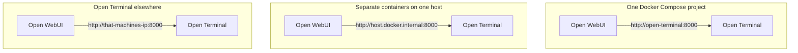

# Connecting Open Terminal to Open WebUI

Open Terminal is [installed and running](./installation). This guide covers connecting it to Open WebUI.

---

## Recommended: Admin settings

Recommended for all deployments, including single-user. An admin connection keeps the API key server-side.


### 1. Open Settings

Click your **name** at the bottom of the left sidebar to open the user menu, then click **Settings**.


### 2. Go to Settings > Admin > Integrations

In the settings sidebar, find the **Admin** section and click **Integrations**.

The settings sidebar lists **Integrations** twice, once under **Personal** in the *Services* group and once under **Admin** in the *Tools* group. Open Terminal belongs in the Admin one. Configuring the personal entry connects the terminal to your account alone and the deployment will not work as described here.


### 3. Find the "Open Terminal" section

Scroll down until you see the **Open Terminal** section.


:::warning Don't confuse it with "Tools"
Open Terminal has its **own section** under Integrations. Don't add it under "External Tools" or "Tool Servers". Using the dedicated section gives you the built-in file browser and terminal sidebar.
:::

### 4. Click + and fill in the details

| Field | What to enter |
| :--- | :--- |
| **URL** | `http://localhost:8000` (or `http://open-terminal:8000` if using Docker Compose) |
| **API Key** | The password you chose during installation |
| **Auth Type** | Leave as `Bearer` (the default) |
| **Chat Uploads** | Leave as `Default`. [Chat Uploads](#chat-uploads) covers what `Filesystem` changes |


### 5. Save

Click **Save**. The connection appears under **Open Terminal** with its toggle switched on.


### 6. (Optional) Restrict access to specific groups

Limit terminal access to specific user groups via the access control button.


:::tip Orchestrator connections can be scoped further
A connection Open WebUI has detected as a [Terminals orchestrator](/features/open-terminal/terminals/) gets an extra **Orchestrator > Terminal Contexts** section, where you decide whether the terminal is offered in chats and in automations, and whether everything shares one workspace or each saved chat or automation gets its own. See [Terminal Contexts](/features/open-terminal/terminals/orchestration/contexts). A direct Open Terminal connection has no such setting and is always available in both.

The same section carries a **Policy** block that takes environment variables for the terminals the orchestrator starts. That is where you set `OPEN_TERMINAL_SYSTEM_PROMPT` to replace the generated system prompt with your own, along with any other [environment variable](/features/open-terminal/terminals/orchestration/environment-variables) those terminals should run with. See [System Prompts](/features/open-terminal/terminals/orchestration/system-prompts) for the template placeholders.
:::

### 7. Select a terminal in chat

In the chat input area, click the **terminal button** (cloud icon ☁). Your admin-configured terminals appear under **System**. Select one to activate it for the conversation.


The selected terminal name appears next to the cloud icon. The AI can now execute commands, read files, and run code through it.

### 8. Enable native function calling

Native function calling is the default tool-calling mode as of v0.10.0, so it is already active for new models. The only thing to check is that the model was not switched to **Legacy**:

1. Go to **Workspace → Models**
2. Click the edit button on the model you're using
3. Make sure **Function Calling** is set to **Native** (the default), not **Legacy**
4. Save


:::warning Legacy Mode is less reliable for tools
If the model is set to **Legacy**, Open WebUI falls back to prompt-based tool calling instead of the provider's structured tool-call format. That is less reliable and may not trigger terminal commands at all. Native (the default) is recommended.
:::

:::tip Performance depends on the model
Not all models are equally capable with tools. Multi-step terminal workflows are the most demanding agentic use case in Open WebUI, so this is one place where a top-tier model genuinely pays off — GPT-5.6 Sol, Claude Opus 5, or Gemini 3.5 Pro. A current mid-tier model (GPT-5.6 Terra, Claude Sonnet 5, Gemini 3.6 Flash, MiniMax M3) is the practical **minimum**. Older or very small models may fail to invoke tools or produce malformed tool calls. If results are poor, try a more capable model.
:::

### 9. Try it out

Ask your AI something like:

> "What operating system are you running on?"

The AI should use Open Terminal to run a command and tell you the answer.


:::tip Pre-configure via environment variable
For Docker deployments, you can configure terminal connections automatically using the `TERMINAL_SERVER_CONNECTIONS` environment variable, which is useful when you want everything set up at startup without manual steps.
:::

---

## Personal Settings (testing only)

:::caution Not recommended for regular use
Adding a terminal connection via personal Settings sends the API key to your browser and routes requests directly from it. This is fine for **quick testing**, but for anything beyond that, use Admin Settings instead. It's more secure and works for all users automatically.
:::

If you need to test a connection without admin access, you can add one from the **Personal** part of settings, under *Services*, at **Integrations → Open Terminal**. The same URL and API key fields apply, and the connection is yours alone rather than the instance's.

---

## Chat Uploads

**Chat Uploads** on the connection form decides where a file attached in the chat input goes while that terminal is selected.

`Default` uploads the file to Open WebUI, extracts its text and hands the model the contents to read, through retrieval or in full depending on the chat's settings. It is what a connection nobody has touched does, and what happens with no terminal selected at all.

`Filesystem` writes the file into the terminal. It lands in the terminal's current working directory, the same place the [file browser](../file-browser) is showing, and appears there straight away. Nothing is stored in Open WebUI, no text is extracted and no retrieval runs, so the model never receives the contents. It receives the path and opens the file with the terminal's own tools, the way it reads anything else in the workspace.

A zip archive, an SQLite database, a video file, an export far larger than a context window: text extraction has little to offer for any of them, and a shell handles all of them. Attaching one this way puts it where the commands the model runs can reach it.

Four things change with it:

- **The model no longer needs to support file upload.** With `Default`, attaching a file while a model without that capability is selected reports "Model(s) do not support file upload" and nothing uploads. With `Filesystem` the file never reaches the model as an attachment, so that check does not run.
- **The model is told the path only when it can act on it.** Open WebUI passes the paths of attached files to the model alongside the message when the model is using native function calling in a saved conversation. Set the model to [Legacy](#8-enable-native-function-calling) function calling, or turn its **Builtin Tools** capability off, and the file still reaches the terminal while the model is left without its location.
- **Images go the same way.** An image attached to a saved conversation is written to the working directory rather than passed to the model as a picture. Open WebUI still checks it against the selected models' image support first, so a model with no vision support turns it away at the input.
- **Upload limits still apply.** The maximum file size and the maximum number of attachments configured for Open WebUI are both checked before anything is sent, so `Filesystem` does not lift them.

The field is on every terminal connection, the ones an administrator adds and the ones you add under your own settings.


---

## Troubleshooting

### "Connection failed" or timeout

This almost always means Open WebUI can't reach Open Terminal over the network. What URL to use depends on your setup:

| Your setup | URL to use |
| :--- | :--- |
| Docker Compose (recommended) | `http://open-terminal:8000` |
| Separate Docker containers | `http://host.docker.internal:8000` |
| Both on same machine, no Docker | `http://localhost:8000` |
| Open Terminal on another machine | `http://that-machines-ip:8000` |



Compose gives the containers a shared network and resolves the service name, so the service name is the address. Separate containers have no shared name to resolve, so the request goes back out through the host. A terminal on another machine is reached the way any other host is.

`localhost` only works when neither side is containerised, because inside a container `localhost` is that container rather than the machine it runs on. That is the most common cause of the timeout this section is about.

:::tip Quick check
Run this command to see if Open WebUI can reach Open Terminal:

```bash
docker exec open-webui curl -s http://open-terminal:8000/health
```

If it prints `{"status": "ok"}`, the connection works. If it errors, the containers can't see each other.
:::

### Nothing happens when you save a new connection

Adding a connection works whether you reach Open WebUI over `https://` or over plain `http://`. On older versions the **Add Terminal Connection** dialog stayed open and saved nothing when the interface was reached over plain `http://` at a network address, a LAN IP for example, rather than on `localhost`. Browsers withhold the identifier generator a new connection needs on origins they do not treat as secure, and a new connection gets its identifier automatically when you leave the optional **ID** field blank. Typing an **ID** of your own works around it, because then there is nothing to generate.

Only creating a connection from **Settings > Admin > Integrations** was affected. Editing, enabling, disabling or deleting an existing one, adding one under your own **Settings > Integrations** and connections shipped in [`TERMINAL_SERVER_CONNECTIONS`](/reference/env-configuration#terminal_server_connections) all worked regardless.

### Terminal shows up but AI doesn't use it

Make sure:
- The toggle switch next to the connection is **turned on**. Turning it off takes the terminal server out of service completely: the model is not given its tools, the terminal and file browser refuse to connect, and any proxied request to it is rejected. It is a working off switch, not just a hint to the model, so use it to retire a server without deleting the connection.
- You've **refreshed the page** after adding the connection
- Your model supports tool calling (most modern models do)

### Terminal is missing from the picker

Only terminals the user is allowed to use are listed, so check the connection's access grants and that the connection is enabled.

For an orchestrator connection, [Terminal Contexts](/features/open-terminal/terminals/orchestration/contexts) also decides this. A terminal whose **Chat** context is **Off** never appears in a chat, and one set to **Per chat** is hidden in temporary chats because it needs a saved conversation to attach to.

### Wrong API key

If you see "unauthorized" or "invalid key":
- Double-check the key matches what you set during installation
- If you forgot it, run `docker logs open-terminal` and look for the `API key:` line

## Next steps

- **[Code execution](../use-cases/code-execution)**
- **[Document & data analysis](../use-cases/file-analysis)**
- **[Software development](../use-cases/software-development)**
- **[File browser](../file-browser)**
