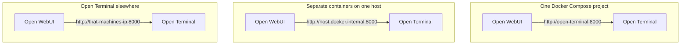

# Connecting Open Terminal to Open WebUI

Open Terminal is [installed and running](./installation.mdx). This guide covers connecting it to Open WebUI.

To let Open WebUI install Open Terminal on a server or laptop for you, see [SSH Machines](./ssh-machines.md). To run it on the server Open WebUI itself runs on, see [Local Machine](./local-machine.md).

---

## Recommended: Admin settings

Recommended for all deployments, including single-user. An admin connection keeps the API key server-side.


### 1. Open Settings

Click your **name** at the bottom of the left sidebar to open the user menu, then click **Settings**.


### 2. Go to Settings > Integrations (admin section)

In the settings sidebar, find the **Admin** section and click **Integrations**.


### 3. Find the "Open Terminal" section

Scroll down until you see the **Machines** section with the **Open Terminal** connections. It is greyed out when [`ENABLE_TOOL_SERVERS`](/reference/env-configuration#enable_tool_servers) is set to `False`.


:::warning Don't confuse it with "Tools"
Add Open Terminal in the **Machines** section, not in the **Tools** section under **External Tool Servers**. Only the **Machines** section gives you the built-in file browser and terminal sidebar.
:::

### 4. Click + and fill in the details

| Field | What to enter |
| :--- | :--- |
| **URL** | `http://localhost:8000` (or `http://open-terminal:8000` if using Docker Compose) |
| **API Key** | The password you chose during installation |
| **Auth** | Leave as `Bearer` (the default). [Auth](#auth) covers why the other options break the interactive terminal |
| **Chat Uploads** | Starts on `Filesystem` for a new connection. [Chat Uploads](#chat-uploads) covers what each option does |
| **Working Directory Context** | Under **Advanced**, on by default. [Working Directory Context](#working-directory-context) covers when to turn it off |
| **User Shell Tools** | Under **Advanced**. Leave as `Automatic`. [User Shell Tools](#user-shell-tools) covers what `Always Include` changes |
| **Forward cookies** | Under **Advanced**, off by default. Only turn it on for a machine that authenticates by cookie, since every cookie the browser holds for your Open WebUI domain travels with the request |


### 5. Save

Click **Save**. The connection appears under **Open Terminal** with its toggle switched on.


### 6. (Optional) Restrict access to specific groups

Limit access to specific user groups via the access control button.


:::tip Orchestrator connections can be scoped further
A connection to a [Terminals orchestrator](/features/open-terminal/terminals/) has **Read** and **Write** access. Users with **Write** create their own machines from the machine menu in the message input, each with its own image, resources, environment variables and sharing. See [Creating Machines](/features/open-terminal/terminals/orchestration/creating-terminals). A direct Open Terminal connection has no machines to create and is available to everyone with access.
:::

### 7. Select a machine in chat

In the chat input area, click the cloud icon. Your machines appear under **Machines**. Select one to activate it for the conversation.


The selected machine name appears next to the cloud icon. The AI can now execute commands, read files, and run code through it. You can pick another machine at any time except while a reply is generating.

Hover over a machine in the menu, click its **More** button and choose **System info** to see the CPU, memory, disk and network use, the uptime and the top processes it reports. The view refreshes every 5 seconds while it is open. For a machine with a separate instance per chat, **System info** appears once the chat is saved.

### 8. Enable native function calling

Native function calling is the default tool-calling mode, so it is already active for new models. The only thing to check is that the model was not switched to **Legacy**:

1. Go to **Workspace → Models**
2. Click the edit button on the model you're using
3. Make sure **Function Calling** is set to **Default** or **Native**, not **Legacy**
4. Save


:::warning Legacy Mode is less reliable for tools
If the model is set to **Legacy**, Open WebUI falls back to prompt-based tool calling instead of the provider's structured tool-call format. That is less reliable and may not trigger terminal commands at all. Native (the default) is recommended.
:::

:::tip Performance depends on the model
Not all models are equally capable with tools. Multi-step terminal workflows are the most demanding agentic use case in Open WebUI, so this is one place where a top-tier model genuinely pays off: GPT-5.6 Sol, Claude Opus 5 or Gemini 3.5 Pro. A current mid-tier model (GPT-5.6 Terra, Claude Sonnet 5, Gemini 3.6 Flash, MiniMax M3) is the practical **minimum**. Older or very small models may fail to invoke tools or produce malformed tool calls. If results are poor, try a more capable model.
:::

### 9. Try it out

Ask your AI something like:

> "What operating system are you running on?"

The AI should use Open Terminal to run a command and tell you the answer.


:::tip Pre-configure via environment variable
For Docker deployments, you can configure machines automatically using the [`MACHINE_CONNECTIONS`](/reference/env-configuration#machine_connections) environment variable, which is useful when you want everything set up at startup without manual steps.
:::

---

## Your own machine (Tether)

Without admin access, add a machine in the Tether app. It is yours alone and its URL and key stay on your computer. See [Bring Your Own Models and Tools](/ecosystem/tether#bring-your-own-models-and-tools).

---

## Auth

**Auth** on the connection form decides what Open WebUI sends the terminal server as credentials. The model's tools and the file browser's listings, reads and uploads go over HTTP. The shell in a **New Terminal** tab, the file browser's live refresh and listening ports, the **Desktop** tab and the streamed output of running commands go over a websocket. The two paths send different things:

| Auth | HTTP requests | Websocket connections |
| :--- | :--- | :--- |
| `Bearer` | The **API Key** as a bearer token | The **API Key** |
| `None` | No key | An empty token |
| `Session` | The user's own Open WebUI token as a bearer token | An empty token |
| `OAuth` | The user's OAuth access token as a bearer token, when they have an OAuth sign-in session | An empty token |

`Bearer` is the only option that sends the **API Key**, and the only one that authenticates both paths. With `Session` or `OAuth` the model's tools and the file browser can work against a terminal server that accepts that token, while every websocket feature reaches the server with an empty token. Those features work only if the terminal server accepts a connection with no key. Open Terminal is set up with an API key, so keep `Bearer` for it.

Terminals created from a [Terminals orchestrator](/features/open-terminal/terminals/) connection always use `Bearer` with the connection's **API Key**, whatever **Auth** is set to.

---

## Chat Uploads

**Chat Uploads** on the connection form decides where a file attached in the chat input goes while that machine is selected.

`Default` uploads the file to Open WebUI, extracts its text and hands the model the contents to read, through retrieval or in full depending on the chat's settings. It is what happens with no machine selected at all.

New machines start on `Filesystem`, and [Tether](/ecosystem/tether) machines always use it.

`Filesystem` writes the file into the machine's working folder, the folder the [file browser](../file-browser.md) has open or the machine's current working directory, and it appears there straight away. Nothing is stored in Open WebUI, no text is extracted and no retrieval runs, so the model never receives the contents. It receives the path and opens the file with the machine's own tools, the way it reads anything else in the workspace.

A zip archive, an SQLite database, a video file, an export far larger than a context window: text extraction has little to offer for any of them, and a shell handles all of them. Attaching one this way puts it where the commands the model runs can reach it.

Four things change with it:

- **The model does not need to support file upload.** With `Default`, attaching a file while a model without that capability is selected reports "Model(s) do not support file upload" and nothing uploads. With `Filesystem` the file never reaches the model as an attachment, so that check does not run.
- **The model is told the path only when it can act on it.** Open WebUI passes the paths of attached files to the model alongside the message when the model is using native function calling in a saved conversation. Set the model to [Legacy](#8-enable-native-function-calling) function calling, or turn its **Builtin Tools** capability off, and the file still reaches the terminal while the model is left without its location.
- **Images go the same way.** An image attached to a saved conversation is written to the working directory rather than passed to the model as a picture. Open WebUI still checks it against the selected models' image support first, so a model with no vision support turns it away at the input.
- **Upload limits still apply.** The maximum file size and the maximum number of attachments configured for Open WebUI are both checked before anything is sent, so `Filesystem` does not lift them.

On a machine with a [separate instance per chat](/features/open-terminal/terminals/orchestration/creating-terminals#machine-scope), a file attached to a new chat's first message uploads into that chat's instance when you send it.

The field is on every machine an administrator adds. [Tether](/ecosystem/tether) machines always use **Automatic**.


---

## Working Directory Context

**Working Directory Context** is under **Advanced** on connections an administrator adds. It is on by default. While it is on, Open WebUI asks the terminal for its current working directory on every message and writes it into the instructions of the command tool, so the model knows where its commands run.

Tool instructions are part of the cached prefix of every request, so each change of directory starts the provider's [prompt cache](/features/chat-conversations/prompt-caching) over. Turn the switch off to keep the instructions identical from message to message.

## User Shell Tools

A **New Terminal** tab, from the **+** menu of the **Tabs**, is your own shell. Two tools let the model read that shell's recent output and send input to it. **User Shell Tools**, under **Advanced**, decides when the model gets them:

- `Automatic` (default): only while your shell for that machine is open in the chat you are sending from. Before each message, Open WebUI asks the terminal server whether it is.
- `Always Include`: on every message, open shell or not. The tool list stays the same from message to message, which keeps the [prompt cache](/features/chat-conversations/prompt-caching) intact when you open and close the shell.

Automations and sub-agents never get the two tools. The field is on every machine an administrator adds. [Tether](/ecosystem/tether) machines always use **Automatic**.

## AGENTS.md

When a terminal is selected in the chat, Open WebUI reads `AGENTS.md` from the home folder of the terminal's user on every message. Its content is added to the conversation as a user message just before the first user message, so the model gets your standing instructions for that workspace. Edits to the file apply from the next message. Windows home folders work too.

A file larger than 32 KiB is skipped, and so is a read that takes longer than 5 seconds. A machine an admin configured is read by the Open WebUI server. A machine a user added in the Tether app is read through Tether, so the Tether app has to stay connected.

---

## Troubleshooting

### "Connection failed" or timeout

This almost always means Open WebUI can't reach Open Terminal over the network. What URL to use depends on your setup:

| Your setup | URL to use |
| :--- | :--- |
| Docker Compose (recommended) | `http://open-terminal:8000` |
| Separate Docker containers | `http://host.docker.internal:8000` |
| Both on same machine, no Docker | `http://localhost:8000` |
| Open Terminal on another machine | `http://that-machines-ip:8000` |


```mermaid
flowchart TB
    subgraph Compose["One Docker Compose project"]
        direction LR
        W1["Open WebUI"] -->|"http://open-terminal:8000"| T1["Open Terminal"]
    end
    subgraph Separate["Separate containers on one host"]
        direction LR
        W2["Open WebUI"] -->|"http://host.docker.internal:8000"| T2["Open Terminal"]
    end
    subgraph Remote["Open Terminal elsewhere"]
        direction LR
        W3["Open WebUI"] -->|"http://that-machines-ip:8000"| T3["Open Terminal"]
    end
```

Compose gives the containers a shared network and resolves the service name, so the service name is the address. Separate containers have no shared name to resolve, so the request goes back out through the host. A terminal on another machine is reached the way any other host is.

`localhost` only works when neither side is containerised, because inside a container `localhost` is that container rather than the machine it runs on. That is the most common cause of the timeout this section is about.

:::tip Quick check
Run this command to see if Open WebUI can reach Open Terminal:

```bash
docker exec open-webui curl -s http://open-terminal:8000/health
```

If it prints `{"status": "ok"}`, the connection works. If it errors, the containers can't see each other.
:::

### Machine shows up but AI doesn't use it

Make sure:
- The toggle switch next to the connection is **turned on**. Turning it off takes the machine out of service completely: the model is not given its tools, the terminal and file browser refuse to connect, and any proxied request to it is rejected. It is a working off switch, not just a hint to the model, so use it to retire a machine without deleting the connection.
- You've **refreshed the page** after adding the connection
- Your model supports tool calling (most modern models do)

### Machine is missing from the picker

Only machines the user is allowed to use are listed, so check the connection's access grants and that the connection is enabled.

For an orchestrator connection, a machine is listed for you only when it is shared with you or you have **Write** access to the connection. A machine with a separate instance per chat is hidden in temporary chats because it needs a saved conversation. See [Creating Machines](/features/open-terminal/terminals/orchestration/creating-terminals#machine-scope).

### Command output is empty

The `run_command` result shows `"status": "running"` and an empty `output` list. `run_command` starts the command in the background and returns its command ID right away. It waits for the command only when the call sends a `wait` value (up to `300` seconds) or the server sets `OPEN_TERMINAL_EXECUTE_TIMEOUT`, which is unset by default. The model reads the output later by calling `get_process_status` with that ID, which accepts `wait` too.

To get the output of short commands in the first result, set `OPEN_TERMINAL_EXECUTE_TIMEOUT` on the Open Terminal server, for example `OPEN_TERMINAL_EXECUTE_TIMEOUT=5`, and restart it. A command that finishes sooner returns as soon as it ends. A command that runs longer still returns status `running`, and its output comes from `get_process_status`. See [Configuration](/features/open-terminal/advanced/configuration).

### File browser shows Permission denied in multi-user mode

When the file browser fails with `403` and `Permission denied` on a machine in [multi-user mode](/features/open-terminal/advanced/multi-user) while the model can still read files, check where `/home` is stored. See [Home folders on network storage](/features/open-terminal/advanced/multi-user#home-folders-on-network-storage).

### Wrong API key

If you see "unauthorized" or "invalid key":
- Double-check the key matches what you set during installation
- If you forgot it, run `docker logs open-terminal` and look for the `API Key:` line

## Next steps

- **[Code execution](../use-cases/code-execution.md)**
- **[Document & data analysis](../use-cases/file-analysis.md)**
- **[Software development](../use-cases/software-development.md)**
- **[File browser](../file-browser.md)**
