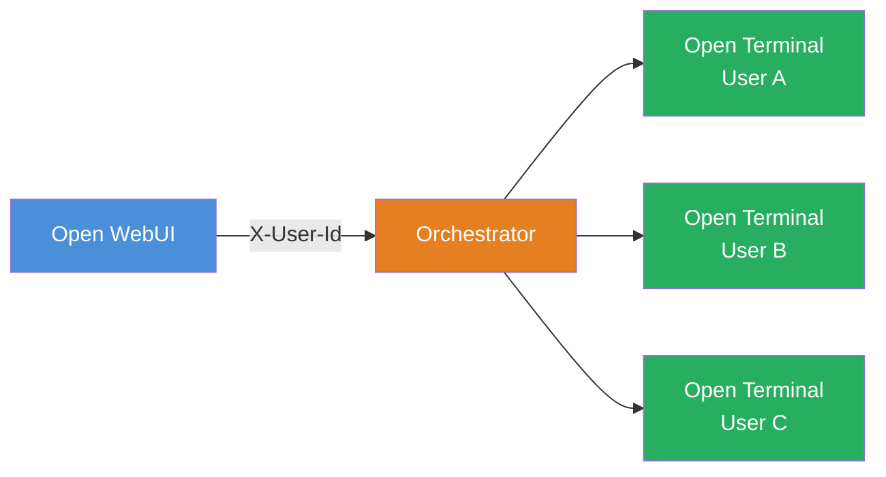

import Tabs from '@theme/Tabs';
import TabItem from '@theme/TabItem';

import Docker from './tab-deployment/Docker.md';
import Kubernetes from './tab-deployment/Kubernetes.md';

# Terminals (Orchestrator)

**Terminals** is an enterprise orchestration layer for [Open Terminal](/features/open-terminal) that provisions a fully isolated terminal container for every user. Instead of sharing a single container, each person gets their own, complete with separate files, processes, resource limits, and network isolation.

:::tip Quick navigation
- **Need different environments per team?** → [Policies guide](./policies)
:::

---

## How it works

The orchestrator sits between Open WebUI and the Open Terminal instances:

1. A user activates a terminal in Open WebUI.
2. Open WebUI proxies the request to the **orchestrator**, a service that manages the lifecycle of terminal containers.
3. The orchestrator provisions a personal Open Terminal container for that user (or reconnects to an existing one).
4. All traffic is proxied through the orchestrator. The user never connects to their container directly.
5. Idle containers are automatically cleaned up after a configurable timeout. Data optionally persists across sessions.

The orchestrator also exposes the same OpenAPI-based tool interface as Open Terminal, so the AI can execute commands, read files, and run code, all scoped to the requesting user's container.

---

## Deployment

<Tabs>
  <TabItem value="docker" label="Docker" default>
    

      <Docker />
    

  </TabItem>
  <TabItem value="kubernetes" label="Kubernetes Operator">
    

      <Kubernetes />
    

  </TabItem>
</Tabs>

---

## Authentication

The orchestrator supports three authentication modes:

| Mode | When to use | How to configure |
| :--- | :--- | :--- |
| **Open WebUI JWT** | Production. The orchestrator validates tokens against your Open WebUI instance. | Set `TERMINALS_OPEN_WEBUI_URL` on the orchestrator to your Open WebUI URL. |
| **Shared API key** | Standard. Open WebUI includes a shared secret in every request. | Set `TERMINALS_API_KEY` to the same value on both Open WebUI and the orchestrator. |
| **Open** | Development only. No authentication. Do not use in production. | Leave both `TERMINALS_OPEN_WEBUI_URL` and `TERMINALS_API_KEY` unset. |

When deployed via Docker Compose or Helm, the shared API key is configured automatically between Open WebUI and the orchestrator.

---

## Troubleshooting

### Terminal won't start

1. **Check orchestrator logs.** The orchestrator logs the full provisioning flow, including image pull and container creation. Look for errors related to image availability or resource limits.
2. **Verify the API key.** Ensure `TERMINALS_API_KEY` matches between Open WebUI and the orchestrator. A mismatch causes silent auth failures.
3. **Check image pull access.** If using a private container registry, make sure the orchestrator (Docker) or cluster (Kubernetes) has pull credentials configured.

### Authentication failures

- If using **JWT mode**, confirm `TERMINALS_OPEN_WEBUI_URL` points to a reachable Open WebUI instance.
- If using **API key mode**, confirm the key is set identically on both sides. Check for extra whitespace or newlines.
- Check the orchestrator logs for `401` or `403` responses.

### Container is reaped too quickly

Increase `TERMINALS_IDLE_TIMEOUT_MINUTES` (or `idle_timeout_minutes` in a policy). The default is `0` (disabled), but if set too low, containers may be cleaned up while users are still working. A value of `30` is typical.

### Connection refused

- **Docker:** ensure `TERMINALS_NETWORK` is set so containers can communicate by name. Without it, containers use published ports and the `TERMINALS_DOCKER_HOST` address must be reachable.
- **Kubernetes:** verify the orchestrator Service is accessible from the Open WebUI Pod. Run `kubectl get svc -n open-webui` to confirm the service exists.

---

## Further reading

- [Multi-User Setup](../advanced/multi-user): comparison of isolation approaches
- [Security best practices](../advanced/security)
- [Configuration reference](../advanced/configuration): all Open Terminal container settings

---

## License

Terminals requires an [Open WebUI Enterprise License](https://openwebui.com/enterprise) for production use. See the [Terminals repository](https://github.com/open-webui/terminals) for details.
