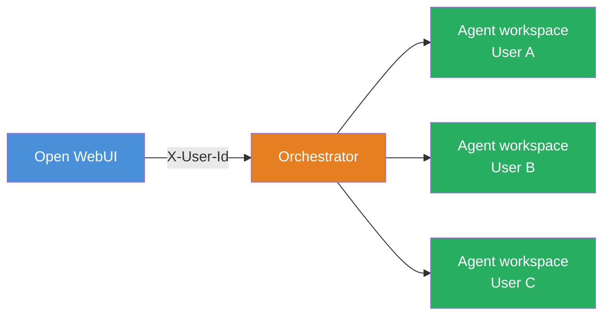

import Tabs from '@theme/Tabs';
import TabItem from '@theme/TabItem';

import Docker from './tab-deployment/Docker.md';
import Kubernetes from './tab-deployment/Kubernetes.md';

# Terminals (Orchestrator)

**Terminals** is the enterprise orchestration layer for [Open Terminal](/features/open-terminal). It provisions a dedicated computer substrate for every Open WebUI user: separate files, processes, package environment, resource limits, network boundary, and optional persistent storage.

Open Terminal turns one Open WebUI chat into a full agent harness with a real workspace for action. Terminals turns that into managed fleet infrastructure, so every user or policy can get the right workspace without sharing state or hand-wiring containers.

Open WebUI is where the harness is configured, governed, and observed. Terminals is the workspace lifecycle layer inside that harness: it provisions, isolates, reuses, refreshes, and resets the computer substrates agents use to do real work.

:::tip Quick navigation
- **Need to operate per-user terminal environments?** → [Orchestration](/features/open-terminal/terminals/orchestration)
:::

```mermaid
flowchart LR
    OW["Open WebUI"]
    OR["Orchestrator"]
    OW -->|X-User-Id| OR
    OR --> TA["Agent workspace<br/>User A"]
    OR --> TB["Agent workspace<br/>User B"]
    OR --> TC["Agent workspace<br/>User C"]

    style OW fill:#4a90d9,color:#fff
    style OR fill:#e67e22,color:#fff
    style TA fill:#27ae60,color:#fff
    style TB fill:#27ae60,color:#fff
    style TC fill:#27ae60,color:#fff
```

---

## How It Works

The orchestrator sits between Open WebUI and the per-user Open Terminal workspaces:

1. A user activates Open Terminal in Open WebUI.
2. Open WebUI proxies the request to the **orchestrator**, which manages workspace lifecycle.
3. The orchestrator resolves the selected policy: image, resources, storage, env vars, security context, and idle timeout.
4. The orchestrator provisions or reuses a personal Open Terminal workspace for that user and policy.
5. All traffic is proxied through the orchestrator. The user never connects to the workspace directly.
6. Idle workspaces are cleaned up after a configurable timeout. Files can persist across sessions when storage is enabled.

The orchestrator exposes the same OpenAPI-based tool interface as Open Terminal, so the AI can work with files, run code, execute commands, start servers, and inspect results, all scoped to the requesting user's workspace.

## Why It Matters

Terminals is what makes the full agent harness operable for teams. It lets admins give agents enough environment to do real work while still controlling the boundary:

| Need | What Terminals provides |
| :--- | :--- |
| Isolation | One workspace per user and policy, with separate files and processes |
| Governance | Policy-controlled images, env vars, resource limits, storage, and security context |
| Repeatability | Custom images and startup packages so users get the right tools every time |
| Lifecycle | Reuse, idle cleanup, refresh, and scheduled resets |
| Scale | Docker for a single host, Kubernetes/operator mode for larger deployments |
| Supportability | Admin UI, logs, status, policy APIs, and predictable routing |

In harness-engineering terms, Terminals owns the workspace lifecycle: provision, route, persist, reap, refresh, and reset.

:::info Admin UI (new in 0.0.4)
The orchestrator serves a built-in minimal admin UI at `/` for viewing terminal status, active sessions, and policies. It is on by default and toggled with `TERMINALS_ENABLE_UI`; set it to `false` for API-only deployments.
:::

---

## Deployment

<Tabs>
  <TabItem value="docker" label="Docker" default>
    

      <Docker />
    

  </TabItem>
  <TabItem value="kubernetes" label="Kubernetes Operator">
    

      <Kubernetes />
    

  </TabItem>
</Tabs>

---

## Authentication

The orchestrator supports three authentication modes:

| Mode | When to use | How to configure |
| :--- | :--- | :--- |
| **Open WebUI JWT** | Production. The orchestrator validates tokens against your Open WebUI instance. | Set `TERMINALS_OPEN_WEBUI_URL` on the orchestrator to your Open WebUI URL. |
| **Shared API key** | Standard. Open WebUI includes a shared secret in every request. | Set `TERMINALS_API_KEY` to the same value on both Open WebUI and the orchestrator. |
| **Open** | Development only. No authentication. Do not use in production. | Leave both `TERMINALS_OPEN_WEBUI_URL` and `TERMINALS_API_KEY` unset. |

When deployed via Docker Compose or Helm, the shared API key is configured automatically between Open WebUI and the orchestrator.

---

## Troubleshooting

### Terminal won't start

1. **Check orchestrator logs.** The orchestrator logs the full provisioning flow, including image pull and workspace creation. Look for errors related to image availability, policy configuration, or resource limits.
2. **Verify the API key.** Ensure `TERMINALS_API_KEY` matches between Open WebUI and the orchestrator. A mismatch causes silent auth failures.
3. **Check image pull access.** If using a private container registry, make sure the orchestrator (Docker) or cluster (Kubernetes) has pull credentials configured.

### Authentication failures

- If using **JWT mode**, confirm `TERMINALS_OPEN_WEBUI_URL` points to a reachable Open WebUI instance.
- If using **API key mode**, confirm the key is set identically on both sides. Check for extra whitespace or newlines.
- Check the orchestrator logs for `401` or `403` responses.

### Workspace is reaped too quickly

Increase `TERMINALS_IDLE_TIMEOUT_MINUTES` (or `idle_timeout_minutes` in a policy). The default is `0` (disabled), but if set too low, workspaces may be cleaned up while users are still working. A value of `30` is typical.

### Connection refused

- **Docker:** ensure `TERMINALS_NETWORK` is set so containers can communicate by name. Without it, containers use published ports and the `TERMINALS_DOCKER_HOST` address must be reachable.
- **Kubernetes:** verify the orchestrator Service is accessible from the Open WebUI Pod. Run `kubectl get svc -n open-webui` to confirm the service exists.

---

## Further reading

- [Multi-User Setup](/features/open-terminal/advanced/multi-user): comparison of isolation approaches
- [Security best practices](/features/open-terminal/advanced/security)
- [Configuration reference](/features/open-terminal/advanced/configuration): all Open Terminal container settings

---

## License

Terminals requires an [Open WebUI Enterprise License](https://openwebui.com/enterprise) for production use. See the [Terminals repository](https://github.com/open-webui/terminals) for details.
