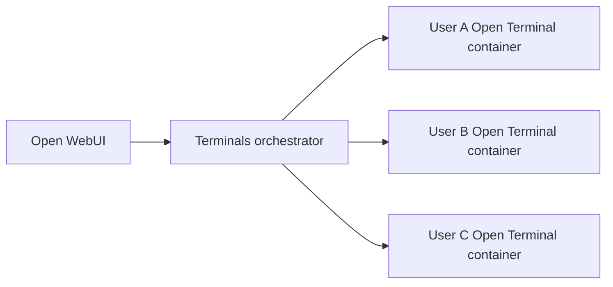

# Orchestration

The Terminals orchestrator gives each Open WebUI user a dedicated Open Terminal container. Open WebUI stores the connection, the orchestrator resolves policy, and Open Terminal runs inside the per-user container.

When a user opens a terminal, Open WebUI routes through `/p/{policy_id}/...`. The orchestrator provisions or reuses that user's container for the selected policy.

## Read This Section

- [Policies](/features/open-terminal/terminals/orchestration/policies): image selection, resources, storage, env vars, and idle timeout.
- [Environment Variables](/features/open-terminal/terminals/orchestration/environment-variables): raw env values, quote handling, forwarding behavior, and reserved keys.
- [Applying Changes](/features/open-terminal/terminals/orchestration/applying-changes): why changes affect newly provisioned terminals and how to refresh users.
- [Custom Images](/features/open-terminal/terminals/orchestration/custom-images): build, tag, push, configure, and roll out custom Open Terminal images.
- [Scheduled Resets](/features/open-terminal/terminals/orchestration/scheduled-resets): recurring reset schedules, idle-safe reset behavior, and what gets deleted.
- [OpenShift](/features/open-terminal/terminals/orchestration/openshift): restricted per-user terminal sandboxes on OpenShift.
- [System Prompts](/features/open-terminal/terminals/orchestration/system-prompts): generated prompts, `OPEN_TERMINAL_SYSTEM_PROMPT`, placeholders, and `OPEN_TERMINAL_INFO`.
- [File Browser Root](/features/open-terminal/terminals/orchestration/file-browser-home-boundary): how Open Terminal exposes a visual root for clients to render and clamp navigation.
- [API and Troubleshooting](/features/open-terminal/terminals/orchestration/api-troubleshooting): policy APIs, refresh API, and sharp support answers.

## Responsibilities

| Layer | Responsibility |
| :--- | :--- |
| Open WebUI | Stores the orchestrator connection, selects the policy, and presents the terminal and file browser UI |
| Terminals orchestrator | Authenticates requests, resolves policies, provisions containers, forwards env vars, applies idle timeout, and handles refresh/lifecycle work |
| Policy | Defines image, env, resources, storage, and idle timeout |
| Policy lifecycle | Defines maintenance behavior over time, such as scheduled resets of persisted terminal files |
| Open Terminal container | Executes commands, serves files, exposes OpenAPI tools, and reports file-browser root metadata |

## Orchestrator Environment Variables

These configure the orchestrator service itself, prefixed with `TERMINALS_` (or set in a `.env` file). They are distinct from the per-container `OPEN_TERMINAL_*` policy variables covered in [Environment Variables](/features/open-terminal/terminals/orchestration/environment-variables), which are forwarded into each user's container.

| Variable | Default | Description |
| :--- | :--- | :--- |
| `TERMINALS_BACKEND` | `docker` | Backend to use: `docker`, `kubernetes`, or `kubernetes-operator` |
| `TERMINALS_API_KEY` | *(unset)* | Bearer token for API auth. Unset means no auth (development only) |
| `TERMINALS_OPEN_WEBUI_URL` | *(unset)* | If set, validate JWTs against this Open WebUI instance |
| `TERMINALS_HOST` | `0.0.0.0` | Address the orchestrator HTTP server binds to |
| `TERMINALS_PORT` | `3000` | Port the orchestrator HTTP server listens on |
| `TERMINALS_ENABLE_UI` | `true` | Serve the built-in minimal admin UI at `/`. Set `false` for API-only deployments |
| `TERMINALS_LOG_LEVEL` | `INFO` | Minimum log level: `DEBUG`, `INFO`, `WARNING`, `ERROR`, or `CRITICAL` |
| `TERMINALS_DATABASE_URL` | `sqlite+aiosqlite:///<data>/terminals.db` | SQLAlchemy database URL. SQLite is the default; PostgreSQL is optional |
| `TERMINALS_IMAGE` | `ghcr.io/open-webui/open-terminal:latest` | Default container image when a policy sets none |
| `TERMINALS_NETWORK` | *(unset)* | Docker network for terminal containers. When set, containers are reached by name instead of published ports |
| `TERMINALS_DOCKER_HOST` | `127.0.0.1` | Address used to reach published container ports (Docker backend) |
| `TERMINALS_DATA_DIR` | `<data>/terminals` | Host directory holding per-user persisted files (Docker backend) |
| `TERMINALS_IDLE_TIMEOUT_MINUTES` | `0` | Tear down terminals after N minutes of inactivity (`0` = disabled) |
| `TERMINALS_MAX_CPU` | *(unset)* | Hard cap on CPU per container that policies cannot exceed |
| `TERMINALS_MAX_MEMORY` | *(unset)* | Hard cap on memory per container that policies cannot exceed |
| `TERMINALS_MAX_STORAGE` | *(unset)* | Hard cap on storage per container that policies cannot exceed |
| `TERMINALS_ALLOWED_IMAGES` | *(unset)* | Comma-separated list of allowed image patterns (globs). Empty allows any image |
| `TERMINALS_KUBERNETES_NAMESPACE` | `terminals` | Namespace for terminal pods (Kubernetes backends) |
| `TERMINALS_KUBERNETES_IMAGE` | `ghcr.io/open-webui/open-terminal:latest` | Default image for terminal pods (Kubernetes backends) |
| `TERMINALS_KUBERNETES_STORAGE_CLASS` | *(unset)* | StorageClass for PVCs. Empty uses the cluster default |
| `TERMINALS_KUBERNETES_STORAGE_SIZE` | `1Gi` | Default PVC size when a policy sets none |
| `TERMINALS_KUBERNETES_STORAGE_MODE` | `per-user` | Storage mode: `per-user`, `shared`, or `shared-rwo` |
| `TERMINALS_KUBERNETES_SERVICE_TYPE` | `ClusterIP` | Service type for terminal pods |
| `TERMINALS_KUBERNETES_KUBECONFIG` | *(unset)* | Path to a kubeconfig. Empty uses in-cluster config |
| `TERMINALS_KUBERNETES_LABELS` | *(unset)* | Extra labels applied to created resources as `k=v,k2=v2` |
| `TERMINALS_KUBERNETES_RESTRICTED` | `false` | Enable restricted Kubernetes/OpenShift pod defaults globally |
| `TERMINALS_KUBERNETES_POD_SECURITY_CONTEXT` | `{}` | JSON pod security context merged into terminal pods |
| `TERMINALS_KUBERNETES_CONTAINER_SECURITY_CONTEXT` | `{}` | JSON container security context merged into terminal containers |
| `TERMINALS_KUBERNETES_CRD_GROUP` | `openwebui.com` | CRD group watched by the operator backend |
| `TERMINALS_KUBERNETES_CRD_VERSION` | `v1alpha1` | CRD version watched by the operator backend |

Any value omitted here falls back to the default shown. See [`config.py`](https://github.com/open-webui/terminals/blob/main/terminals/config.py) for the authoritative list.

## Important Behavior

Policy changes apply to newly provisioned terminals. Existing running terminals keep their current image and environment until they are stopped, refreshed, or cleaned up by idle timeout.

The visual file-browser boundary is for usability. Open Terminal reports a root path that clients can render as `Home` and use to hide parent folders, but it is not a security boundary.
