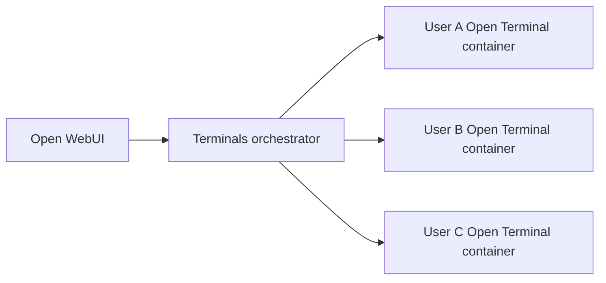

# Orchestration

The Terminals orchestrator gives each Open WebUI user a dedicated Open Terminal container. Open WebUI stores the connection, the orchestrator resolves policy, and Open Terminal runs inside the per-user container.

When a user opens a terminal, Open WebUI routes through `/p/{policy_id}/...`. The orchestrator provisions or reuses that user's container for the selected policy.

## Read This Section

- [Policies](./policies): image selection, resources, storage, env vars, and idle timeout.
- [Environment Variables](./environment-variables): raw env values, quote handling, forwarding behavior, and reserved keys.
- [Applying Changes](./applying-changes): why changes affect newly provisioned terminals and how to refresh users.
- [Custom Images](./custom-images): build, tag, push, configure, and roll out custom Open Terminal images.
- [Scheduled Resets](./scheduled-resets): recurring reset schedules, idle-safe reset behavior, and what gets deleted.
- [OpenShift](./openshift): restricted per-user terminal sandboxes on OpenShift.
- [System Prompts](./system-prompts): generated prompts, `OPEN_TERMINAL_SYSTEM_PROMPT`, placeholders, and `OPEN_TERMINAL_INFO`.
- [File Browser Root](./file-browser-home-boundary): how Open Terminal exposes a visual root for clients to render and clamp navigation.
- [API and Troubleshooting](./api-troubleshooting): policy APIs, refresh API, and sharp support answers.

## Responsibilities

| Layer | Responsibility |
| :--- | :--- |
| Open WebUI | Stores the orchestrator connection, selects the policy, and presents the terminal and file browser UI |
| Terminals orchestrator | Authenticates requests, resolves policies, provisions containers, forwards env vars, applies idle timeout, and handles refresh/lifecycle work |
| Policy | Defines image, env, resources, storage, and idle timeout |
| Policy lifecycle | Defines maintenance behavior over time, such as scheduled resets of persisted terminal files |
| Open Terminal container | Executes commands, serves files, exposes OpenAPI tools, and reports file-browser root metadata |

## Important Behavior

Policy changes apply to newly provisioned terminals. Existing running terminals keep their current image and environment until they are stopped, refreshed, or cleaned up by idle timeout.

The visual file-browser boundary is for usability. Open Terminal reports a root path that clients can render as `Home` and use to hide parent folders, but it is not a security boundary.
