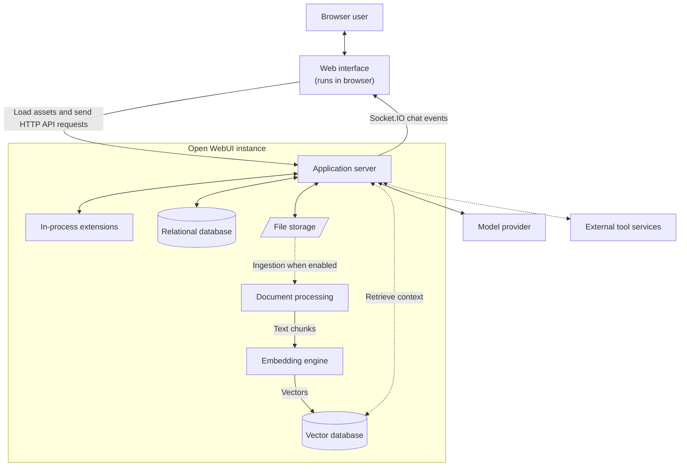

# How Open WebUI Works

Installing Open WebUI gives you more than a chat page. A standard installation combines a browser interface, an application server, data stores, and connections to one or more model providers. This page describes those roles inside a single Open WebUI instance so you can reason about where data goes and which component is responsible when something fails.

This is a logical view, not a required deployment topology. Most components use built-in defaults for a single-instance installation and can be replaced or moved to shared infrastructure when you [scale Open WebUI](/getting-started/advanced-topics/scaling).

## Component Overview

In the standard connection path, the browser talks to the Open WebUI application server, and the server talks to the selected model provider. [Direct Connections](/features/chat-conversations/direct-connections) are an optional exception: when explicitly enabled and configured, the browser can send a request directly to a compatible provider.

### Web interface

The SvelteKit web interface runs in the browser. It renders chats, settings, files, model choices, tool activity, and streamed responses. In a standard deployment, the application server also serves the built frontend assets, so the web interface and API arrive from the same Open WebUI instance even though they have different responsibilities.

After loading, the interface sends authenticated HTTP API requests to the application server. For a standard saved chat, the HTTP request starts server-side work and live content, status, and tool events return through Socket.IO. The model provider may stream its upstream response to the server using SSE, but that is a separate connection boundary.

### Application server

The Python/FastAPI application server is the control point for the standard request path. It authenticates users, checks model access, manages chat state, applies model settings, and routes requests to model providers. Optional features such as files, knowledge retrieval, filters, tools, and external tool servers also enter the request pipeline here.

The server exposes APIs for chats, models, knowledge, files, tools, users, and administration. It also serves the built web interface and coordinates real-time chat events.

### Model connections

Open WebUI generally connects to model providers rather than running inference inside the application server. Those providers can be local inference servers or hosted services. The application server selects the configured connection, translates payloads when necessary, forwards the inference request, and normalizes the response for the web interface.

Start with [Connect a Provider](/getting-started/quick-start/connect-a-provider) to see the supported connection patterns. Adding more providers does not create additional Open WebUI application servers; it gives the existing server more inference destinations.

### Database and file storage

The relational database stores structured application data such as users, chats, settings, and metadata. A single-instance installation uses SQLite by default. Multi-process or multi-replica deployments should move this role to PostgreSQL before scaling.

Uploaded files are stored separately from those database records. Local file storage is the default for a single instance; shared filesystems or object storage become relevant when multiple instances must access the same uploads. See the [scaling guide](/getting-started/advanced-topics/scaling) before changing either storage role.

### RAG pipeline

Retrieval-Augmented Generation (RAG) is used only when a chat or model needs external knowledge. During ingestion, Open WebUI extracts text from a document, splits it into chunks, creates embeddings, and writes those embeddings to a vector database. At query time, it retrieves relevant chunks and adds that context to the model request.

By default, pypdf extracts document content, SentenceTransformers creates embeddings locally, and ChromaDB stores the vectors. These roles can be configured independently: for example, Tika or Docling can handle extraction, an external embedding endpoint can replace local embeddings, and a client-server vector database such as PGVector can replace local vector storage.

These steps are separate from inference: a slow parser or embedding service affects document ingestion and retrieval, while the model provider generates the final answer. See [Retrieval-Augmented Generation](/features/chat-conversations/rag) for feature details and [Scaling Open WebUI](/getting-started/advanced-topics/scaling#step-6-fix-content-extraction--embeddings) before selecting production alternatives.

### Extensibility

Tools and Functions can add capabilities or transform messages inside the Open WebUI process. OpenAPI and MCP connections let the server call separately hosted services. The diagram shows these as different roles because external services have their own network and availability boundaries. Both are optional: a basic chat request needs a model connection, but it does not need an extension.

Use the [Extensibility overview](/features/extensibility) to choose the appropriate mechanism. Extensions share the application request path, but externally hosted services remain separate processes with their own availability and security boundaries.

## A Chat Request, End to End

For a typical saved chat using the standard server-side connection path:

1. The browser sends an authenticated chat request to the application server.
2. The server verifies the user and selected model, then loads the applicable model settings and chat metadata.
3. The request pipeline applies configured context such as files, knowledge retrieval, filters, skills, or tools. Features that are not enabled are skipped.
4. The server dispatches the resulting request to the selected model provider or Pipe.
5. The server acknowledges the saved-chat request and continues processing it. As the provider responds, the server sends content, status, tool, and completion events to the browser through Socket.IO.
6. The server updates the saved chat state, and the web interface renders the latest message.

API-style requests without a saved browser chat can receive an SSE stream directly from the application server. [Direct Connections](/features/chat-conversations/direct-connections) move the provider connection into the browser. Exact steps vary, but these different paths should not be treated as the same connection.

If a request fails, identify the last boundary it crossed: browser to application server, server-side processing, application server to provider, or an optional retrieval or extension service.

## Default Data Placement

| Data | Role that stores it | Single-instance default |
|---|---|---|
| Users, chats, settings, and application metadata | Relational database | SQLite |
| Uploaded files | File storage | Local filesystem |
| Embedding index used for retrieval | Vector database | Local ChromaDB |

These defaults are designed for a single process with local storage. Before adding workers or replicas, follow [Scaling Open WebUI](/getting-started/advanced-topics/scaling) to introduce the shared services required for consistency.

## Where to Go Next

- [Connect a Provider](/getting-started/quick-start/connect-a-provider) to add an inference destination.
- [Retrieval-Augmented Generation](/features/chat-conversations/rag) to understand document ingestion and retrieval.
- [Extensibility](/features/extensibility) to add tools, functions, or external services.
- [Scaling Open WebUI](/getting-started/advanced-topics/scaling) to replace single-instance defaults and run multiple workers or replicas.
