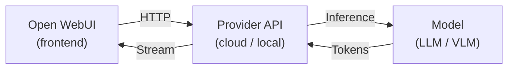

# Connect Local and Cloud Models {#connect-a-provider}

Connect local model servers and cloud APIs to the same Open WebUI instance. Add a connection for each provider, then choose which model to use for a conversation.

Open WebUI supports multiple connection protocols, including **Ollama**, **OpenAI-compatible APIs**, and **Open Responses**. Any cloud API or local server that speaks one of these protocols works out of the box. Just add a URL and API key, and your models appear in the dropdown.

---

## How It Works

1. **You type a message** in Open WebUI
2. Open WebUI sends it to your provider's API endpoint
3. The provider runs inference on the selected model
4. Tokens **stream back** to Open WebUI in real time
5. You see the response in the chat interface

:::tip
Adding a provider is as simple as entering a URL and API key in **Settings → Admin → Connections**. Open WebUI auto-detects available models from most providers.
:::

---

## Use local and cloud models together

You need a running Open WebUI instance, administrator access, a reachable local model server, and an API key for the hosted provider you choose.

1. [Connect Ollama](./starting-with-ollama) and make sure a downloaded local model appears in the model selector.
2. Add a hosted connection using the [OpenAI](./starting-with-openai), [Anthropic](./starting-with-anthropic), or [OpenAI-compatible provider](./starting-with-openai-compatible) guide.
3. Start a conversation, select the local model, and send a short test message. Start another conversation with the hosted model and confirm that it also responds.
4. To send the same prompt to both models, use [Multi-Model Chats](/features/chat-conversations/chat-features/multi-model-chats).

The selected endpoint determines where inference happens. Selecting a cloud model sends the prompt and included context to that provider; comparing models sends the prompt to each selected endpoint. Local inference does not make separately configured cloud tools, extraction, or embedding services local. See [Chat Data Privacy & Encryption](/security/chat-data-privacy-and-encryption) when choosing providers for sensitive content.

## Cloud Providers

Hosted APIs that require an account and API key. No hardware needed.

| Provider | Models | Guide |
|----------|--------|-------|
| **OpenAI** | GPT-5.6 Sol, GPT-5.6 Terra, GPT-5.6 Luna | [Starting with OpenAI →](./starting-with-openai) |
| **Anthropic** | Claude Opus 5, Sonnet 5, Haiku 4.5 | [Starting with Anthropic →](./starting-with-anthropic) |
| **OpenAI-Compatible** | DeepSeek, Mistral, Groq, OpenRouter, Vercel AI Gateway, Amazon Bedrock, Azure, and more | [OpenAI-Compatible Providers →](./starting-with-openai-compatible) |

---

## Local Servers

Run downloaded models on your own hardware. Authentication depends on how you configure the local server.

| Server | Description | Guide |
|--------|-------------|-------|
| **Ollama** | Run and manage downloaded models locally | [Starting with Ollama →](./starting-with-ollama) |
| **llama.cpp** | Efficient GGUF model inference with OpenAI-compatible API | [Starting with llama.cpp →](./starting-with-llama-cpp) |
| **vLLM** | High-throughput inference engine for production workloads | [Starting with vLLM →](./starting-with-vllm) |

More local servers (LM Studio, LocalAI, Docker Model Runner, Lemonade) are covered in the [OpenAI-Compatible Providers](./starting-with-openai-compatible#local-servers) guide.

---

## Other Connection Methods

| Feature | Description | Guide |
|---------|-------------|-------|
| **Open Responses** | Connect providers using the Open Responses specification | [Starting with Open Responses →](./starting-with-open-responses) |
| **Functions** | Extend Open WebUI with custom pipe functions for any backend | [Starting with Functions →](./starting-with-functions) |

---

## Looking for Agents?

If you want to connect an autonomous AI agent (with terminal access, file operations, web search, and more) instead of a plain model provider, see [**Connect an Agent**](/getting-started/quick-start/connect-an-agent).
