:::warning

This tutorial is a community contribution and is not supported by the Open WebUI team. It serves only as a demonstration on how to customize Open WebUI for your specific use case. Want to contribute? Check out the contributing tutorial.

:::

> [!WARNING]
> This documentation reflects schema changes up to Open WebUI v0.11.1.

## Open-WebUI Internal SQLite Database

For Open-WebUI, the SQLite database serves as the backbone for user management, chat history, file storage, and various other core functionalities. Understanding this structure is essential for anyone looking to contribute to or maintain the project effectively.

## Internal SQLite Location

You can find the SQLite database at `root` -> `data` -> `webui.db`

```txt
📁 Root (/)
├── 📁 data
│   ├── 📁 cache
│   ├── 📁 uploads
│   ├── 📁 vector_db
│   └── 📄 webui.db
├── 📄 dev.sh
├── 📁 open_webui
├── 📄 requirements.txt
├── 📄 start.sh
└── 📄 start_windows.bat
```

## Copy Database Locally

If you want to copy the Open-WebUI SQLite database running in the container to your local machine, you can use:

```bash
docker cp open-webui:/app/backend/data/webui.db ./webui.db
```

Alternatively, you can access the database within the container using:

```bash
docker exec -it open-webui /bin/sh
```

## Table Overview

Here is a complete list of tables in Open-WebUI's SQLite database. The tables are listed alphabetically and numbered for convenience.

| **No.** | **Table Name**   | **Description**                                              |
| ------- | ---------------- | ------------------------------------------------------------ |
| 01      | access_grant     | Stores normalized access control grants for all resources    |
| 02      | auth             | Stores user authentication credentials and login information |
| 03      | calendar         | Stores user-owned calendars with access control              |
| 04      | calendar_event   | Stores calendar events with recurrence (RRULE) support       |
| 05      | calendar_event_attendee | Tracks attendee RSVPs for shared calendar events      |
| 06      | channel          | Manages chat channels and their configurations               |
| 07      | channel_file     | Links files to channels and messages                         |
| 08      | channel_member   | Tracks user membership and permissions within channels       |
| 09      | chat             | Stores chat sessions and their metadata                      |
| 10      | chat_file        | Links files to chats and messages                            |
| 11      | chatidtag        | Maps relationships between chats and their associated tags   |
| 12      | config           | Maintains system-wide configuration settings                 |
| 13      | document         | **Legacy.** Pre-Knowledge documents table; data migrated to `knowledge` and no longer used (see note below) |
| 14      | feedback         | Captures user feedback and ratings                           |
| 15      | file             | Manages uploaded files and their metadata                    |
| 16      | folder           | Organizes files and content into hierarchical structures     |
| 17      | function         | Stores custom functions and their configurations             |
| 18      | group            | Manages user groups and their permissions                    |
| 19      | group_member     | Tracks user membership within groups                         |
| 20      | knowledge        | Stores knowledge base entries and related information        |
| 21      | knowledge_file   | Links files to knowledge bases                               |
| 22      | memory           | Maintains chat history and context memory                    |
| 23      | message          | Stores individual chat messages and their content            |
| 24      | message_reaction | Records user reactions (emojis/responses) to messages        |
| 25      | migrate_history  | Tracks database schema version and migration records         |
| 26      | model            | Manages AI model configurations and settings                 |
| 27      | note             | Stores user-created notes and annotations                    |
| 28      | oauth_session    | Manages active OAuth sessions for users                      |
| 29      | prompt           | Stores templates and configurations for AI prompts           |
| 30      | prompt_history   | Tracks version history and snapshots for prompts             |
| 31      | shared_chat      | Stores snapshots of shared chats for link sharing            |
| 32      | skill            | Stores reusable markdown instruction sets (Skills)           |
| 33      | tag              | Manages tags/labels for content categorization               |
| 34      | tool             | Stores configurations for system tools and integrations      |
| 35      | user             | Maintains user profiles and account information              |
| 36      | automation       | Stores user-defined scheduled automations                    |
| 37      | automation_run   | Stores execution history for automation runs                 |
| 38      | pinned_note      | Tracks per-user note pins (each row = one user pinning one note) |
| 39      | chat_message     | Normalized per-message store for chat conversations              |
| 40      | api_key          | Stores per-user API keys, replacing the former `user.api_key` column |
| 41      | knowledge_directory | Nestable folders that organize files within a knowledge base |
| 42      | channel_webhook  | Stores per-channel incoming webhooks for unauthenticated posting |

Note: there are two additional tables in Open-WebUI's SQLite database that are not related to Open-WebUI's core functionality, that have been excluded:

- Alembic Version table
- Migrate History table

Note on the `document` table: it is a **legacy** table from before the Knowledge feature. Its rows were migrated into the `knowledge` table (migration `6a39f3d8e55c`) and nothing writes to it anymore, but no migration drops it, so it may still be present (empty) in databases that predate the Knowledge feature. There is no backing model for it in current code.

Now that we have all the tables, let's understand the structure of each table.

## Access Grant Table

| **Column Name** | **Data Type** | **Constraints**         | **Description**                                        |
| --------------- | ------------- | ----------------------- | ------------------------------------------------------ |
| id              | Integer       | PRIMARY KEY, AUTOINCREMENT | Unique identifier                                   |
| resource_type   | Text          | NOT NULL                | Type of resource (e.g., `model`, `knowledge`, `tool`)  |
| resource_id     | Text          | NOT NULL                | ID of the specific resource                            |
| principal_type  | Text          | NOT NULL                | Type of grantee: `user`, `group` or `anyone`           |
| principal_id    | Text          | NOT NULL                | ID of the user or group (or `*` for public)            |
| permission      | Text          | NOT NULL                | Permission level: `read` or `write`                    |
| created_at      | BigInteger    | nullable                | Grant creation timestamp                               |

Things to know about the access_grant table:

- Unique constraint on (`resource_type`, `resource_id`, `principal_type`, `principal_id`, `permission`) to prevent duplicate grants
- Indexed on (`resource_type`, `resource_id`) and (`principal_type`, `principal_id`) for efficient lookups
- Replaces the former `access_control` JSON column that was previously embedded in each resource table
- `principal_type` of `user` with `principal_id` of `*` represents public access, meaning every signed-in user. It does not reach visitors who are not logged in
- `principal_type` of `anyone` (added in v0.11.0) is the no-sign-in grant behind [open share links](/features/chat-conversations/chat-features/chatshare#open-links-no-sign-in). It is only ever stored as `anyone` / `*` / `read`, any other combination is rejected, and it is only honoured for the `shared_chat` resource type. Every other resource strips it
- Supports both group-level and individual user-level access grants

## API Key Table

Added in v0.6.41 (migration `b10670c03dd5`), which also dropped the `api_key` column from the [User Table](#user-table) after copying every existing key into this table.

| **Column Name** | **Data Type** | **Constraints**                        | **Description**                       |
| --------------- | ------------- | -------------------------------------- | ------------------------------------- |
| id              | Text          | PRIMARY KEY, UNIQUE                    | Unique identifier                     |
| user_id         | Text          | FOREIGN KEY(user.id) CASCADE           | Owner of the key                      |
| key             | Text          | UNIQUE, NOT NULL                       | The API key itself                    |
| data            | JSON          | nullable                               | Extensible data payload               |
| expires_at      | BigInteger    | nullable                               | Expiry timestamp                      |
| last_used_at    | BigInteger    | nullable                               | Timestamp of the key's last use       |
| created_at      | BigInteger    | NOT NULL                               | Creation timestamp                    |
| updated_at      | BigInteger    | NOT NULL                               | Last update timestamp                 |

Things to know about the api_key table:

- Deleting a user cascades to delete their keys.
- Generating a key deletes the account's existing rows first, so an account holds at most one key. Rows carry the fixed id `key_{user_id}`.
- Key generation, retrieval and deletion all go through `/api/v1/auths/api_key`. All three are refused unless the `auth.enable_api_keys` config key is on, and non-admins additionally need the `features.api_keys` permission.
- `data`, `expires_at` and `last_used_at` are present in the schema and no code path writes them. Key lookup joins on `key` alone and does not consult `expires_at`.

## Auth Table

| **Column Name** | **Data Type** | **Constraints** | **Description**   |
| --------------- | ------------- | --------------- | ----------------- |
| id              | String        | PRIMARY KEY     | Unique identifier |
| email           | String        | -               | User's email      |
| password        | Text          | -               | Hashed password   |
| active          | Boolean       | -               | Account status    |

Things to know about the auth table:

- Uses UUID for primary key
- One-to-One relationship with the `user` table (shared id)

## Channel Table

| **Column Name** | **Data Type** | **Constraints** | **Description**                     |
| --------------- | ------------- | --------------- | ----------------------------------- |
| id              | Text          | PRIMARY KEY     | Unique identifier (UUID)            |
| user_id         | Text          | -               | Owner/creator of channel            |
| type            | Text          | nullable        | Channel type                        |
| name            | Text          | -               | Channel name                        |
| description     | Text          | nullable        | Channel description                 |
| is_private      | Boolean       | nullable        | Private flag for `group` type channels |
| data            | JSON          | nullable        | Flexible data storage               |
| meta            | JSON          | nullable        | Channel metadata                    |
| created_at      | BigInteger    | -               | Creation timestamp (nanoseconds)    |
| updated_at      | BigInteger    | -               | Last update timestamp (nanoseconds) |
| updated_by      | Text          | nullable        | User who last updated the channel   |
| archived_at     | BigInteger    | nullable        | Archive timestamp (nanoseconds)     |
| archived_by     | Text          | nullable        | User who archived the channel       |
| deleted_at      | BigInteger    | nullable        | Deletion timestamp (nanoseconds)    |
| deleted_by      | Text          | nullable        | User who deleted the channel        |

Things to know about the channel table:

- Uses UUID for primary key
- Case-insensitive channel names (stored lowercase)
- `type` was added in migration `3781e22d8b01`. `is_private`, `updated_by`, `archived_at`, `archived_by`, `deleted_at` and `deleted_by` were added in migration `90ef40d4714e`.
- Channel listing and member queries return only rows where both `archived_at` and `deleted_at` are null, so the schema is shaped for archiving and soft deletion.
- No code path writes `archived_at`, `archived_by`, `deleted_at`, `deleted_by` or `updated_by`. Deleting a channel removes the row outright, so a deleted channel leaves nothing behind for the `deleted_at` filter to exclude. Anyone querying this table directly will find those five columns null on every row.
- The `access_control` column that this table was created with was dropped in migration `f1e2d3c4b5a6`. Channel access is managed through the `access_grant` table with `resource_type = 'channel'`.

## Channel Member Table

| **Column Name**   | **Data Type** | **Constraints**                 | **Description**                              |
| ----------------- | ------------- | ------------------------------- | -------------------------------------------- |
| id                | Text          | PRIMARY KEY, UNIQUE             | Unique identifier for the channel membership |
| channel_id        | Text          | NOT NULL                        | Reference to the channel                     |
| user_id           | Text          | NOT NULL                        | Reference to the user                        |
| role              | Text          | nullable                        | Member's role within the channel             |
| status            | Text          | nullable                        | Membership status: `joined` or `left`        |
| is_active         | Boolean       | NOT NULL, server_default=true   | Whether the membership is live               |
| is_channel_muted  | Boolean       | NOT NULL, server_default=false  | Per-member mute flag                         |
| is_channel_pinned | Boolean       | NOT NULL, server_default=false  | Per-member pin flag                          |
| data              | JSON          | nullable                        | Extensible data payload                      |
| meta              | JSON          | nullable                        | Optional metadata                            |
| invited_at        | BigInteger    | nullable                        | Invitation timestamp (nanoseconds)           |
| invited_by        | Text          | nullable                        | User who added this member                   |
| joined_at         | BigInteger    | NOT NULL                        | Join timestamp (nanoseconds)                 |
| left_at           | BigInteger    | nullable                        | Leave timestamp (nanoseconds)                |
| last_read_at      | BigInteger    | nullable                        | Last read timestamp, drives unread state     |
| created_at        | BigInteger    | -                               | Timestamp when membership was created        |
| updated_at        | BigInteger    | nullable                        | Last update timestamp (nanoseconds)          |

Things to know about the channel_member table:

- `role`, `invited_at` and `invited_by` were added in migration `90ef40d4714e`. `status`, `is_active`, `is_channel_muted`, `is_channel_pinned`, `data`, `meta`, `joined_at`, `left_at`, `last_read_at` and `updated_at` were added in migration `2f1211949ecc`.
- `status` is written as `joined` when the membership is created. Leaving a channel writes `left`, sets `is_active` to false and stamps `left_at`. The row survives.
- `is_active` is the flag that channel listings and member listings filter on, so a membership someone has left drops out of those results while remaining in the table. It is also written by `POST /api/v1/channels/{id}/members/active`.
- `last_read_at` is stamped when the membership is created and updated over the socket connection when the user reads the channel.
- `role` is read in one place, to test whether a member is a `manager` for manager-only queries. No code path writes it, so it is null on every row.
- `is_channel_muted` has no write path and stays false. `is_channel_pinned` has a setter on the model, `Channels.pin_channel`, that nothing calls.
- `joined_at` is NOT NULL in the database (migration `2f1211949ecc`) while the SQLAlchemy model omits the flag. The database constraint is the one that applies.
- Deleting a user account leaves their `channel_member` rows in place. Member listings, the member count on a channel and the lookup that finds the existing direct message for a set of people all skip rows whose `user_id` no longer matches an account, so a leftover row is not counted as a member and does not push a direct message into a second conversation.

## Channel File Table

| **Column Name** | **Data Type** | **Constraints**                    | **Description**                   |
| --------------- | ------------- | ---------------------------------- | --------------------------------- |
| id              | Text          | PRIMARY KEY                        | Unique identifier (UUID)          |
| user_id         | Text          | NOT NULL                           | Owner of the relationship         |
| channel_id      | Text          | FOREIGN KEY(channel.id), NOT NULL  | Reference to the channel          |
| file_id         | Text          | FOREIGN KEY(file.id), NOT NULL     | Reference to the file             |
| message_id      | Text          | FOREIGN KEY(message.id), nullable  | Reference to associated message   |
| created_at      | BigInteger    | NOT NULL                           | Creation timestamp                |
| updated_at      | BigInteger    | NOT NULL                           | Last update timestamp             |

Things to know about the channel_file table:

- Unique constraint on (`channel_id`, `file_id`) to prevent duplicate entries
- Foreign key relationships with CASCADE delete
- Indexed on `channel_id`, `file_id`, and `user_id` for performance

## Chat Table

| **Column Name** | **Data Type** | **Constraints**         | **Description**          |
| --------------- | ------------- | ----------------------- | ------------------------ |
| id              | String        | PRIMARY KEY             | Unique identifier (UUID) |
| user_id         | String        | -                       | Owner of the chat        |
| title           | Text          | -                       | Chat title               |
| chat            | JSON          | -                       | Chat content and history |
| created_at      | BigInteger    | -                       | Creation timestamp       |
| updated_at      | BigInteger    | -                       | Last update timestamp    |
| share_id        | Text          | UNIQUE, nullable        | Sharing identifier       |
| archived        | Boolean       | default=False           | Archive status           |
| pinned          | Boolean       | default=False, nullable | Pin status               |
| meta            | JSON          | server_default="{}"     | Metadata including tags  |
| folder_id       | Text          | nullable                | Parent folder ID         |
| tasks           | JSON          | nullable                | Chat-level task/todo list used by agentic workflows |
| summary         | Text          | nullable                | Optional chat summary text |
| last_read_at    | BigInteger    | nullable                | Last read timestamp used for unread indicators |
| current_message_id | Text       | nullable                | Current (active leaf) message of the chat's history |
| variables       | JSON          | nullable                | Values filled in for the model's chat variables |

Things to know about the chat table:

- `tasks` and `summary` support structured planning/status UX in chat sessions.
- `last_read_at` is used by sidebar unread state logic (compare with `updated_at`).
- `share_id` references the `shared_chat.id` token when the chat has an active share link.
- `current_message_id` was added in v0.11.0 (migration `9a1b2c3d4e5f`). It records the chat's current message, the leaf of the active branch that a new reply continues from, and is backfilled from the existing history when the migration runs. Context compaction and context-usage resolution read it so they work on the branch actually in play rather than the whole message tree.
- `variables` was added in v0.11.0 (migration `c49178636c78`). It holds the values a user filled in for the [chat variables](/features/chat-conversations/chat-features/chat-params#chat-variables) declared by the model's system prompt, as a flat map keyed by variable name, and is copied along when a chat is forked or cloned. Temporary chats keep their values in the request instead, so nothing is stored.
- A migration (`242a2047eae0`) adds an **`old_chat`** column (Text) that backs up the original JSON `chat` blob as text. It is a migration safety net, not part of the active model, and is not read at runtime.

## Shared Chat Table

| **Column Name** | **Data Type** | **Constraints**                  | **Description**                    |
| --------------- | ------------- | -------------------------------- | ---------------------------------- |
| id              | Text          | PRIMARY KEY                      | Share token (UUID) used in `/s/{id}` URLs |
| chat_id         | Text          | FOREIGN KEY(chat.id) CASCADE, NOT NULL | Reference to the original chat |
| user_id         | Text          | NOT NULL                         | User who created the share         |
| title           | Text          | nullable                         | Chat title at time of sharing      |
| chat            | JSON          | nullable                         | Snapshot of chat content at share time |
| created_at      | BigInteger    | nullable                         | Share creation timestamp           |
| updated_at      | BigInteger    | nullable                         | Last re-snapshot timestamp         |

Things to know about the shared_chat table:

- Replaces the previous pattern of storing shared chat snapshots as phantom rows in the `chat` table with `user_id` set to `shared-{chat_id}`.
- Each row is an immutable snapshot of the original chat at the time of sharing (or last re-share). The snapshot is updated when the user clicks "Update and Copy Link".
- Deleting the original chat cascades to delete the shared snapshot.
- Access control for shared chats is managed via the `access_grant` table with `resource_type = 'shared_chat'`.

## Chat Message Table

The `chat_message` table is the **normalized per-message store** for chat conversations: one row per message, separate from the JSON history blob in `chat.chat` and distinct from the channel [Message Table](#message-table) (which holds channel/thread messages, not chat-model turns).

| **Column Name** | **Data Type** | **Constraints**                          | **Description**                                          |
| --------------- | ------------- | ---------------------------------------- | -------------------------------------------------------- |
| id              | Text          | PRIMARY KEY                              | Unique identifier (UUID)                                 |
| chat_id         | Text          | FOREIGN KEY(chat.id) CASCADE, NOT NULL   | Parent chat                                              |
| user_id         | Text          | indexed                                  | Author of the message                                   |
| role            | Text          | NOT NULL                                 | Message role: `user`, `assistant`, or `system`           |
| parent_id       | Text          | nullable                                 | Parent message id (for branched conversations)           |
| content         | JSON          | nullable                                 | Message content (a string or a list of content blocks)   |
| output          | JSON          | nullable                                 | Generated output payload                                 |
| model_id        | Text          | nullable, indexed                        | Model that produced the message                          |
| files           | JSON          | nullable                                 | Attached files                                           |
| sources         | JSON          | nullable                                 | Retrieval/citation sources                              |
| embeds          | JSON          | nullable                                 | Embedded artifacts                                       |
| meta            | JSON          | nullable                                 | Message metadata; marks internal sub-agent and timer messages (added in v0.11.0) |
| done            | Boolean       | default=True                             | Whether generation completed                             |
| status_history  | JSON          | nullable                                 | Streamed status updates during generation                |
| error           | JSON          | nullable                                 | Error payload when generation failed                     |
| usage           | JSON          | nullable                                 | Token/usage statistics                                   |
| context_summary | Text          | nullable                                 | Per-message context summary (added in v0.10.0)           |
| created_at      | BigInteger    | indexed                                  | Creation timestamp                                       |
| updated_at      | BigInteger    | -                                        | Last update timestamp                                    |

Things to know about the chat_message table:

- Deleting a chat cascades to delete its messages (`chat_id` foreign key with `ON DELETE CASCADE`).
- Composite indexes back the common access patterns: (`chat_id`, `parent_id`), (`model_id`, `created_at`), and (`user_id`, `created_at`).
- `context_summary` was added in v0.10.0 (migration `4c5ce3d2f27f`) to store a summary of the message's context.
- `meta` was added in v0.11.0 (migration `856c5b02fb54`). It carries per-message metadata and is what marks the messages Open WebUI injects on a user's behalf, such as a [sub-agent](/features/chat-conversations/chat-features/subagents) result or a fired [timer](/features/chat-conversations/chat-features/timers), so the interface can render them differently from a message the user typed.
- [Chat search](/features/chat-conversations/chat-features/history-search) reads a different set of stores per backend. On PostgreSQL it matches `chat_message.content` as well as the `history.messages` map and the older flat `messages` array inside the `chat.chat` blob. On SQLite it matches those two JSON locations only.

## Automation Table

| **Column Name** | **Data Type** | **Constraints**         | **Description** |
| --------------- | ------------- | ----------------------- | --------------- |
| id              | Text          | PRIMARY KEY             | Unique identifier (UUID) |
| user_id         | Text          | NOT NULL                | Owner of the automation |
| folder_id       | Text          | nullable                | Folder the runs' chats are created in |
| name            | Text          | NOT NULL                | Automation display name |
| data            | JSON          | NOT NULL                | Automation payload (`prompt`, `model_id`, `rrule`, optional terminal config) |
| meta            | JSON          | nullable                | Optional metadata |
| is_active       | Boolean       | NOT NULL, default=True  | Active/paused state |
| last_run_at     | BigInteger    | nullable                | Last execution time |
| next_run_at     | BigInteger    | nullable                | Next scheduled execution time |
| created_at      | BigInteger    | NOT NULL                | Creation timestamp |
| updated_at      | BigInteger    | NOT NULL                | Last update timestamp |

Things to know about the automation table:

- `next_run_at` is indexed for efficient due-run polling.
- `data.rrule` defines recurrence and drives scheduler calculations.
- `folder_id` was added in v0.11.0 (migration `959eaac8f909`) together with a (`user_id`, `folder_id`) index, so an owner's automations can be listed per folder. It is not a foreign key: deleting a folder clears the column on that owner's automations instead of deleting the automation, and a run whose folder has disappeared in the meantime clears the column and files its chat outside any folder.

## Automation Run Table

| **Column Name** | **Data Type** | **Constraints** | **Description** |
| --------------- | ------------- | --------------- | --------------- |
| id              | Text          | PRIMARY KEY     | Unique identifier (UUID) |
| automation_id   | Text          | NOT NULL        | Reference to automation |
| chat_id         | Text          | nullable        | Chat created by this run (if available) |
| status          | Text          | NOT NULL        | Run status (`success` / `error`) |
| error           | Text          | nullable        | Error details when status is `error` |
| created_at      | BigInteger    | NOT NULL        | Execution record timestamp |

Things to know about the automation_run table:

- Indexed by `automation_id` for fast per-automation run history queries.
- Rows are deleted when an automation is deleted.

## Calendar Table

| **Column Name** | **Data Type** | **Constraints**         | **Description**                    |
| --------------- | ------------- | ----------------------- | ---------------------------------- |
| id              | Text          | PRIMARY KEY             | Unique identifier (UUID)           |
| user_id         | Text          | NOT NULL                | Owner of the calendar              |
| name            | Text          | NOT NULL                | Calendar display name              |
| color           | Text          | nullable                | Display color (hex, e.g. `#3b82f6`) |
| is_default      | Boolean       | NOT NULL, default=False | Whether this is the user's default calendar |
| data            | JSON          | nullable                | Extensible data payload            |
| meta            | JSON          | nullable                | Optional metadata                  |
| created_at      | BigInteger    | NOT NULL                | Creation timestamp                 |
| updated_at      | BigInteger    | NOT NULL                | Last update timestamp              |

Things to know about the calendar table:

- Indexed on `user_id` for efficient per-user calendar listing.
- A default "Personal" calendar is auto-created on first access.
- The "Scheduled Tasks" calendar is **virtual**: it is not stored in this table. Instead, the API synthesizes it at response time (with constant ID `__scheduled_tasks__`) for users who have Automations access. Automation RRULE future runs and past execution records are rendered as virtual events on this calendar.
- Access control is managed via the `access_grant` table with `resource_type = 'calendar'`, enabling calendar sharing between users and groups.
- A user can only delete non-default calendars. Deleting a calendar cascades to all its events, attendees, and access grants.

## Calendar Event Table

| **Column Name** | **Data Type** | **Constraints**         | **Description**                    |
| --------------- | ------------- | ----------------------- | ---------------------------------- |
| id              | Text          | PRIMARY KEY             | Unique identifier (UUID)           |
| calendar_id     | Text          | NOT NULL                | Reference to parent calendar       |
| user_id         | Text          | NOT NULL                | User who created the event         |
| title           | Text          | NOT NULL                | Event title                        |
| description     | Text          | nullable                | Event description                  |
| start_at        | BigInteger    | NOT NULL                | Start time (epoch nanoseconds)     |
| end_at          | BigInteger    | nullable                | End time (epoch nanoseconds)       |
| all_day         | Boolean       | NOT NULL, default=False | Whether this is an all-day event   |
| rrule           | Text          | nullable                | iCalendar RRULE for recurrence     |
| color           | Text          | nullable                | Per-event color override           |
| location        | Text          | nullable                | Event location                     |
| data            | JSON          | nullable                | Extensible data payload            |
| meta            | JSON          | nullable                | Optional metadata (e.g. `automation_id`) |
| is_cancelled    | Boolean       | NOT NULL, default=False | Soft-cancel flag                   |
| created_at      | BigInteger    | NOT NULL                | Creation timestamp                 |
| updated_at      | BigInteger    | NOT NULL                | Last update timestamp              |

Things to know about the calendar_event table:

- Composite index on (`calendar_id`, `start_at`) for efficient range queries within a calendar.
- Composite index on (`user_id`, `start_at`) for efficient per-user date range queries.
- Recurring events store an `rrule` string and are expanded into individual instances at query time (server-side Python expansion using `dateutil`). Expansion runs in the user's time zone, so every instance keeps the local clock time of the stored `start_at`, including across daylight saving changes. Accounts with no usable time zone fall back to the server's.
- Cancelled events (`is_cancelled = True`) are excluded from range queries but retained in the database.

## Calendar Event Attendee Table

| **Column Name** | **Data Type** | **Constraints**                    | **Description**                    |
| --------------- | ------------- | ---------------------------------- | ---------------------------------- |
| id              | Text          | PRIMARY KEY                        | Unique identifier (UUID)           |
| event_id        | Text          | NOT NULL                           | Reference to the calendar event    |
| user_id         | Text          | NOT NULL                           | User invited to the event          |
| status          | Text          | NOT NULL, default='pending'        | RSVP status: `pending`, `accepted`, `declined`, `tentative` |
| meta            | JSON          | nullable                           | Optional metadata                  |
| created_at      | BigInteger    | NOT NULL                           | Creation timestamp                 |
| updated_at      | BigInteger    | NOT NULL                           | Last update timestamp              |

Things to know about the calendar_event_attendee table:

- Unique constraint on (`event_id`, `user_id`) to prevent duplicate attendee entries.
- Indexed on (`user_id`, `status`) for efficient lookups of events a user is invited to.
- Attendees are replaced in bulk when an event is updated with a new attendee list.
- Deleting an event cascades to delete all attendee records.

## Chat File Table

| **Column Name** | **Data Type** | **Constraints**                  | **Description**                   |
| --------------- | ------------- | -------------------------------- | --------------------------------- |
| id              | Text          | PRIMARY KEY                      | Unique identifier (UUID)          |
| user_id         | Text          | NOT NULL                         | User associated with the file     |
| chat_id         | Text          | FOREIGN KEY(chat.id), NOT NULL   | Reference to the chat             |
| file_id         | Text          | FOREIGN KEY(file.id), NOT NULL   | Reference to the file             |
| message_id      | Text          | nullable                         | Reference to associated message   |
| created_at      | BigInteger    | NOT NULL                         | Creation timestamp                |
| updated_at      | BigInteger    | NOT NULL                         | Last update timestamp             |

Things to know about the chat_file table:

- Unique constraint on (`chat_id`, `file_id`) to prevent duplicate entries
- Foreign key relationships with CASCADE delete
- Indexed on `chat_id`, `file_id`, `message_id`, and `user_id` for performance

**Why this table was added:**

- **Query Efficiency**: Before this, files were embedded in message objects. This table allows direct indexed lookups for finding all files in a chat without iterating through every message.
- **Data Consistency**: Acts as a single source of truth for file associations. In multi-node deployments, all nodes query this table instead of relying on potentially inconsistent embedded data.
- **Deduplication**: The database-level unique constraint prevents duplicate file associations, which is more reliable than application-level checks.

## Chat ID Tag Table

| **Column Name** | **Data Type** | **Constraints** | **Description**    |
| --------------- | ------------- | --------------- | ------------------ |
| id              | VARCHAR(255)  | NOT NULL        | Unique identifier  |
| tag_name        | VARCHAR(255)  | NOT NULL        | Name of the tag    |
| chat_id         | VARCHAR(255)  | NOT NULL        | Reference to chat  |
| user_id         | VARCHAR(255)  | NOT NULL        | Reference to user  |
| timestamp       | INTEGER       | NOT NULL        | Creation timestamp |

## Config

As of v0.10.0 the config table is **per-key**: every setting is its own row keyed by a dot-notation path, replacing the previous single-row JSON blob.

| **Column Name** | **Data Type** | **Constraints** | **Description**                                          |
| --------------- | ------------- | --------------- | -------------------------------------------------------- |
| key             | Text          | PRIMARY KEY     | Config key in dot notation (e.g. `audio.stt.engine`)     |
| value           | JSON          | NOT NULL        | The stored value for this key                            |
| updated_at      | BigInteger    | nullable        | Last update timestamp (epoch)                            |

Things to know about the config table:

- Reshaped in migration `3ff2c63645b8`. The old single-row schema (`id` INTEGER PK, `data` JSON, `version` INTEGER, `created_at`/`updated_at` DATETIME) was migrated by exploding the JSON blob into one row per key.
- The pre-migration table is preserved as **`config_old`** (renamed, not dropped) so the change is reversible; it is not used at runtime.
- Reads/writes go through individual keys, which avoids rewriting the entire configuration blob on every change.

## Feedback Table

| **Column Name** | **Data Type** | **Constraints** | **Description**                 |
| --------------- | ------------- | --------------- | ------------------------------- |
| id              | Text          | PRIMARY KEY     | Unique identifier (UUID)        |
| user_id         | Text          | -               | User who provided feedback      |
| version         | BigInteger    | default=0       | Feedback version number         |
| type            | Text          | -               | Type of feedback                |
| data            | JSON          | nullable        | Feedback data including ratings |
| meta            | JSON          | nullable        | Metadata (arena, chat_id, etc)  |
| snapshot        | JSON          | nullable        | Associated chat snapshot        |
| created_at      | BigInteger    | -               | Creation timestamp              |
| updated_at      | BigInteger    | -               | Last update timestamp           |

## File Table

| **Column Name** | **Data Type** | **Constraints** | **Description**       |
| --------------- | ------------- | --------------- | --------------------- |
| id              | String        | PRIMARY KEY     | Unique identifier     |
| user_id         | String        | -               | Owner of the file     |
| hash            | Text          | nullable        | File hash/checksum    |
| filename        | Text          | -               | Name of the file      |
| path            | Text          | nullable        | File system path      |
| data            | JSON          | nullable        | File-related data     |
| meta            | JSON          | nullable        | File metadata         |
| created_at      | BigInteger    | -               | Creation timestamp    |
| updated_at      | BigInteger    | -               | Last update timestamp |

The `meta` field's expected structure:

```python
{
    "name": string,          # Optional display name
    "content_type": string,  # MIME type
    "size": integer,         # File size in bytes
    # Additional metadata supported via ConfigDict(extra="allow")
}
```

## Folder Table

| **Column Name** | **Data Type** | **Constraints** | **Description**                |
| --------------- | ------------- | --------------- | ------------------------------ |
| id              | Text          | PK (composite)  | Unique identifier (UUID)       |
| parent_id       | Text          | nullable        | Parent folder ID for hierarchy |
| user_id         | Text          | PK (composite)  | Owner of the folder            |
| name            | Text          | -               | Folder name                    |
| items           | JSON          | nullable        | Folder contents                |
| data            | JSON          | nullable        | Additional folder data         |
| meta            | JSON          | nullable        | Folder metadata                |
| is_expanded     | Boolean       | default=False   | UI expansion state             |
| created_at      | BigInteger    | -               | Creation timestamp             |
| updated_at      | BigInteger    | -               | Last update timestamp          |

Things to know about the folder table:

- Primary key is composite (`id`, `user_id`)
- Folders can be nested (`parent_id` reference)
- Root folders have null `parent_id`
- Folder names must be unique within the same parent

## Function Table

| **Column Name** | **Data Type** | **Constraints** | **Description**           |
| --------------- | ------------- | --------------- | ------------------------- |
| id              | String        | PRIMARY KEY     | Unique identifier         |
| user_id         | String        | -               | Owner of the function     |
| name            | Text          | -               | Function name             |
| type            | Text          | -               | Function type             |
| content         | Text          | -               | Function content/code     |
| meta            | JSON          | -               | Function metadata         |
| valves          | JSON          | -               | Function control settings |
| is_active       | Boolean       | -               | Function active status    |
| is_global       | Boolean       | -               | Global availability flag  |
| created_at      | BigInteger    | -               | Creation timestamp        |
| updated_at      | BigInteger    | -               | Last update timestamp     |

Things to know about the function table:

- `type` is one of: `pipe`, `filter`, `action`, `event` (the `event` type was added in v0.10.0). The type is auto-detected from the top-level class name in the function's source code.

## Group Table

| **Column Name** | **Data Type** | **Constraints**     | **Description**          |
| --------------- | ------------- | ------------------- | ------------------------ |
| id              | Text          | PRIMARY KEY, UNIQUE | Unique identifier (UUID) |
| user_id         | Text          | -                   | Group owner/creator      |
| name            | Text          | -                   | Group name               |
| description     | Text          | -                   | Group description        |
| data            | JSON          | nullable            | Additional group data    |
| meta            | JSON          | nullable            | Group metadata           |
| permissions     | JSON          | nullable            | Permission configuration |
| created_at      | BigInteger    | -                   | Creation timestamp       |
| updated_at      | BigInteger    | -                   | Last update timestamp    |

Note: The `user_ids` column has been migrated to the `group_member` table.

## Group Member Table

| **Column Name** | **Data Type** | **Constraints**                  | **Description**                   |
| --------------- | ------------- | -------------------------------- | --------------------------------- |
| id              | Text          | PRIMARY KEY, UNIQUE              | Unique identifier (UUID)          |
| group_id        | Text          | FOREIGN KEY(group.id), NOT NULL  | Reference to the group            |
| user_id         | Text          | FOREIGN KEY(user.id), NOT NULL, indexed | Reference to the user      |
| created_at      | BigInteger    | nullable                         | Creation timestamp                |
| updated_at      | BigInteger    | nullable                         | Last update timestamp             |

Things to know about the group_member table:

- Unique constraint on (`group_id`, `user_id`) to prevent duplicate memberships, which also serves lookups that start from a group
- Indexed on (`user_id`, `group_id`) for efficient lookups of the groups a user belongs to (migration `1ce6ade7d93b`). The unique constraint leads with `group_id` and cannot answer that question, so without this index every permission and access check reads the whole membership table, and the cost grows with the total number of memberships on the instance rather than with the number a single user has
- Foreign key relationships with CASCADE delete to group and user tables

## Knowledge Table

| **Column Name** | **Data Type** | **Constraints**     | **Description**            |
| --------------- | ------------- | ------------------- | -------------------------- |
| id              | Text          | PRIMARY KEY, UNIQUE | Unique identifier (UUID)   |
| user_id         | Text          | -                   | Knowledge base owner       |
| name            | Text          | -                   | Knowledge base name        |
| description     | Text          | -                   | Knowledge base description |
| data            | JSON          | nullable            | Knowledge base content     |
| meta            | JSON          | nullable            | Additional metadata        |
| created_at      | BigInteger    | -                   | Creation timestamp         |
| updated_at      | BigInteger    | -                   | Last update timestamp      |

## Knowledge Directory Table

Nestable folders that organize the files inside one knowledge base. Added by migration `3c9b0ca343fd`, which also added `directory_id` to the [Knowledge File Table](#knowledge-file-table).

| **Column Name** | **Data Type** | **Constraints**                                          | **Description**                 |
| --------------- | ------------- | -------------------------------------------------------- | ------------------------------- |
| id              | Text          | PRIMARY KEY                                              | Unique identifier (UUID)        |
| knowledge_id    | Text          | FOREIGN KEY(knowledge.id) CASCADE, NOT NULL              | Parent knowledge base           |
| parent_id       | Text          | FOREIGN KEY(knowledge_directory.id) CASCADE, nullable    | Parent directory for nesting    |
| name            | Text          | NOT NULL                                                 | Directory name                  |
| user_id         | Text          | NOT NULL                                                 | User who created the directory  |
| created_at      | BigInteger    | NOT NULL                                                 | Creation timestamp              |
| updated_at      | BigInteger    | NOT NULL                                                 | Last update timestamp           |

Things to know about the knowledge_directory table:

- Directories nest through the self-referencing `parent_id`. Root directories have a null `parent_id`.
- Unique constraint on (`knowledge_id`, `parent_id`, `name`) (`uq_knowledge_directory_knowledge_parent_name`), so directory names are unique among siblings within one knowledge base.
- Indexed on `knowledge_id` and on `parent_id` (`ix_knowledge_directory_knowledge_id`, `ix_knowledge_directory_parent_id`).
- Deleting a knowledge base cascades to its directories. Deleting a directory cascades to the directories nested inside it.

## Knowledge File Table

| **Column Name** | **Data Type** | **Constraints**                                            | **Description**                   |
| --------------- | ------------- | ---------------------------------------------------------- | --------------------------------- |
| id              | Text          | PRIMARY KEY                                                | Unique identifier (UUID)          |
| user_id         | Text          | NOT NULL                                                   | Owner of the relationship         |
| knowledge_id    | Text          | FOREIGN KEY(knowledge.id), NOT NULL                        | Reference to the knowledge base   |
| file_id         | Text          | FOREIGN KEY(file.id), NOT NULL                             | Reference to the file             |
| directory_id    | Text          | FOREIGN KEY(knowledge_directory.id) SET NULL, nullable, indexed | Directory holding the file   |
| created_at      | BigInteger    | NOT NULL                                                   | Creation timestamp                |
| updated_at      | BigInteger    | NOT NULL                                                   | Last update timestamp             |

Things to know about the knowledge_file table:

- Unique constraint on (`knowledge_id`, `file_id`) to prevent duplicate entries
- Foreign key relationships with CASCADE delete
- Indexed on `knowledge_id`, `file_id`, and `user_id` for performance
- `directory_id` was added in migration `3c9b0ca343fd`, with the index `ix_knowledge_file_directory_id`. It is the one foreign key here that does not cascade: deleting a directory sets `directory_id` back to null on its files rather than deleting them, and a null `directory_id` puts the file at the root of its knowledge base

Access control for resources (models, knowledge bases, tools, prompts, notes, files, channels) is managed through the `access_grant` table rather than embedded JSON. Each grant entry specifies a resource, a principal (user or group), and a permission level (read or write). See the [Access Grant Table](#access-grant-table) section above for details.

## Memory Table

| **Column Name** | **Data Type** | **Constraints**            | **Description**          |
| --------------- | ------------- | -------------------------- | ------------------------ |
| id              | String        | PRIMARY KEY                | Unique identifier (UUID) |
| user_id         | String        | indexed                    | Memory owner             |
| type            | String        | default `context`, indexed | Memory type: `user` or `context` (added in v0.10.0) |
| path            | Text          | nullable                   | Optional path for organizing memories into a hierarchy (added in v0.10.0) |
| content         | Text          | -                          | Memory content           |
| meta            | JSON          | nullable                   | Optional metadata (added in v0.10.0) |
| created_at      | BigInteger    | -                          | Creation timestamp       |
| updated_at      | BigInteger    | -                          | Last update timestamp    |

Things to know about the memory table:

- `type` distinguishes `user` memories (explicit, user-curated facts) from `context` memories (learned from conversation); it is indexed for per-type lookups. Added in migration `7b3f2a9c1d4e` (with an index fixup migration following it).
- `path` and `meta` (added in a later v0.10.0 migration) back the expanded builtin memory tools, which let the model organize memories under paths and attach structured metadata.
- A covering index on `(id, user_id)` was added in v0.11.0 (migration `55f1302ac17c`) to speed up per-user memory lookups.

## Message Table

| **Column Name** | **Data Type** | **Constraints** | **Description**                     |
| --------------- | ------------- | --------------- | ----------------------------------- |
| id              | Text          | PRIMARY KEY     | Unique identifier (UUID)            |
| user_id         | Text          | -               | Message author                      |
| channel_id      | Text          | nullable        | Associated channel                  |
| parent_id       | Text          | nullable        | Parent message for threads          |
| content         | Text          | -               | Message content                     |
| data            | JSON          | nullable        | Additional message data             |
| meta            | JSON          | nullable        | Message metadata                    |
| created_at      | BigInteger    | -               | Creation timestamp (nanoseconds)    |
| updated_at      | BigInteger    | -               | Last update timestamp (nanoseconds) |

## Message Reaction Table

| **Column Name** | **Data Type** | **Constraints** | **Description**          |
| --------------- | ------------- | --------------- | ------------------------ |
| id              | Text          | PRIMARY KEY     | Unique identifier (UUID) |
| user_id         | Text          | -               | User who reacted         |
| message_id      | Text          | -               | Associated message       |
| name            | Text          | -               | Reaction name/emoji      |
| created_at      | BigInteger    | -               | Reaction timestamp       |

## Model Table

| **Column Name** | **Data Type** | **Constraints** | **Description**        |
| --------------- | ------------- | --------------- | ---------------------- |
| id              | Text          | PRIMARY KEY     | Model identifier       |
| user_id         | Text          | -               | Model owner            |
| base_model_id   | Text          | nullable        | Parent model reference |
| name            | Text          | -               | Display name           |
| params          | JSON          | -               | Model parameters       |
| meta            | JSON          | -               | Model metadata         |
| is_active       | Boolean       | default=True    | Active status          |
| created_at      | BigInteger    | -               | Creation timestamp     |
| updated_at      | BigInteger    | -               | Last update timestamp  |

## Note Table

| **Column Name** | **Data Type** | **Constraints** | **Description**            |
| --------------- | ------------- | --------------- | -------------------------- |
| id              | Text          | PRIMARY KEY     | Unique identifier          |
| user_id         | Text          | nullable        | Owner of the note          |
| title           | Text          | nullable        | Note title                 |
| data            | JSON          | nullable        | Note content and data      |
| meta            | JSON          | nullable        | Note metadata              |
| created_at      | BigInteger    | nullable        | Creation timestamp         |
| updated_at      | BigInteger    | nullable        | Last update timestamp      |

The note body lives in `data` under `content.md` and is markdown text. A row that holds an object or an array there instead, which a model can produce by passing structured data to the note tools, is served with that content rendered as a fenced `json` code block, and the row is rewritten to match the next time the note is saved.

Pin state is no longer stored on this table. The legacy `is_pinned` column was removed in migration `4de81c2a3af1` and replaced by a per-user [Pinned Note Table](#pinned-note-table). Pre-existing pins were backfilled to the note owner; the API surfaces `is_pinned` as a per-request join against the calling user's rows.

## Pinned Note Table

Per-user note pins. Each row records that one user has pinned one note for their own sidebar. Pinning is private and does not affect any other user with access to the same note.

| **Column Name** | **Data Type** | **Constraints**                                      | **Description**                                  |
| --------------- | ------------- | ---------------------------------------------------- | ------------------------------------------------ |
| id              | Text          | PRIMARY KEY                                          | Unique identifier (UUID)                         |
| user_id         | Text          | NOT NULL                                             | The user who pinned the note                     |
| note_id         | Text          | NOT NULL, FOREIGN KEY(note.id) ON DELETE CASCADE     | The pinned note                                  |
| created_at      | BigInteger    | NOT NULL                                             | Pin creation timestamp (used for ordering)       |

A `UNIQUE(user_id, note_id)` constraint prevents duplicate pins for the same user/note pair. The pinned-note list is ordered by `created_at DESC` per user, so the most recently pinned note appears first. Deleting a note cascades through this table; toggling a pin does **not** modify `note.updated_at`.

## OAuth Session Table

| **Column Name** | **Data Type** | **Constraints**                            | **Description**                   |
| --------------- | ------------- | ------------------------------------------ | --------------------------------- |
| id              | Text          | PRIMARY KEY, UNIQUE                        | Unique session identifier         |
| user_id         | Text          | FOREIGN KEY(user.id) CASCADE, NOT NULL     | Associated user                   |
| provider        | Text          | NOT NULL                                   | OAuth provider (e.g., 'google')   |
| token           | Text          | NOT NULL                                   | Encrypted OAuth token set         |
| expires_at      | BigInteger    | NOT NULL                                   | Token expiration timestamp        |
| created_at      | BigInteger    | NOT NULL                                   | Session creation timestamp        |
| updated_at      | BigInteger    | NOT NULL                                   | Session last update timestamp     |

Things to know about the oauth_session table:

- The relationship to `user` is one-to-many. Each sign-in inserts a new row, so several rows can exist for the same user and the same provider. `OAUTH_MAX_SESSIONS_PER_USER` (default 10) caps how many a user may hold per provider; on sign-in the oldest rows above the cap are deleted.
- Indexed on `user_id`, on `expires_at` and on (`user_id`, `provider`) (`idx_oauth_session_user_id`, `idx_oauth_session_expires_at`, `idx_oauth_session_user_provider`, all from migration `38d63c18f30f`).
- Deleting a user cascades to delete their sessions.
- `token` holds the provider's token set (access token, ID token and refresh token) as JSON, encrypted at rest with Fernet before it is written and decrypted on read. The key comes from `OAUTH_SESSION_TOKEN_ENCRYPTION_KEY`, which falls back to `WEBUI_SECRET_KEY`. A key that is not already 44 characters is hashed with SHA-256 and base64-encoded to the length Fernet requires.

## Prompt Table

| **Column Name** | **Data Type** | **Constraints** | **Description**                     |
| --------------- | ------------- | --------------- | ----------------------------------- |
| id              | Text          | PRIMARY KEY     | Unique identifier (UUID)            |
| command         | String        | UNIQUE, INDEX   | Unique command identifier           |
| user_id         | String        | NOT NULL        | Owner of the prompt                 |
| name            | Text          | NOT NULL        | Display name of the prompt          |
| content         | Text          | NOT NULL        | Prompt content/template             |
| data            | JSON          | nullable        | Additional prompt data              |
| meta            | JSON          | nullable        | Prompt metadata                     |
| is_active       | Boolean       | default=True    | Active status                       |
| version_id      | Text          | nullable        | Current version identifier          |
| tags            | JSON          | nullable        | Associated tags                     |
| created_at      | BigInteger    | NOT NULL        | Creation timestamp                  |
| updated_at      | BigInteger    | NOT NULL        | Last update timestamp               |

## Prompt History Table

| **Column Name** | **Data Type** | **Constraints**                | **Description**                   |
| --------------- | ------------- | ------------------------------ | --------------------------------- |
| id              | Text          | PRIMARY KEY                    | Unique identifier (UUID)          |
| prompt_id       | Text          | FOREIGN KEY(prompt.id), INDEX  | Reference to the prompt           |
| parent_id       | Text          | nullable                       | Reference to the parent version   |
| snapshot        | JSON          | NOT NULL                       | Snapshot of the prompt at version |
| user_id         | Text          | NOT NULL                       | User who created the version      |
| commit_message  | Text          | nullable                       | Version commit message            |
| created_at      | BigInteger    | NOT NULL                       | Creation timestamp                |

## Skill Table

| **Column Name** | **Data Type** | **Constraints** | **Description**                    |
| --------------- | ------------- | --------------- | ---------------------------------- |
| id              | Text          | PRIMARY KEY     | Unique identifier (UUID)           |
| user_id         | Text          | NOT NULL        | Owner/creator of the skill         |
| name            | Text          | NOT NULL        | Display name of the skill          |
| description     | Text          | nullable        | Short description (used in manifest) |
| content         | Text          | NOT NULL        | Full skill instructions (Markdown) |
| data            | JSON          | nullable        | Additional skill data              |
| meta            | JSON          | nullable        | Skill metadata                     |
| is_active       | Boolean       | default=True    | Active status                      |
| created_at      | BigInteger    | NOT NULL        | Creation timestamp                 |
| updated_at      | BigInteger    | NOT NULL        | Last update timestamp              |

Things to know about the skill table:

- Uses UUID for primary key
- Access control is managed through the `access_grant` table (resource_type `skill`)
- `description` is injected into the system prompt as part of the manifest; `content` is loaded on-demand via the `view_skill` builtin tool

## Tag Table

| **Column Name** | **Data Type** | **Constraints** | **Description**           |
| --------------- | ------------- | --------------- | ------------------------- |
| id              | String        | PK (composite)  | Normalized tag identifier |
| name            | String        | -               | Display name              |
| user_id         | String        | PK (composite)  | Tag owner                 |
| meta            | JSON          | nullable        | Tag metadata              |

Things to know about the tag table:

- Primary key is composite (id, user_id)

## Tool Table

| **Column Name** | **Data Type** | **Constraints** | **Description**       |
| --------------- | ------------- | --------------- | --------------------- |
| id              | String        | PRIMARY KEY     | Unique identifier     |
| user_id         | String        | -               | Tool owner            |
| name            | Text          | -               | Tool name             |
| content         | Text          | -               | Tool content/code     |
| specs           | JSON          | -               | Tool specifications   |
| meta            | JSON          | -               | Tool metadata         |
| valves          | JSON          | -               | Tool control settings |
| created_at      | BigInteger    | -               | Creation timestamp    |
| updated_at      | BigInteger    | -               | Last update timestamp |

## User Table

| **Column Name**          | **Data Type** | **Constraints**   | **Description**            |
| ------------------------ | ------------- | ----------------- | -------------------------- |
| id                       | String        | PRIMARY KEY       | Unique identifier          |
| username                 | String(50)    | nullable          | User's handle              |
| name                     | String        | NOT NULL          | User's name                |
| email                    | String        | -                 | User's email               |
| role                     | String        | default='pending' | User's role                |
| profile_image_url        | Text          | -                 | Profile image path         |
| profile_banner_image_url | Text          | nullable          | Profile banner image path  |
| bio                      | Text          | nullable          | User's biography           |
| gender                   | Text          | nullable          | User's gender              |
| date_of_birth            | Date          | nullable          | User's date of birth       |
| timezone                 | String        | nullable          | IANA time zone name        |
| presence_state           | String        | nullable          | Presence state             |
| status_emoji             | String        | nullable          | Emoji shown with status    |
| status_message           | Text          | nullable          | Status text                |
| status_expires_at        | BigInteger    | nullable          | Status expiry timestamp    |
| last_active_at           | BigInteger    | -                 | Last activity timestamp    |
| updated_at               | BigInteger    | -                 | Last update timestamp      |
| created_at               | BigInteger    | -                 | Creation timestamp         |
| settings                 | JSON          | nullable          | User preferences           |
| info                     | JSON          | nullable          | Additional user info       |
| variables                | JSON          | nullable          | User variables substituted into system prompts |
| oauth                    | JSON          | nullable          | Identity provider subjects, keyed by provider |
| scim                     | JSON          | nullable          | SCIM provisioning data     |

Things to know about the user table:

- Uses UUID for primary key
- One-to-One relationship with `auth` table (shared id)
- One-to-Many relationship with `oauth_session` table (via `user_id` foreign key), one row per sign-in
- `email` is unique case-insensitively, enforced by the partial unique index `uq_user_email_lower` on `lower(email)` where `email` is not null (migration `f0bd01a18a3d`). An upgrade onto a database that already holds two accounts differing only in capitalisation stops and names them rather than choosing between them; see [Duplicate Emails](/troubleshooting/manual-database-migration#duplicate-emails-migration-failure).
- The `email` column carries no plain `UNIQUE` constraint in the database, which is why the row above shows none. The SQLAlchemy model declares `unique=True` on it, but the schema is built only from the migrations and none of them creates that constraint, so the index above is the whole of the enforcement.
- `variables` was added in v0.11.0 (migration `b0018471bbbe`). It holds the user's own [user variables](/features/chat-conversations/chat-features/chat-params#user-variables) as a flat map of string keys to string values, substituted into system prompts at request time. It is excluded from user API responses and is read through its own endpoints instead.
- `oauth` replaced the single `oauth_sub` text column in v0.6.41 (migration `b10670c03dd5`), so one account can hold a subject from several identity providers at once. It stores `{"<provider>": {"sub": "<subject>"}}`. Databases that were still older than v0.6.41 when they were upgraded on a v0.9.6 or newer build had that value written as text rather than as an object, which locked the affected accounts out; migration `6d09d1bf1f23` rewrites those rows on startup and leaves every other row alone. See [Existing accounts cannot sign in after a long-delayed upgrade](/troubleshooting/sso#12-existing-accounts-cannot-sign-in-after-a-long-delayed-upgrade).
- The `api_key` column was removed in v0.6.41 (the same migration `b10670c03dd5`). API keys are now rows in the dedicated [API Key Table](#api-key-table). The migration copies each existing key across before dropping the column.
- `profile_banner_image_url`, `timezone`, `presence_state`, `status_emoji`, `status_message` and `status_expires_at` were all added in v0.6.41 (migration `b10670c03dd5`).
- `timezone` holds an IANA zone name (for example `Europe/Vienna`), written by `POST /api/v1/auths/update/timezone`. Calendar recurrence expansion, automation scheduling and the per-user usage statistics read it. An unset or unrecognised value falls back to the server's zone for calendars and automations, and to UTC for usage statistics.
- `status_emoji`, `status_message` and `status_expires_at` hold the status a user sets for themselves. They are written through `POST /api/v1/users/user/status/update`, which is refused unless the `users.enable_status` config key is on, and they are returned with the signin response and with channel member listings.
- `presence_state` is returned in channel member listings and in the socket session payload. No code path writes it.

The `scim` field's expected structure:

```python
{
    "<provider>": {
        "external_id": string,  # externalId from the identity provider
    },
    # Multiple providers can be stored simultaneously
    # Example:
    # "microsoft": { "external_id": "abc-123" },
    # "okta": { "external_id": "def-456" }
}
```

**Why this column was added:**

- **SCIM account linking**: Stores per-provider `externalId` values from SCIM provisioning, enabling identity providers (like Azure AD, Okta) to match users by their external identifiers rather than relying solely on email.
- **Multi-provider support**: The per-provider key structure allows a single user to be provisioned from multiple identity providers simultaneously, each storing their own `externalId`.
- **OAuth fallback**: When looking up a user by `externalId`, the system falls back to matching it against the subject stored in the `oauth` field for the same provider if no `scim` entry is found, enabling seamless linking of SCIM-provisioned and OAuth-authenticated accounts.

## Entity Relationship Diagram

To help visualize the relationship between the tables, refer to the below Entity Relationship Diagram (ERD) generated with Mermaid.

```mermaid
erDiagram
    %% User and Authentication
    user ||--o{ auth : "has"
    user ||--o{ chat : "owns"
    user ||--o{ shared_chat : "shares"
    user ||--o{ calendar : "owns"
    user ||--o{ calendar_event : "creates"
    user ||--o{ channel : "owns"
    user ||--o{ message : "creates"
    user ||--o{ folder : "owns"
    user ||--o{ file : "owns"
    user ||--o{ feedback : "provides"
    user ||--o{ function : "manages"
    user ||--o{ group : "manages"
    user ||--o{ knowledge : "manages"
    user ||--o{ memory : "owns"
    user ||--o{ model : "manages"
    user ||--o{ prompt : "creates"
    user ||--o{ prompt_history : "creates"
    prompt ||--o{ prompt_history : "has"
    user ||--o{ tag : "creates"
    user ||--o{ skill : "manages"
    user ||--o{ tool : "manages"
    user ||--o{ note : "owns"
    user ||--o{ pinned_note : "pins"
    note ||--o{ pinned_note : "pinned_by"
    user ||--o{ oauth_session : "has"
    user ||--o{ api_key : "holds"

    %% Content Relationships
    message ||--o{ message_reaction : "has"
    chat ||--o{ tag : "tagged_with"
    chat ||--o{ chat_message : "contains"
    chat ||--o{ shared_chat : "shared_via"
    chat }|--|| folder : "organized_in"
    calendar ||--o{ calendar_event : "contains"
    calendar_event ||--o{ calendar_event_attendee : "has"
    channel ||--o{ message : "contains"
    channel ||--o{ channel_member : "has"
    user ||--o{ channel_member : "joins"
    message ||--o{ message : "replies"
    knowledge ||--o{ knowledge_directory : "contains"
    knowledge_directory ||--o{ knowledge_directory : "nests"
    knowledge_directory ||--o{ knowledge_file : "holds"

    user {
        string id PK
        string username
        string name
        string email
        string role
        text profile_image_url
        text profile_banner_image_url
        text bio
        text gender
        date date_of_birth
        string timezone
        string presence_state
        string status_emoji
        text status_message
        bigint status_expires_at
        bigint last_active_at
        json settings
        json info
        json variables
        json oauth
        json scim
    }

    auth {
        string id PK
        string email
        text password
        boolean active
    }

    chat {
        string id PK
        string user_id FK
        string title
        json chat
        text share_id
        boolean archived
        boolean pinned
        json meta
        text folder_id FK
    }

    shared_chat {
        text id PK
        text chat_id FK
        text user_id FK
        text title
        json chat
        bigint created_at
        bigint updated_at
    }

    chat_message {
        text id PK
        text chat_id FK
        text user_id FK
        text role
        text parent_id FK
        json content
        json output
        text model_id
        json files
        json sources
        boolean done
        json usage
        text context_summary
    }

    calendar {
        text id PK
        text user_id FK
        text name
        text color
        boolean is_default
        json data
        json meta
    }

    calendar_event {
        text id PK
        text calendar_id FK
        text user_id FK
        text title
        text description
        bigint start_at
        bigint end_at
        boolean all_day
        text rrule
        text color
        text location
        json data
        json meta
        boolean is_cancelled
    }

    calendar_event_attendee {
        text id PK
        text event_id FK
        text user_id FK
        text status
        json meta
    }

    channel {
        text id PK
        text user_id FK
        text type
        text name
        text description
        boolean is_private
        json data
        json meta
        text updated_by
        bigint archived_at
        text archived_by
        bigint deleted_at
        text deleted_by
    }

    channel_member {
        text id PK
        text channel_id FK
        text user_id FK
        text role
        text status
        boolean is_active
        boolean is_channel_muted
        boolean is_channel_pinned
        json data
        json meta
        bigint invited_at
        text invited_by
        bigint joined_at
        bigint left_at
        bigint last_read_at
    }

    message {
        text id PK
        text user_id FK
        text channel_id FK
        text parent_id FK
        text content
        json data
        json meta
    }

    message_reaction {
        text id PK
        text user_id FK
        text message_id FK
        text name
    }

    feedback {
        text id PK
        text user_id FK
        bigint version
        text type
        json data
        json meta
        json snapshot
    }

    file {
        string id PK
        string user_id FK
        text hash
        text filename
        text path
        json data
        json meta
    }

    folder {
        text id PK "composite"
        text user_id PK "composite"
        text parent_id FK
        text name
        json items
        json data
        json meta
        boolean is_expanded
    }

    function {
        string id PK
        string user_id FK
        text name
        text content
        json meta
        json valves
        boolean is_active
        boolean is_global
    }

    group {
        text id PK
        text user_id FK
        text name
        text description
        json data
        json meta
        json permissions
    }

    knowledge {
        text id PK
        text user_id FK
        text name
        text description
        json data
        json meta
    }

    knowledge_directory {
        text id PK
        text knowledge_id FK
        text parent_id FK
        text name
        text user_id FK
        bigint created_at
        bigint updated_at
    }

    knowledge_file {
        text id PK
        text knowledge_id FK
        text file_id FK
        text directory_id FK
        text user_id FK
        bigint created_at
        bigint updated_at
    }

    memory {
        string id PK
        string user_id FK
        string type
        text path
        text content
        json meta
    }

    model {
        text id PK
        text user_id FK
        text base_model_id FK
        text name
        json params
        json meta
        boolean is_active
    }

    note {
        text id PK
        text user_id FK
        text title
        json data
        json meta
    }

    pinned_note {
        text id PK
        text user_id FK
        text note_id FK
        bigint created_at
    }

    oauth_session {
        text id PK
        text user_id FK
        text provider
        text token
        bigint expires_at
    }

    api_key {
        text id PK
        text user_id FK
        text key
        json data
        bigint expires_at
        bigint last_used_at
    }

    prompt {
        text id PK
        string command
        string user_id FK
        text name
        text content
        json data
        json meta
        boolean is_active
        text version_id
        json tags
    }

    prompt_history {
        text id PK
        text prompt_id FK
        text parent_id FK
        json snapshot
        text user_id FK
        text commit_message
    }

    tag {
        string id PK "composite"
        string user_id PK "composite"
        string name
        json meta
    }

    skill {
        text id PK
        text user_id FK
        text name
        text description
        text content
        json data
        json meta
        boolean is_active
    }

    tool {
        string id PK
        string user_id FK
        text name
        text content
        json specs
        json meta
        json valves
    }
```



---

## Database Encryption with SQLCipher

For enhanced security, Open WebUI supports at-rest encryption for its primary SQLite database using SQLCipher. This is recommended for deployments handling sensitive data where using a larger database like PostgreSQL is not needed.

### Prerequisites

SQLCipher encryption requires additional dependencies that are **not included by default**. Before using this feature, you must install:

- The **SQLCipher system library** (e.g., `libsqlcipher-dev` on Debian/Ubuntu, `sqlcipher` on macOS via Homebrew)
- The **`sqlcipher3-wheels`** Python package (`pip install sqlcipher3-wheels`)

For Docker users, this means building a custom image with these dependencies included.

### Configuration

To enable encryption, set the following environment variables:

```bash
# Required: Set the database type to use SQLCipher
DATABASE_TYPE=sqlite+sqlcipher

# Required: Set a secure password for database encryption
DATABASE_PASSWORD=your-secure-password
```

When these are set and a full `DATABASE_URL` is **not** explicitly defined, Open WebUI will automatically create and use an encrypted database file at `./data/webui.db`.

### Important Notes

:::danger

- The **`DATABASE_PASSWORD`** environment variable is **required** when using `sqlite+sqlcipher`.
- The **`DATABASE_TYPE`** variable tells Open WebUI which connection logic to use. Setting it to `sqlite+sqlcipher` activates the encryption feature.
- **Keep the password secure**, as it is needed to decrypt and access all application data.
- **Losing the password means losing access to all data** in the encrypted database.

:::

:::warning Migrating Existing Data to SQLCipher

**Open WebUI does not support automatic migration from an unencrypted SQLite database to an encrypted SQLCipher database.** If you enable SQLCipher on an existing installation, the application will fail to read your existing unencrypted data.

To use SQLCipher with existing data, you must either:

1. **Start fresh**: Enable SQLCipher on a new installation and have users export/re-import their chats manually
2. **Manual database migration**: Use external SQLite/SQLCipher tools to export data from the unencrypted database and import it into a new encrypted database (advanced users only)
3. **Use filesystem-level encryption**: Consider alternatives like LUKS (Linux) or BitLocker (Windows) for at-rest encryption without database-level changes
4. **Switch to PostgreSQL**: For multi-user deployments, PostgreSQL with TLS provides encryption in transit and can be combined with encrypted storage

:::

### Related Database Environment Variables

| Variable | Default | Description |
|----------|---------|-------------|
| `DATABASE_TYPE` | `None` | Set to `sqlite+sqlcipher` for encrypted SQLite |
| `DATABASE_PASSWORD` | - | Encryption password (required for SQLCipher) |
| `DATABASE_ENABLE_SQLITE_WAL` | `False` | Enable Write-Ahead Logging for better performance |
| `DATABASE_SQLITE_PRAGMA_SYNCHRONOUS` | `NORMAL` | SQLite sync mode (safe with WAL, avoids fsync per txn) |
| `DATABASE_SQLITE_PRAGMA_BUSY_TIMEOUT` | `5000` | Write-lock wait time in milliseconds |
| `DATABASE_SQLITE_PRAGMA_CACHE_SIZE` | `-65536` | Page cache size (negative = KiB; ≈ 64 MB) |
| `DATABASE_SQLITE_PRAGMA_TEMP_STORE` | `MEMORY` | Temp table storage (`MEMORY` keeps temps in RAM) |
| `DATABASE_SQLITE_PRAGMA_MMAP_SIZE` | `268435456` | Memory-mapped I/O size in bytes (≈ 256 MB) |
| `DATABASE_SQLITE_PRAGMA_JOURNAL_SIZE_LIMIT` | `67108864` | Max WAL file size after checkpoint (≈ 64 MB) |
| `DATABASE_POOL_SIZE` | `None` | Database connection pool size |
| `DATABASE_POOL_TIMEOUT` | `30` | Pool connection timeout in seconds |
| `DATABASE_POOL_RECYCLE` | `3600` | Pool connection recycle time in seconds |

For more details, see the [Environment Variable Configuration](/reference/env-configuration) documentation.
