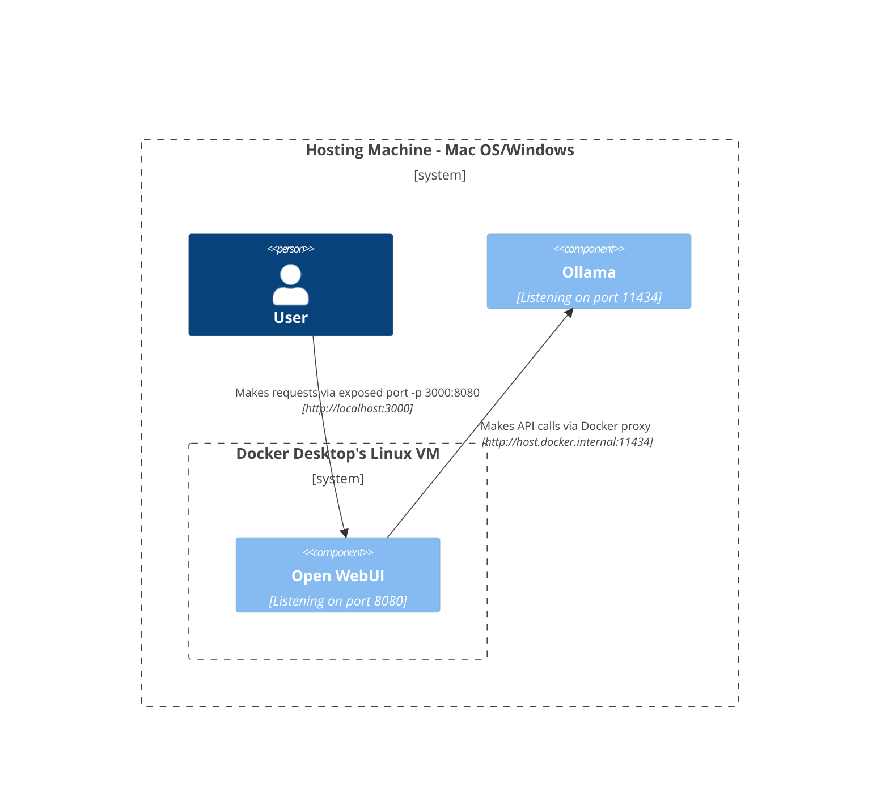
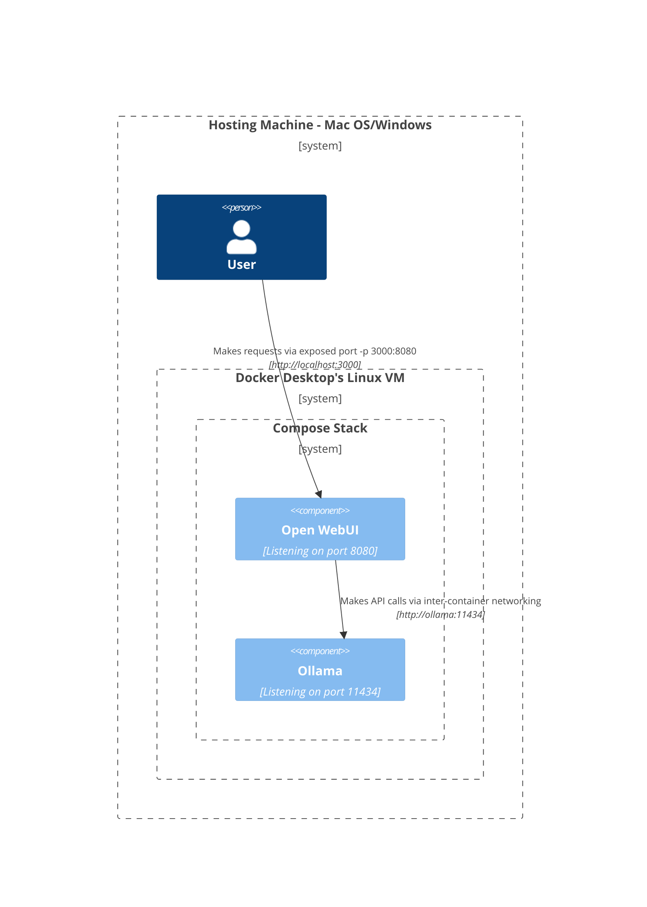
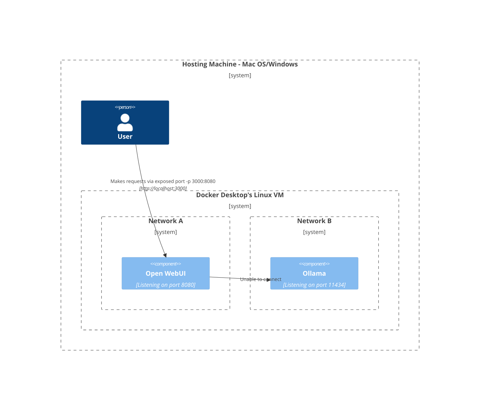
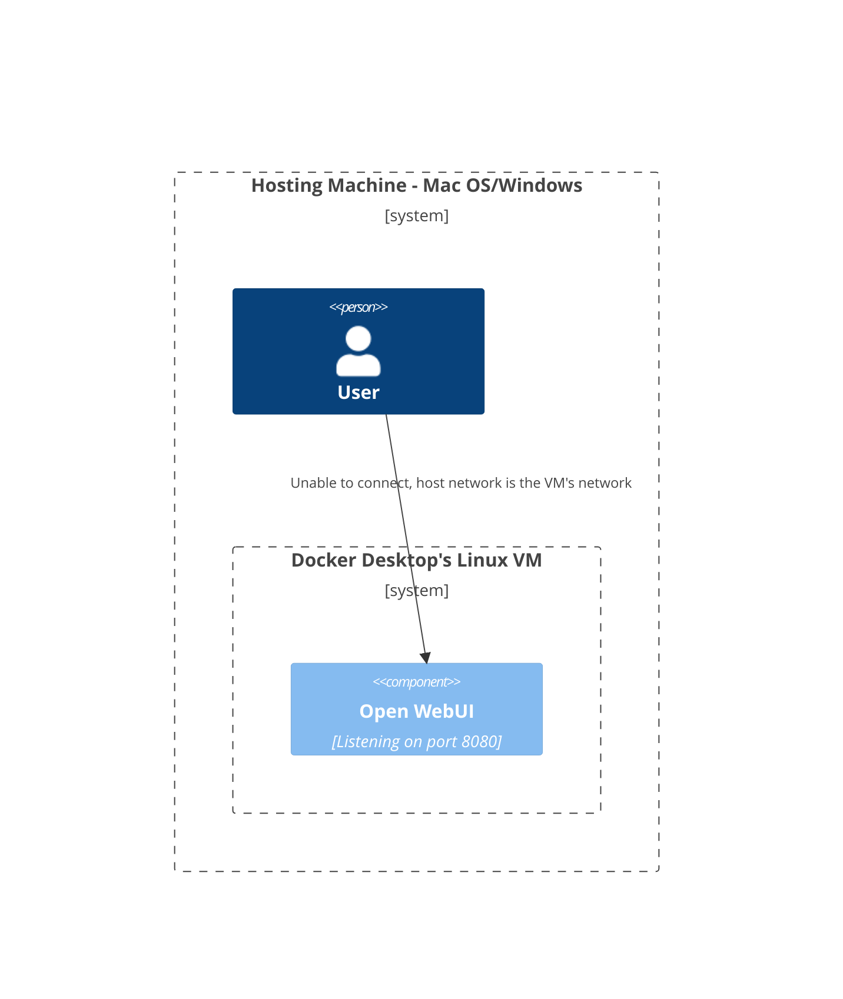
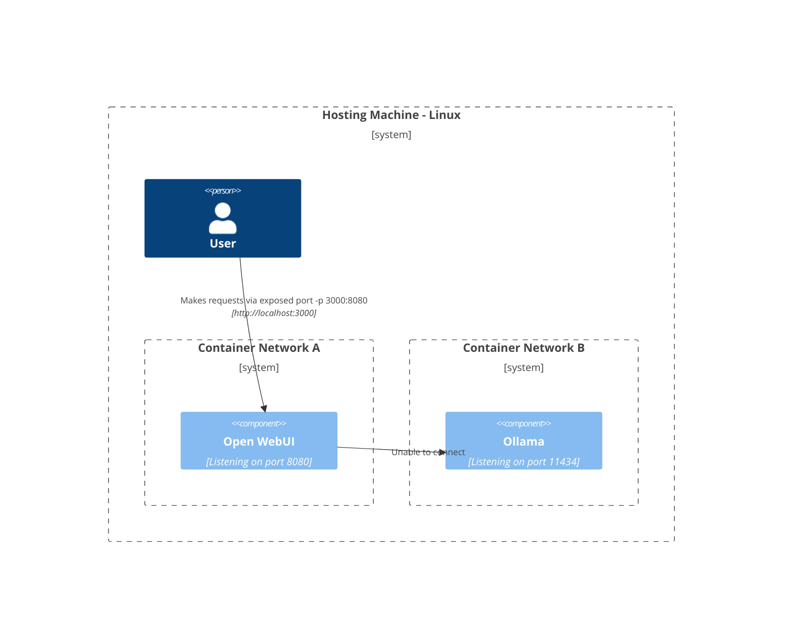
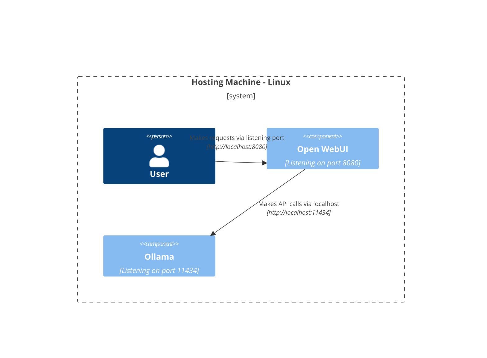

Here, we provide clear and structured diagrams to help you understand how various components of the network interact within different setups. This documentation is designed to assist both macOS/Windows and Linux users. Each scenario is illustrated using Mermaid diagrams to show how the interactions are set up depending on the different system configurations and deployment strategies.

## Mac OS/Windows Setup Options 🖥️

### Ollama on Host, Open WebUI in Container

In this scenario, `Ollama` runs directly on the host machine while `Open WebUI` operates within a Docker container.

### Ollama and Open WebUI in Compose Stack

Both `Ollama` and `Open WebUI` are configured within the same Docker Compose stack, simplifying network communications.

### Ollama and Open WebUI, Separate Networks

Here, `Ollama` and `Open WebUI` are deployed in separate Docker networks, potentially leading to connectivity issues.

### Open WebUI in Host Network

In this configuration, `Open WebUI` utilizes the host network, which impacts its ability to connect in certain environments.

## Linux Setup Options 🐧

### Ollama on Host, Open WebUI in Container (Linux)

This diagram is specific to the Linux platform, with `Ollama` running on the host and `Open WebUI` deployed inside a Docker container.

### Ollama and Open WebUI in Compose Stack (Linux)

A set-up where both `Ollama` and `Open WebUI` reside within the same Docker Compose stack, allowing for straightforward networking on Linux.

### Ollama and Open WebUI, Separate Networks (Linux)

A scenario in which `Ollama` and `Open WebUI` are in different Docker networks under a Linux environment, which could hinder connectivity.

### Open WebUI in Host Network, Ollama on Host (Linux)

An optimal layout where both `Open WebUI` and `Ollama` use the host’s network, facilitating seamless interaction on Linux systems.

Each setup addresses different deployment strategies and networking configurations to help you choose the best layout for your requirements.
