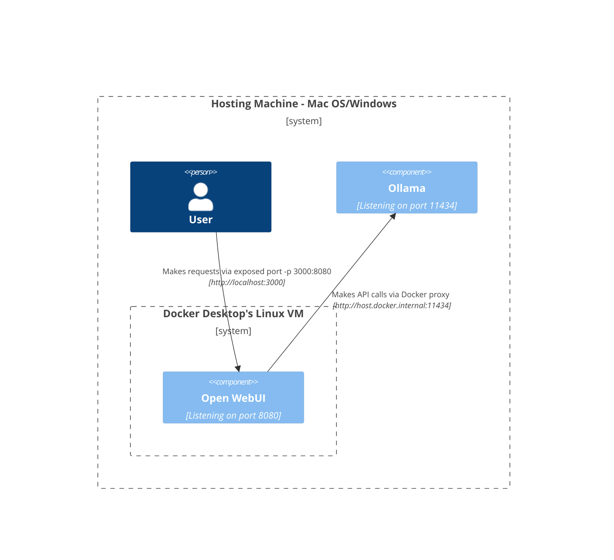
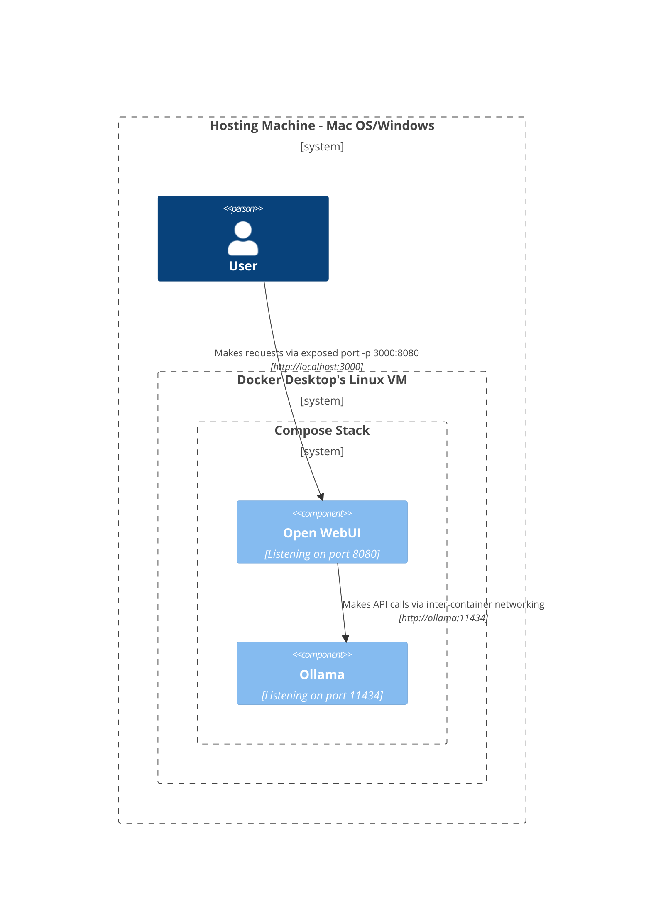
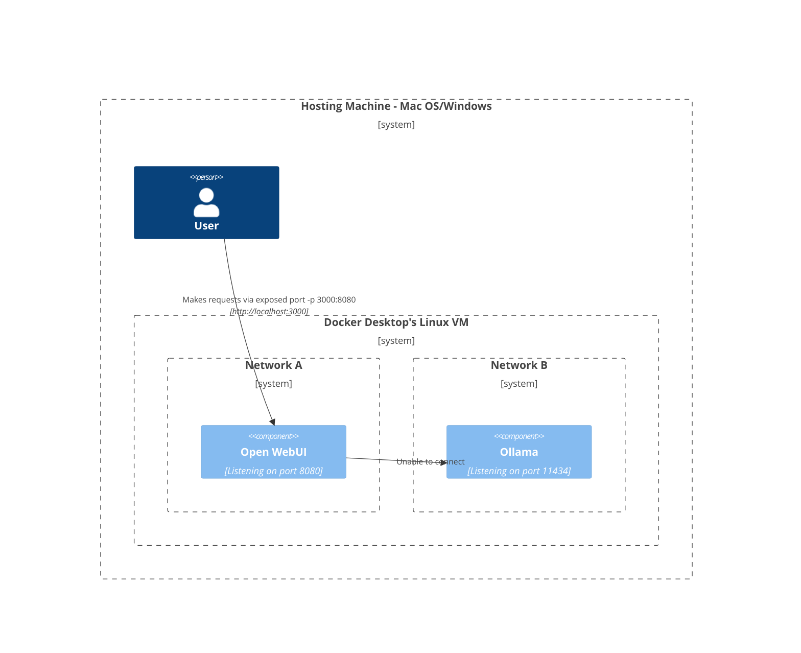
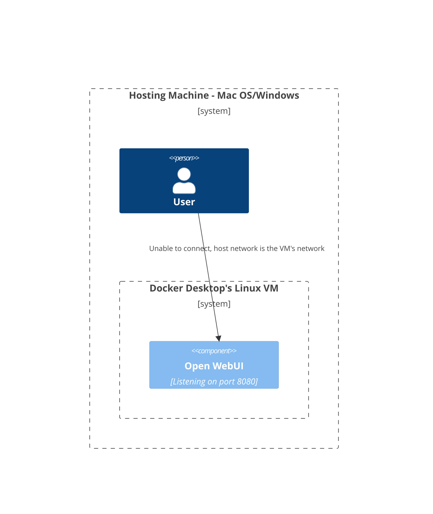
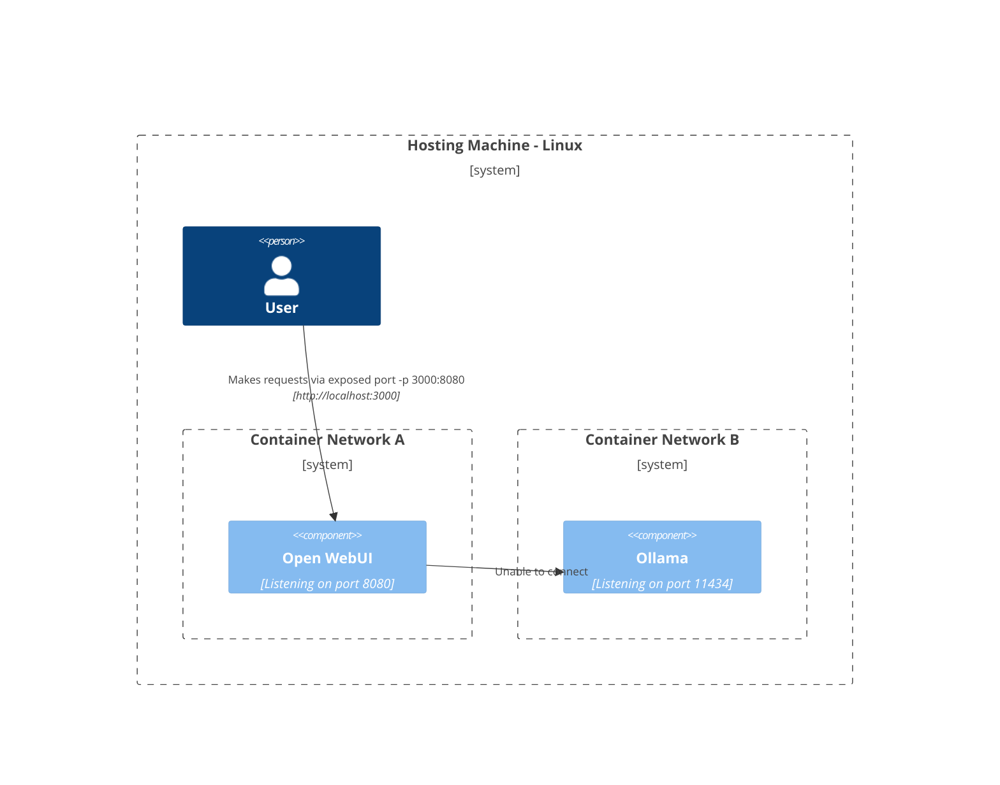
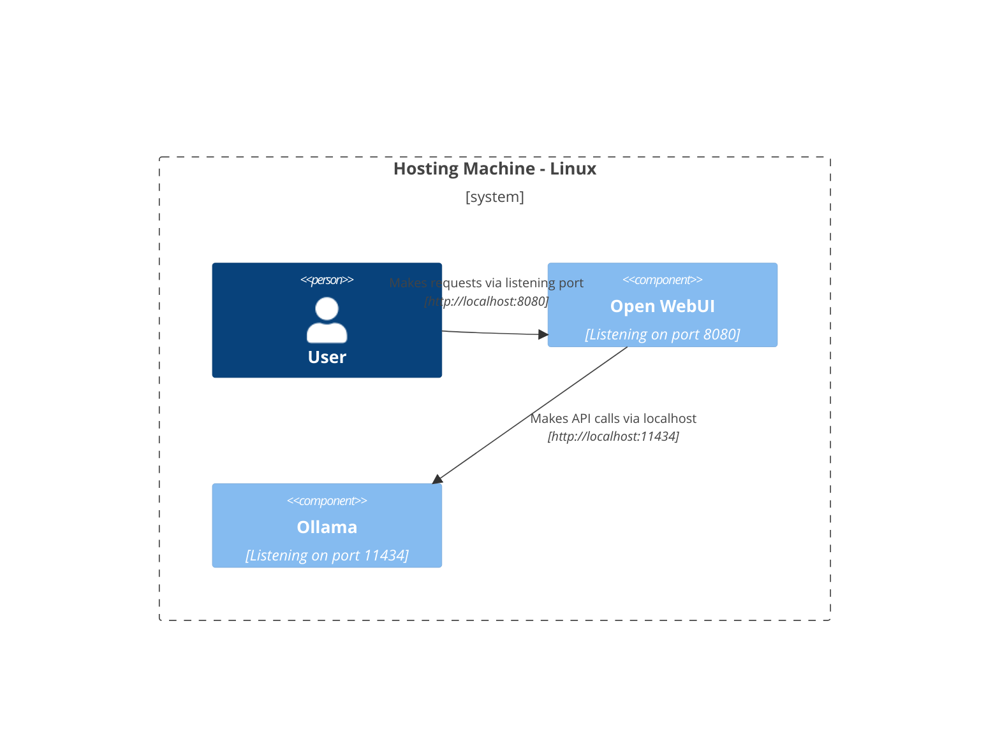

import Tabs from '@theme/Tabs';
import TabItem from '@theme/TabItem';

Visual C4 diagrams for common deployment topologies showing how Open WebUI, Ollama, and Docker communicate. Use these to debug connectivity issues or plan your architecture.

<Tabs groupId="os-platform">
  <TabItem value="macos-windows" label="macOS / Windows" default>

  <Tabs groupId="macos-topology">
    <TabItem value="host-ollama-mac" label="Host Ollama" default>

#### Ollama on Host, Open WebUI in Container

`Ollama` runs directly on the host machine while `Open WebUI` operates within a Docker container.

```mermaid
C4Context
Boundary(b0, "Hosting Machine - Mac OS/Windows") {
   Person(user, "User")
   Boundary(b1, "Docker Desktop's Linux VM") {
      Component(openwebui, "Open WebUI", "Listening on port 8080")
   }
   Component(ollama, "Ollama", "Listening on port 11434")
}
Rel(openwebui, ollama, "Makes API calls via Docker proxy", "http://host.docker.internal:11434")
Rel(user, openwebui, "Makes requests via exposed port -p 3000:8080", "http://localhost:3000")
UpdateRelStyle(user, openwebui, $offsetX="-100", $offsetY="-50")
```

    </TabItem>
    <TabItem value="compose-stack-mac" label="Compose Stack">

#### Ollama and Open WebUI in Compose Stack

Both `Ollama` and `Open WebUI` are configured within the same Docker Compose stack, simplifying network communications.

```mermaid
C4Context
Boundary(b0, "Hosting Machine - Mac OS/Windows") {
   Person(user, "User")
   Boundary(b1, "Docker Desktop's Linux VM") {
      Boundary(b2, "Compose Stack") {
         Component(openwebui, "Open WebUI", "Listening on port 8080")
         Component(ollama, "Ollama", "Listening on port 11434")
      }
   }
}
Rel(openwebui, ollama, "Makes API calls via inter-container networking", "http://ollama:11434")
Rel(user, openwebui, "Makes requests via exposed port -p 3000:8080", "http://localhost:3000")
UpdateRelStyle(user, openwebui, $offsetX="-100", $offsetY="-50")
```

    </TabItem>
    <TabItem value="separate-networks-mac" label="Separate Networks">

#### Ollama and Open WebUI, Separate Networks

`Ollama` and `Open WebUI` are deployed in separate Docker networks. This leads to connectivity issues.

```mermaid
C4Context
Boundary(b0, "Hosting Machine - Mac OS/Windows") {
   Person(user, "User")
   Boundary(b1, "Docker Desktop's Linux VM") {
      Boundary(b2, "Network A") {
         Component(openwebui, "Open WebUI", "Listening on port 8080")
      }
      Boundary(b3, "Network B") {
         Component(ollama, "Ollama", "Listening on port 11434")
      }
   }
}
Rel(openwebui, ollama, "Unable to connect")
Rel(user, openwebui, "Makes requests via exposed port -p 3000:8080", "http://localhost:3000")
UpdateRelStyle(user, openwebui, $offsetX="-100", $offsetY="-50")
```

    </TabItem>
    <TabItem value="host-network-mac" label="Host Network">

#### Open WebUI in Host Network

`Open WebUI` utilizes the host network, which impacts its ability to connect in certain environments.

```mermaid
C4Context
Boundary(b0, "Hosting Machine - Mac OS/Windows") {
   Person(user, "User")
   Boundary(b1, "Docker Desktop's Linux VM") {
      Component(openwebui, "Open WebUI", "Listening on port 8080")
   }
}
Rel(user, openwebui, "Unable to connect, host network is the VM's network")
UpdateRelStyle(user, openwebui, $offsetX="-100", $offsetY="-50")
```

    </TabItem>
  </Tabs>

  </TabItem>
  <TabItem value="linux" label="Linux">

  <Tabs groupId="linux-topology">
    <TabItem value="host-ollama-linux" label="Host Ollama" default>

#### Ollama on Host, Open WebUI in Container

`Ollama` runs on the host and `Open WebUI` is deployed inside a Docker container.

```mermaid
C4Context
Boundary(b0, "Hosting Machine - Linux") {
   Person(user, "User")
   Boundary(b1, "Container Network") {
      Component(openwebui, "Open WebUI", "Listening on port 8080")
   }
   Component(ollama, "Ollama", "Listening on port 11434")
}
Rel(openwebui, ollama, "Makes API calls via Docker proxy", "http://host.docker.internal:11434")
Rel(user, openwebui, "Makes requests via exposed port -p 3000:8080", "http://localhost:3000")
UpdateRelStyle(user, openwebui, $offsetX="-100", $offsetY="-50")
```

    </TabItem>
    <TabItem value="compose-stack-linux" label="Compose Stack">

#### Ollama and Open WebUI in Compose Stack

Both `Ollama` and `Open WebUI` reside within the same Docker Compose stack, allowing for straightforward networking.

```mermaid
C4Context
Boundary(b0, "Hosting Machine - Linux") {
   Person(user, "User")
   Boundary(b1, "Container Network") {
      Boundary(b2, "Compose Stack") {
         Component(openwebui, "Open WebUI", "Listening on port 8080")
         Component(ollama, "Ollama", "Listening on port 11434")
      }
   }
}
Rel(openwebui, ollama, "Makes API calls via inter-container networking", "http://ollama:11434")
Rel(user, openwebui, "Makes requests via exposed port -p 3000:8080", "http://localhost:3000")
UpdateRelStyle(user, openwebui, $offsetX="-100", $offsetY="-50")
```

    </TabItem>
    <TabItem value="separate-networks-linux" label="Separate Networks">

#### Ollama and Open WebUI, Separate Networks

`Ollama` and `Open WebUI` are in different Docker networks, which can hinder connectivity.

```mermaid
C4Context
Boundary(b0, "Hosting Machine - Linux") {
   Person(user, "User")
   Boundary(b2, "Container Network A") {
      Component(openwebui, "Open WebUI", "Listening on port 8080")
   }
   Boundary(b3, "Container Network B") {
      Component(ollama, "Ollama", "Listening on port 11434")
   }
}
Rel(openwebui, ollama, "Unable to connect")
Rel(user, openwebui, "Makes requests via exposed port -p 3000:8080", "http://localhost:3000")
UpdateRelStyle(user, openwebui, $offsetX="-100", $offsetY="-50")
```

    </TabItem>
    <TabItem value="host-network-linux" label="Host Network">

#### Open WebUI in Host Network, Ollama on Host

Both `Open WebUI` and `Ollama` use the host's network, enabling seamless interaction.

```mermaid
C4Context
Boundary(b0, "Hosting Machine - Linux") {
   Person(user, "User")
   Component(openwebui, "Open WebUI", "Listening on port 8080")
   Component(ollama, "Ollama", "Listening on port 11434")
}
Rel(openwebui, ollama, "Makes API calls via localhost", "http://localhost:11434")
Rel(user, openwebui, "Makes requests via listening port", "http://localhost:8080")
UpdateRelStyle(user, openwebui, $offsetX="-100", $offsetY="-50")
```

    </TabItem>
  </Tabs>

  </TabItem>
</Tabs>
