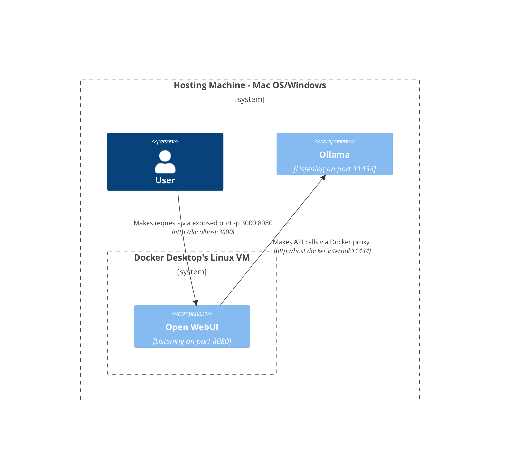
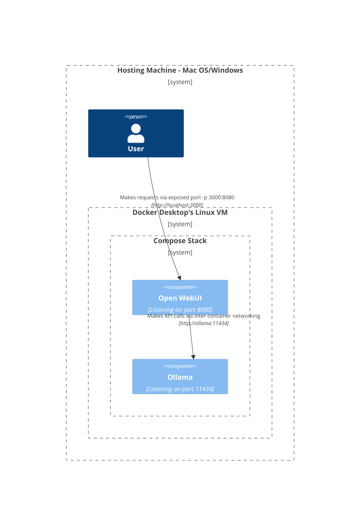
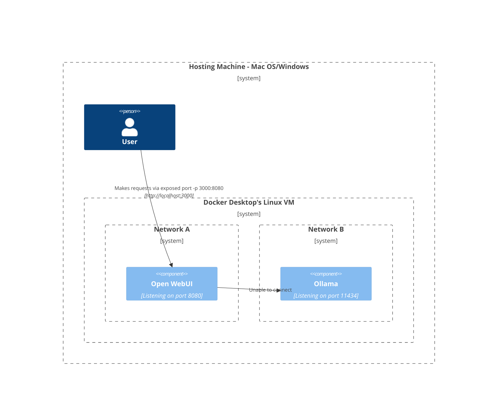
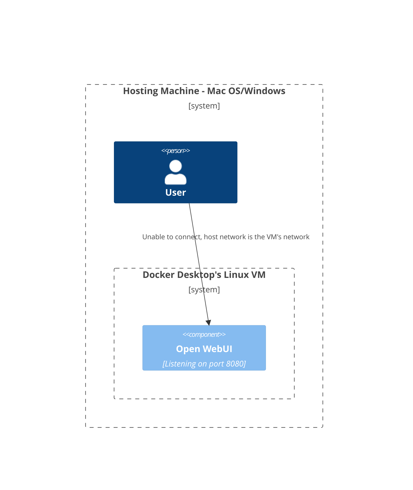
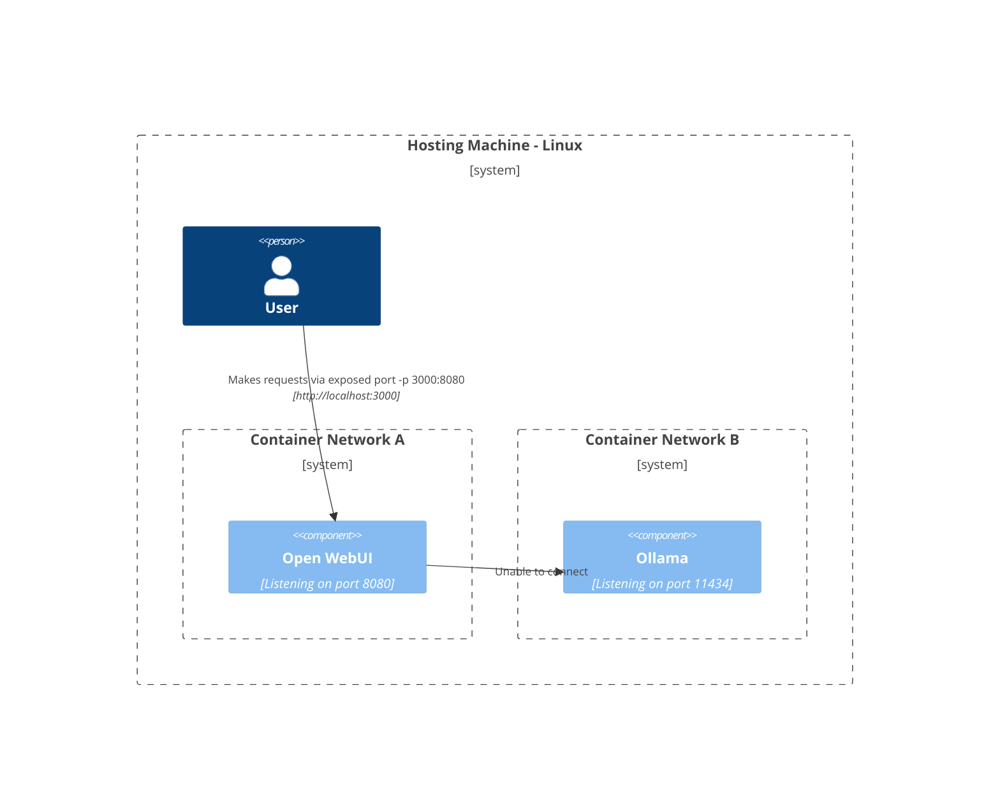
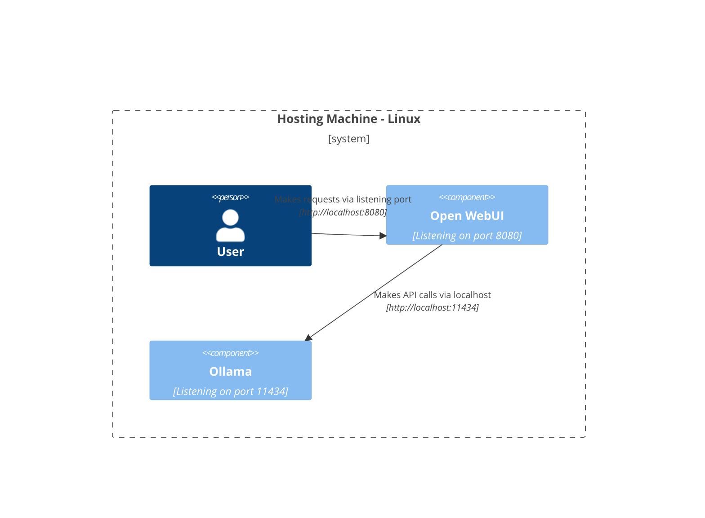

import { TopBanners } from "@site/src/components/TopBanners";

<TopBanners />

## Open WebUI: Server Connection Error

If you're experiencing connection issues, it’s often due to the WebUI docker container not being able to reach the Ollama server at 127.0.0.1:11434 (host.docker.internal:11434) inside the container . Use the `--network=host` flag in your docker command to resolve this. Note that the port changes from 3000 to 8080, resulting in the link: `http://localhost:8080`.

**Example Docker Command**:

```bash
docker run -d --network=host -v open-webui:/app/backend/data -e OLLAMA_BASE_URL=http://127.0.0.1:11434 --name open-webui --restart always ghcr.io/open-webui/open-webui:main
```

If you're experiencing connection issues with the SSL error of huggingface.co, please checked the huggingface server, if it is down, you could set the `HF_ENDPOINT` to `https://hf-mirror.com/` in the `docker run` command.

```bash
docker run -d -p 3000:8080 -e HF_ENDPOINT=https://hf-mirror.com/ --add-host=host.docker.internal:host-gateway -v open-webui:/app/backend/data --name open-webui --restart always ghcr.io/open-webui/open-webui:main
```

If you're using Podman on MacOS, to reach Ollama running on your computer you must enable the host loopback with `--network slirp4netns:allow_host_loopback=true` and override `OLLAMA_BASE_URL` to `http://host.containers.internal:11434`. The Open WebUI link remains the default: `http://localhost:3000`.

**Example Podman Command**:

```bash
podman run -d --network slirp4netns:allow_host_loopback=true -p 3000:8080 -e OLLAMA_BASE_URL=http://host.containers.internal:11434 -v open-webui:/app/backend/data --name open-webui --restart always ghcr.io/open-webui/open-webui:main
```

## Difficulty Accessing Ollama from Open WebUI

If you're encountering difficulties accessing Ollama from the Open WebUI interface, it could be due to Ollama being configured to listen on a restricted network interface by default. To enable access from the Open WebUI, you need to configure Ollama to listen on a broader range of network interfaces.

Follow these steps to adjust the Ollama configuration:

1. **Configure Ollama Host**: Set the `OLLAMA_HOST` environment variable to `0.0.0.0`. This tells Ollama to listen on all available network interfaces, enabling connections from external sources, including the Open WebUI.

2. **Modify Ollama Environment Variables**: Depending on how you're running Ollama, you may need to adjust the environment variables accordingly. If you're running Ollama in a Docker container, ensure that the `OLLAMA_HOST` variable is correctly set within the container environment. For other deployment methods, refer to the respective documentation for instructions on setting environment variables.

3. **Restart Ollama**: After modifying the environment variables, restart the Ollama service to apply the changes. This ensures that Ollama begins listening on the specified network interfaces.

Once Ollama is configured to listen on `0.0.0.0`, you should be able to access it from the Open WebUI without any issues.

For detailed instructions on setting environment variables for Ollama, refer to the [official Ollama documentation](https://github.com/ollama/ollama/blob/main/docs/faq.md#setting-environment-variables-on-linux).

## General Connection Errors

**Ensure Ollama Version is Up-to-Date**: Always start by checking that you have the latest version of Ollama. Visit [Ollama's official site](https://ollama.com/) for the latest updates.

**Troubleshooting Steps**:

1. **Verify Ollama URL Format**:
   - When running the Web UI container, ensure the `OLLAMA_BASE_URL` is correctly set. (e.g., `http://192.168.1.1:11434` for different host setups).
   - In the Open WebUI, navigate to "Settings" > "General".
   - Confirm that the Ollama Server URL is correctly set to `[OLLAMA URL]` (e.g., `http://localhost:11434`).

By following these enhanced troubleshooting steps, connection issues should be effectively resolved. For further assistance or queries, feel free to reach out to us on our community Discord.

## [SSL: CERTIFICATE_VERIFY_FAILED]

If you get this error while trying to run OI, most likely the issue is that you are on a network which intercepts HTTPS traffic (e.g. a corporate network), 
you will need to add the new cert into OI's truststore. 

**For pre-built Docker image**:

1. Mount the certificiate store from your host machine into the container by passing `--volume=/etc/ssl/certs/ca-certificiate.crt:/etc/ssl/certs/ca-certificiates.crt:ro` as a command-line option to `docker run`
2. Force python to use the system truststore by setting `REQUESTS_CA_BUNDLE=/etc/ssl/certs/ca-certificates.crt` (see https://docs.docker.com/reference/cli/docker/container/run/#env)

Example `compose.yaml` from [@KizzyCode](https://github.com/open-webui/open-webui/issues/1398#issuecomment-2258463210):

```yaml
services:
  openwebui:
    image: ghcr.io/open-webui/open-webui:main
    volumes:
      - /var/containers/openwebui:/app/backend/data:rw
      - /etc/containers/openwebui/compusrv.crt:/etc/ssl/certs/ca-certificates.crt:ro
      - /etc/timezone:/etc/timezone:ro
      - /etc/localtime:/etc/localtime:ro
    environment:
      - WEBUI_NAME=compusrv
      - ENABLE_SIGNUP=False
      - ENABLE_COMMUNITY_SHARING=False
      - WEBUI_SESSION_COOKIE_SAME_SITE=strict
      - WEBUI_SESSION_COOKIE_SECURE=True
      - ENABLE_OLLAMA_API=False
      - REQUESTS_CA_BUNDLE=/etc/ssl/certs/ca-certificates.crt
```

**For local development**:

You can also add the certificates in the build process by modifying the `Dockerfile`. This is useful if you want to make changes to the UI, for instance.
Since the build happens in [multiple stages](https://docs.docker.com/build/building/multi-stage/), you have to add the cert into both
1. Frontend (`build` stage): 
```dockerfile
COPY package.json package-lock.json <YourRootCert>.crt ./
ENV NODE_EXTRA_CA_CERTS=/app/<YourRootCert>.crt
RUN npm ci
```
2. Backend (`base` stage):
```dockerfile
COPY <CorporateSSL.crt> /usr/local/share/ca-certificates/
RUN update-ca-certificates
ENV PIP_CERT=/etc/ssl/certs/ca-certificates.crt \
    REQUESTS_CA_BUNDLE=/etc/ssl/certs/ca-certificates.crt
```

## Network Diagrams of different deployments

#### Mac OS/Windows - Ollama on Host, Open WebUI in container



#### Mac OS/Windows - Ollama and Open WebUI in the same Compose stack



#### Mac OS/Windows - Ollama and Open WebUI in containers, in different networks



#### Mac OS/Windows - Open WebUI in host network



#### Linux - Ollama on Host, Open WebUI in container


#### Linux - Ollama and Open WebUI in the same Compose stack


#### Linux - Ollama and Open WebUI in containers, in different networks



#### Linux - Open WebUI in host network, Ollama on host



## Reset Admin Password

If you've forgotten your admin password, you can reset it by following these steps:

### Reset Admin Password in Docker

To reset the admin password for Open WebUI in a Docker deployment, generate a bcrypt hash of your new password and run a Docker command to update the database. Replace `your-new-password` with the desired password and execute:

1. **Generate bcrypt hash** (local machine):

   ```bash
   htpasswd -bnBC 10 "" your-new-password | tr -d ':\n'
   ```

2. **Update password in Docker** (replace `HASH` and `admin@example.com`):
   ```bash
   docker run --rm -v open-webui:/data alpine/socat EXEC:"bash -c 'apk add sqlite && echo UPDATE auth SET password='\''HASH'\'' WHERE email='\''admin@example.com'\''; | sqlite3 /data/webui.db'", STDIO
   ```

### Reset Admin Password Locally

For local installations of Open WebUI, navigate to the `open-webui` directory and update the password in the `backend/data/webui.db` database.

1. **Generate bcrypt hash** (local machine):

   ```bash
   htpasswd -bnBC 10 "" your-new-password | tr -d ':\n'
   ```

2. **Update password locally** (replace `HASH` and `admin@example.com`):
   ```bash
   sqlite3 backend/data/webui.db "UPDATE auth SET password='HASH' WHERE email='admin@example.com';"
   ```

## Understanding the Open WebUI Architecture

The Open WebUI system is designed to streamline interactions between the client (your browser) and the Ollama API. At the heart of this design is a backend reverse proxy, enhancing security and resolving CORS issues.

- **How it Works**: The Open WebUI is designed to interact with the Ollama API through a specific route. When a request is made from the WebUI to Ollama, it is not directly sent to the Ollama API. Initially, the request is sent to the Open WebUI backend via `/ollama` route. From there, the backend is responsible for forwarding the request to the Ollama API. This forwarding is accomplished by using the route specified in the `OLLAMA_BASE_URL` environment variable. Therefore, a request made to `/ollama` in the WebUI is effectively the same as making a request to `OLLAMA_BASE_URL` in the backend. For instance, a request to `/ollama/api/tags` in the WebUI is equivalent to `OLLAMA_BASE_URL/api/tags` in the backend.

- **Security Benefits**: This design prevents direct exposure of the Ollama API to the frontend, safeguarding against potential CORS (Cross-Origin Resource Sharing) issues and unauthorized access. Requiring authentication to access the Ollama API further enhances this security layer.
