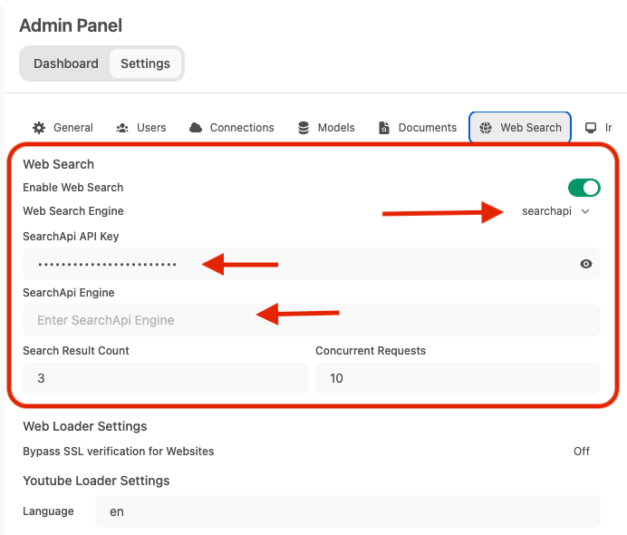
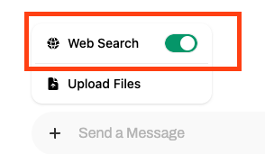
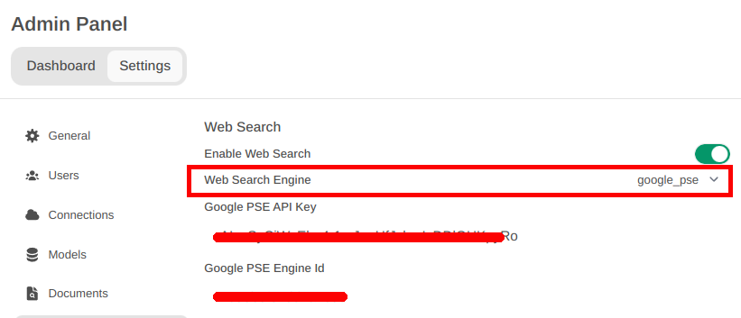
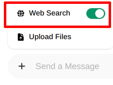

# Web Search

## Overview

This guide provides instructions on how to set up web search capabilities in Open WebUI using various search engines.

## SearXNG (Docker)

SearXNG is a metasearch engine that aggregates results from multiple search engines.

### 1. SearXNG Configuration

Create a folder named `searxng` in the same directory as your compose files. This folder will contain your Searxng configuration files. Refer to the [Searxng documentation](https://docs.searxng.org/) for configuration instructions.

#### Configuration Files:

<details>
<summary>searxng/settings.yml</summary>

```yaml
# see https://docs.searxng.org/admin/settings/settings.html#settings-use-default-settings
use_default_settings: true

server:
  secret_key: "f9e603d4191caab069b021fa0568391a33c8a837b470892c64461b5dd12464f4"
  limiter: false
  image_proxy: true
  port: 8080
  bind_address: "0.0.0.0"

ui:
  static_use_hash: true

search:
  safe_search: 0
  autocomplete: ""
  default_lang: ""
  formats:
    - html
    - json
```

</details>

<details>
<summary>searxng/limiter.toml</summary>

```toml
[botdetection.ip_limit]
# activate link_token method in the ip_limit method
link_token = true
```

</details>

<details>
<summary>searxng/uwsgi.ini</summary>

```ini
[uwsgi]
# Who will run the code
uid = searxng
gid = searxng

# Number of workers (usually CPU count)
# default value: %k (= number of CPU core, see Dockerfile)
workers = %k

# Number of threads per worker
# default value: 4 (see Dockerfile)
threads = 4

# The right granted on the created socket
chmod-socket = 666

# Plugin to use and interpreter config
single-interpreter = true
master = true
plugin = python3
lazy-apps = true
enable-threads = 4

# Module to import
module = searx.webapp

# Virtualenv and python path
pythonpath = /usr/local/searxng/
chdir = /usr/local/searxng/searx/

# automatically set processes name to something meaningful
auto-procname = true

# Disable request logging for privacy
disable-logging = true
log-5xx = true

# Set the max size of a request (request-body excluded)
buffer-size = 8192

# No keep alive
# See https://github.com/searx/searx-docker/issues/24
add-header = Connection: close

# uwsgi serves the static files
static-map = /static=/usr/local/searxng/searx/static
# expires set to one day
static-expires = /* 86400
static-gzip-all = True
offload-threads = 4
```

</details>

### 2. Docker Compose Setup

Add the following to a file named `docker-compose.searxng.yaml` alongside your existing `docker-compose.yaml`:

```yaml
services:
  open-webui:
    environment:
      ENABLE_RAG_WEB_SEARCH: True
      RAG_WEB_SEARCH_ENGINE: "searxng"
      RAG_WEB_SEARCH_RESULT_COUNT: 3
      RAG_WEB_SEARCH_CONCURRENT_REQUESTS: 10
      SEARXNG_QUERY_URL: "http://searxng:8080/search?q=<query>"

  searxng:
    image: searxng/searxng:latest
    container_name: searxng
    ports:
      - "8080:8080"
    volumes:
      - ./searxng:/etc/searxng
    restart: always
```

Launch your updated stack with:

```bash
docker compose -f docker-compose.yaml -f docker-compose.searxng.yaml up -d
```

### 3. Alternative: Docker Run

You can run SearXNG directly using `docker run`:

```bash
docker run -d --name searxng -p 8080:8080 -v ./searxng:/etc/searxng --restart always searxng/searxng:latest
```

### 4. GUI Configuration

1. Navigate to: `Admin Panel` -> `Settings` -> `Web Search`
2. Toggle `Enable Web Search`
3. Set `Web Search Engine` from dropdown menu to `searxng`
4. Set `Searxng Query URL` to examples given: `https://<search.domain.com>/search?q=<query>` or `http://<searxng.local>/search?q=<query>`. **Do note the `/search?q=<query>` part is mandatory.**
5. Adjust the `Search Result Count` and `Concurrent Requests` values accordingly
6. Save changes


### 5. Using Web Search in a Chat

To access Web Search, Click on the + next to the message input field.

Here you can toggle Web Search On/Off.


#### Note

You will have to explicitly toggle this On/Off in a chat.

This is enabled on a per session basis eg. reloading the page, changing to another chat will toggle off.

## SearchApi API

[SearchApi](https://searchapi.io) is a collection of real-time SERP APIs. Any existing or upcoming SERP engine that returns `organic_results` is supported. The default web search engine is `google`, but it can be changed to `bing`, `baidu`, `google_news`, `bing_news`, `google_scholar`, `google_patents`, and others.

### Setup

1. Go to [SearchApi](https://searchapi.io), and log on or create a new account.
2. Go to `Dashboard` and copy the API key.
3. With `API key`, open `Open WebUI Admin panel` and click `Settings` tab, and then click `Web Search`.
4. Enable `Web search` and set `Web Search Engine` to `searchapi`.
5. Fill `SearchApi API Key` with the `API key` that you copied in step 2 from [SearchApi](https://www.searchapi.io/) dashboard.
6. [Optional] Enter the `SearchApi engine` name you want to query. Example, `google`, `bing`, `baidu`, `google_news`, `bing_news`, `google_videos`, `google_scholar` and `google_patents.` By default, it is set to `google`.
7. Click `Save`.



#### Note
You have to enable `Web search` in the prompt field, using plus (`+`) button to search the web using [SearchApi](https://www.searchapi.io/) engines.



## Google PSE API

### Setup

1. Go to Google Developers, use [Programmable Search Engine](https://developers.google.com/custom-search), and log on or create account.
2. Go to [control panel](https://programmablesearchengine.google.com/controlpanel/all) and click `Add` button
3. Enter a search engine name, set the other properties to suit your needs, verify you're not a robot and click `Create` button.
4. Generate `API key` and get the `Search engine ID`. (Available after the engine is created)
5. With `API key` and `Search engine ID`, open `Open WebUI Admin panel` and click `Settings` tab, and then click `Web Search`
6. Enable `Web search` and Set `Web Search Engine` to `google_pse`
7. Fill `Google PSE API Key` with the `API key` and `Google PSE Engine Id` (# 4)
8. Click `Save`




#### Note
You have to enable `Web search` in the prompt field, using plus (`+`) button.
Search the web ;-)



## Serper API

## Serpstack API

## Brave API

### Docker Compose Setup

Add the following to a file named `docker-compose.yaml`:

```yaml
services:
  open-webui:
    environment:
      ENABLE_RAG_WEB_SEARCH: True
      RAG_WEB_SEARCH_ENGINE: "brave"
      BRAVE_SEARCH_API_KEY: "YOUR_API_KEY"
      RAG_WEB_SEARCH_RESULT_COUNT: 3
      RAG_WEB_SEARCH_CONCURRENT_REQUESTS: 10
```

