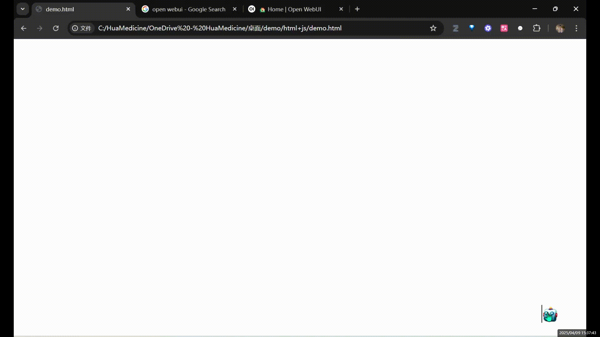

:::warning
This tutorial is a community contribution and is not supported by the Open WebUI team. It serves only as a demonstration on how to customize Open WebUI for your specific use case. Want to contribute? Check out the contributing tutorial.
:::

# Prerequisites

-   A running instance of Open WebUI accessible via HTTP/HTTPS.

# HTML+Javascript Integration

To embed the Open WebUI chat interface into your existing webpage, add the following `<script>` tag anywhere within the `<body>` of your HTML document. This script will create a hovering, retractable pop-up button that opens the chat interface.



```html title="Example Embedding Script"
<!-- Add this script tag to your HTML body -->
<script
  type="text/javascript"   
  src="http://<OPEN_WEBUI_URL>/static/iframe/iframe.js"  <!-- Adjust the src path -->
  id="chatbot-iframe" 
  data-bot-src="http://<OPEN_WEBUI_URL>" <!-- Set your Open WebUI URL -->
  data-default-open="false"
  data-drag="false"
  data-open-icon="https://em-content.zobj.net/source/telegram/386/robot_1f916.webp"
  data-close-icon="https://em-content.zobj.net/source/telegram/386/robot_1f916.webp"
  defer
></script>
```

**Important Notes:**

-   Replace `<OPEN_WEBUI_URL>` in both `src` and `data-bot-src` with the actual base URL where your Open WebUI instance is running (e.g., `http://localhost:8080`, `https://chat.yourdomain.com`).
-   **Security:** Ensure the `data-bot-src` URL points to your trusted Open WebUI instance. Embedding content via iframes requires careful consideration of the source.
-   **Customization:** The style and behavior of the chatbot button and window can be further customized. You might modify the `iframe.js` file directly (if self-hosting Open WebUI) or override CSS styles targeting the iframe elements from your host page's stylesheet (e.g., targeting `#chatbot-iframe-container`, `#chatbot-iframe-button`).

## Configuration Options

Here's a breakdown of the configuration options available via `data-*` attributes on the `<script>` tag:

-   **`id="chatbot-iframe"`**: A unique identifier for the script tag. Useful for CSS targeting or custom JavaScript interactions.
-   **`src=".../static/iframe/iframe.js"`**: Specifies the path to the core JavaScript file responsible for the iframe embedding. This file is served by your Open WebUI instance. Ensure the URL points correctly to your instance's `/static/iframe/iframe.js` endpoint.
-   **`data-bot-src="<OPEN_WEBUI_URL>"`**: **Required.** The base URL of your Open WebUI instance. This is the URL that will be loaded inside the iframe.
-   **`data-default-open="false"`**: Controls whether the chat window is initially open (`true`) or closed (`false`) when the page loads. Defaults to `false`.
-   **`data-drag="false"`**: Determines if the chat button/window can be dragged around the page (`true`) or remain fixed (`false`). Defaults to `false`.
-   **`data-open-icon="..."`**: The URL for the image to be used as the icon when the chat is closed (the floating button).
-   **`data-close-icon="..."`**: The URL for the image to be used as the icon in the header of the chat window when it's open.

# Troubleshooting

If the chat interface doesn't appear or function correctly, check the following:

-   **Browser Developer Console:** Open your browser's developer tools (usually by pressing F12) and check the Console tab for errors. Look for 404 Not Found errors (for `iframe.js` or icons), JavaScript errors, or messages indicating blocked content.
-   **Open WebUI URL:** Verify that the `src` path for `iframe.js` and the `data-bot-src` URL are correct and that your Open WebUI instance is running and accessible from the user's browser at that URL. Try accessing the `data-bot-src` URL directly in your browser.
-   **Script Path:** Ensure the `src` attribute in the `<script>` tag correctly points to the `iframe.js` file served by your Open WebUI instance.
-   **HTTPS/HTTP Mismatch:** If your hosting page is HTTPS, the `data-bot-src` should also ideally be HTTPS. Browsers may block mixed content (loading HTTP content on an HTTPS page).


(...More to come with Vue, React embedding with Open WebUI)