:::warning

This tutorial is a community contribution and is not supported by the Open WebUI team. It serves only as a demonstration on how to customize Open WebUI for your specific use case. Want to contribute? Check out the contributing tutorial.

:::

> [!WARNING]
> This documentation was created/updated based on version 0.8.0 and updated for recent migrations.

## Open-WebUI Internal SQLite Database

For Open-WebUI, the SQLite database serves as the backbone for user management, chat history, file storage, and various other core functionalities. Understanding this structure is essential for anyone looking to contribute to or maintain the project effectively.

## Internal SQLite Location

You can find the SQLite database at `root` -> `data` -> `webui.db`

```txt
📁 Root (/)
├── 📁 data
│   ├── 📁 cache
│   ├── 📁 uploads
│   ├── 📁 vector_db
│   └── 📄 webui.db
├── 📄 dev.sh
├── 📁 open_webui
├── 📄 requirements.txt
├── 📄 start.sh
└── 📄 start_windows.bat
```

## Copy Database Locally

If you want to copy the Open-WebUI SQLite database running in the container to your local machine, you can use:

```bash
docker cp open-webui:/app/backend/data/webui.db ./webui.db
```

Alternatively, you can access the database within the container using:

```bash
docker exec -it open-webui /bin/sh
```

## Table Overview

Here is a complete list of tables in Open-WebUI's SQLite database. The tables are listed alphabetically and numbered for convenience.

| **No.** | **Table Name**   | **Description**                                              |
| ------- | ---------------- | ------------------------------------------------------------ |
| 01      | access_grant     | Stores normalized access control grants for all resources    |
| 02      | auth             | Stores user authentication credentials and login information |
| 03      | channel          | Manages chat channels and their configurations               |
| 04      | channel_file     | Links files to channels and messages                         |
| 05      | channel_member   | Tracks user membership and permissions within channels       |
| 06      | chat             | Stores chat sessions and their metadata                      |
| 07      | chat_file        | Links files to chats and messages                            |
| 08      | chatidtag        | Maps relationships between chats and their associated tags   |
| 09      | config           | Maintains system-wide configuration settings                 |
| 10      | document         | Stores documents and their metadata for knowledge management |
| 11      | feedback         | Captures user feedback and ratings                           |
| 12      | file             | Manages uploaded files and their metadata                    |
| 13      | folder           | Organizes files and content into hierarchical structures     |
| 14      | function         | Stores custom functions and their configurations             |
| 15      | group            | Manages user groups and their permissions                    |
| 16      | group_member     | Tracks user membership within groups                         |
| 17      | knowledge        | Stores knowledge base entries and related information        |
| 18      | knowledge_file   | Links files to knowledge bases                               |
| 19      | memory           | Maintains chat history and context memory                    |
| 20      | message          | Stores individual chat messages and their content            |
| 21      | message_reaction | Records user reactions (emojis/responses) to messages        |
| 22      | migrate_history  | Tracks database schema version and migration records         |
| 23      | model            | Manages AI model configurations and settings                 |
| 24      | note             | Stores user-created notes and annotations                    |
| 25      | oauth_session    | Manages active OAuth sessions for users                      |
| 26      | prompt           | Stores templates and configurations for AI prompts           |
| 27      | prompt_history   | Tracks version history and snapshots for prompts             |
| 28      | skill            | Stores reusable markdown instruction sets (Skills)           |
| 29      | tag              | Manages tags/labels for content categorization               |
| 30      | tool             | Stores configurations for system tools and integrations      |
| 31      | user             | Maintains user profiles and account information              |

Note: there are two additional tables in Open-WebUI's SQLite database that are not related to Open-WebUI's core functionality, that have been excluded:

- Alembic Version table
- Migrate History table

Now that we have all the tables, let's understand the structure of each table.

## Access Grant Table

| **Column Name** | **Data Type** | **Constraints**         | **Description**                                        |
| --------------- | ------------- | ----------------------- | ------------------------------------------------------ |
| id              | Integer       | PRIMARY KEY, AUTOINCREMENT | Unique identifier                                   |
| resource_type   | Text          | NOT NULL                | Type of resource (e.g., `model`, `knowledge`, `tool`)  |
| resource_id     | Text          | NOT NULL                | ID of the specific resource                            |
| principal_type  | Text          | NOT NULL                | Type of grantee: `user` or `group`                     |
| principal_id    | Text          | NOT NULL                | ID of the user or group (or `*` for public)            |
| permission      | Text          | NOT NULL                | Permission level: `read` or `write`                    |
| created_at      | BigInteger    | nullable                | Grant creation timestamp                               |

Things to know about the access_grant table:

- Unique constraint on (`resource_type`, `resource_id`, `principal_type`, `principal_id`, `permission`) to prevent duplicate grants
- Indexed on (`resource_type`, `resource_id`) and (`principal_type`, `principal_id`) for efficient lookups
- Replaces the former `access_control` JSON column that was previously embedded in each resource table
- `principal_type` of `user` with `principal_id` of `*` represents public (open) access
- Supports both group-level and individual user-level access grants

## Auth Table

| **Column Name** | **Data Type** | **Constraints** | **Description**   |
| --------------- | ------------- | --------------- | ----------------- |
| id              | String        | PRIMARY KEY     | Unique identifier |
| email           | String        | -               | User's email      |
| password        | Text          | -               | Hashed password   |
| active          | Boolean       | -               | Account status    |

Things to know about the auth table:

- Uses UUID for primary key
- One-to-One relationship with `users` table (shared id)

## Channel Table

| **Column Name** | **Data Type** | **Constraints** | **Description**                     |
| --------------- | ------------- | --------------- | ----------------------------------- |
| id              | Text          | PRIMARY KEY     | Unique identifier (UUID)            |
| user_id         | Text          | -               | Owner/creator of channel            |
| type            | Text          | nullable        | Channel type                        |
| name            | Text          | -               | Channel name                        |
| description     | Text          | nullable        | Channel description                 |
| data            | JSON          | nullable        | Flexible data storage               |
| meta            | JSON          | nullable        | Channel metadata                    |

| created_at      | BigInteger    | -               | Creation timestamp (nanoseconds)    |
| updated_at      | BigInteger    | -               | Last update timestamp (nanoseconds) |

Things to know about the auth table:

- Uses UUID for primary key
- Case-insensitive channel names (stored lowercase)

## Channel Member Table

| **Column Name** | **Data Type** | **Constraints** | **Description**                              |
| --------------- | ------------- | --------------- | -------------------------------------------- |
| id              | TEXT          | NOT NULL        | Unique identifier for the channel membership |
| channel_id      | TEXT          | NOT NULL        | Reference to the channel                     |
| user_id         | TEXT          | NOT NULL        | Reference to the user                        |
| created_at      | BIGINT        | -               | Timestamp when membership was created        |

## Channel File Table

| **Column Name** | **Data Type** | **Constraints**                    | **Description**                   |
| --------------- | ------------- | ---------------------------------- | --------------------------------- |
| id              | Text          | PRIMARY KEY                        | Unique identifier (UUID)          |
| user_id         | Text          | NOT NULL                           | Owner of the relationship         |
| channel_id      | Text          | FOREIGN KEY(channel.id), NOT NULL  | Reference to the channel          |
| file_id         | Text          | FOREIGN KEY(file.id), NOT NULL     | Reference to the file             |
| message_id      | Text          | FOREIGN KEY(message.id), nullable  | Reference to associated message   |
| created_at      | BigInteger    | NOT NULL                           | Creation timestamp                |
| updated_at      | BigInteger    | NOT NULL                           | Last update timestamp             |

Things to know about the channel_file table:

- Unique constraint on (`channel_id`, `file_id`) to prevent duplicate entries
- Foreign key relationships with CASCADE delete
- Indexed on `channel_id`, `file_id`, and `user_id` for performance

## Chat Table

| **Column Name** | **Data Type** | **Constraints**         | **Description**          |
| --------------- | ------------- | ----------------------- | ------------------------ |
| id              | String        | PRIMARY KEY             | Unique identifier (UUID) |
| user_id         | String        | -                       | Owner of the chat        |
| title           | Text          | -                       | Chat title               |
| chat            | JSON          | -                       | Chat content and history |
| created_at      | BigInteger    | -                       | Creation timestamp       |
| updated_at      | BigInteger    | -                       | Last update timestamp    |
| share_id        | Text          | UNIQUE, nullable        | Sharing identifier       |
| archived        | Boolean       | default=False           | Archive status           |
| pinned          | Boolean       | default=False, nullable | Pin status               |
| meta            | JSON          | server_default="{}"     | Metadata including tags  |
| folder_id       | Text          | nullable                | Parent folder ID         |

## Chat File Table

| **Column Name** | **Data Type** | **Constraints**                  | **Description**                   |
| --------------- | ------------- | -------------------------------- | --------------------------------- |
| id              | Text          | PRIMARY KEY                      | Unique identifier (UUID)          |
| user_id         | Text          | NOT NULL                         | User associated with the file     |
| chat_id         | Text          | FOREIGN KEY(chat.id), NOT NULL   | Reference to the chat             |
| file_id         | Text          | FOREIGN KEY(file.id), NOT NULL   | Reference to the file             |
| message_id      | Text          | nullable                         | Reference to associated message   |
| created_at      | BigInteger    | NOT NULL                         | Creation timestamp                |
| updated_at      | BigInteger    | NOT NULL                         | Last update timestamp             |

Things to know about the chat_file table:

- Unique constraint on (`chat_id`, `file_id`) to prevent duplicate entries
- Foreign key relationships with CASCADE delete
- Indexed on `chat_id`, `file_id`, `message_id`, and `user_id` for performance

**Why this table was added:**

- **Query Efficiency**: Before this, files were embedded in message objects. This table allows direct indexed lookups for finding all files in a chat without iterating through every message.
- **Data Consistency**: Acts as a single source of truth for file associations. In multi-node deployments, all nodes query this table instead of relying on potentially inconsistent embedded data.
- **Deduplication**: The database-level unique constraint prevents duplicate file associations, which is more reliable than application-level checks.

## Chat ID Tag Table

| **Column Name** | **Data Type** | **Constraints** | **Description**    |
| --------------- | ------------- | --------------- | ------------------ |
| id              | VARCHAR(255)  | NOT NULL        | Unique identifier  |
| tag_name        | VARCHAR(255)  | NOT NULL        | Name of the tag    |
| chat_id         | VARCHAR(255)  | NOT NULL        | Reference to chat  |
| user_id         | VARCHAR(255)  | NOT NULL        | Reference to user  |
| timestamp       | INTEGER       | NOT NULL        | Creation timestamp |

## Config

| **Column Name** | **Data Type** | **Constraints** | **Default**       | **Description**        |
| --------------- | ------------- | --------------- | ----------------- | ---------------------- |
| id              | INTEGER       | NOT NULL        | -                 | Primary key identifier |
| data            | JSON          | NOT NULL        | -                 | Configuration data     |
| version         | INTEGER       | NOT NULL        | -                 | Config version number  |
| created_at      | DATETIME      | NOT NULL        | CURRENT_TIMESTAMP | Creation timestamp     |
| updated_at      | DATETIME      | -               | CURRENT_TIMESTAMP | Last update timestamp  |

## Feedback Table

| **Column Name** | **Data Type** | **Constraints** | **Description**                 |
| --------------- | ------------- | --------------- | ------------------------------- |
| id              | Text          | PRIMARY KEY     | Unique identifier (UUID)        |
| user_id         | Text          | -               | User who provided feedback      |
| version         | BigInteger    | default=0       | Feedback version number         |
| type            | Text          | -               | Type of feedback                |
| data            | JSON          | nullable        | Feedback data including ratings |
| meta            | JSON          | nullable        | Metadata (arena, chat_id, etc)  |
| snapshot        | JSON          | nullable        | Associated chat snapshot        |
| created_at      | BigInteger    | -               | Creation timestamp              |
| updated_at      | BigInteger    | -               | Last update timestamp           |

## File Table

| **Column Name** | **Data Type** | **Constraints** | **Description**       |
| --------------- | ------------- | --------------- | --------------------- |
| id              | String        | PRIMARY KEY     | Unique identifier     |
| user_id         | String        | -               | Owner of the file     |
| hash            | Text          | nullable        | File hash/checksum    |
| filename        | Text          | -               | Name of the file      |
| path            | Text          | nullable        | File system path      |
| data            | JSON          | nullable        | File-related data     |
| meta            | JSON          | nullable        | File metadata         |

| created_at      | BigInteger    | -               | Creation timestamp    |
| updated_at      | BigInteger    | -               | Last update timestamp |

The `meta` field's expected structure:

```python
{
    "name": string,          # Optional display name
    "content_type": string,  # MIME type
    "size": integer,         # File size in bytes
    # Additional metadata supported via ConfigDict(extra="allow")
}
```

## Folder Table

| **Column Name** | **Data Type** | **Constraints** | **Description**                |
| --------------- | ------------- | --------------- | ------------------------------ |
| id              | Text          | PK (composite)  | Unique identifier (UUID)       |
| parent_id       | Text          | nullable        | Parent folder ID for hierarchy |
| user_id         | Text          | PK (composite)  | Owner of the folder            |
| name            | Text          | -               | Folder name                    |
| items           | JSON          | nullable        | Folder contents                |
| data            | JSON          | nullable        | Additional folder data         |
| meta            | JSON          | nullable        | Folder metadata                |
| is_expanded     | Boolean       | default=False   | UI expansion state             |
| created_at      | BigInteger    | -               | Creation timestamp             |
| updated_at      | BigInteger    | -               | Last update timestamp          |

Things to know about the folder table:

- Primary key is composite (`id`, `user_id`)
- Folders can be nested (`parent_id` reference)
- Root folders have null `parent_id`
- Folder names must be unique within the same parent

## Function Table

| **Column Name** | **Data Type** | **Constraints** | **Description**           |
| --------------- | ------------- | --------------- | ------------------------- |
| id              | String        | PRIMARY KEY     | Unique identifier         |
| user_id         | String        | -               | Owner of the function     |
| name            | Text          | -               | Function name             |
| type            | Text          | -               | Function type             |
| content         | Text          | -               | Function content/code     |
| meta            | JSON          | -               | Function metadata         |
| valves          | JSON          | -               | Function control settings |
| is_active       | Boolean       | -               | Function active status    |
| is_global       | Boolean       | -               | Global availability flag  |
| created_at      | BigInteger    | -               | Creation timestamp        |
| updated_at      | BigInteger    | -               | Last update timestamp     |

Things to know about the function table:

- `type` can only be: ["filter", "action"]

## Group Table

| **Column Name** | **Data Type** | **Constraints**     | **Description**          |
| --------------- | ------------- | ------------------- | ------------------------ |
| id              | Text          | PRIMARY KEY, UNIQUE | Unique identifier (UUID) |
| user_id         | Text          | -                   | Group owner/creator      |
| name            | Text          | -                   | Group name               |
| description     | Text          | -                   | Group description        |
| data            | JSON          | nullable            | Additional group data    |
| meta            | JSON          | nullable            | Group metadata           |
| permissions     | JSON          | nullable            | Permission configuration |
| created_at      | BigInteger    | -                   | Creation timestamp       |
| updated_at      | BigInteger    | -                   | Last update timestamp    |

Note: The `user_ids` column has been migrated to the `group_member` table.

## Group Member Table

| **Column Name** | **Data Type** | **Constraints**                  | **Description**                   |
| --------------- | ------------- | -------------------------------- | --------------------------------- |
| id              | Text          | PRIMARY KEY, UNIQUE              | Unique identifier (UUID)          |
| group_id        | Text          | FOREIGN KEY(group.id), NOT NULL  | Reference to the group            |
| user_id         | Text          | FOREIGN KEY(user.id), NOT NULL   | Reference to the user             |
| created_at      | BigInteger    | nullable                         | Creation timestamp                |
| updated_at      | BigInteger    | nullable                         | Last update timestamp             |

Things to know about the group_member table:

- Unique constraint on (`group_id`, `user_id`) to prevent duplicate memberships
- Foreign key relationships with CASCADE delete to group and user tables

## Knowledge Table

| **Column Name** | **Data Type** | **Constraints**     | **Description**            |
| --------------- | ------------- | ------------------- | -------------------------- |
| id              | Text          | PRIMARY KEY, UNIQUE | Unique identifier (UUID)   |
| user_id         | Text          | -                   | Knowledge base owner       |
| name            | Text          | -                   | Knowledge base name        |
| description     | Text          | -                   | Knowledge base description |
| data            | JSON          | nullable            | Knowledge base content     |
| meta            | JSON          | nullable            | Additional metadata        |

| created_at      | BigInteger    | -                   | Creation timestamp         |
| updated_at      | BigInteger    | -                   | Last update timestamp      |

## Knowledge File Table

| **Column Name** | **Data Type** | **Constraints**                      | **Description**                   |
| --------------- | ------------- | ------------------------------------ | --------------------------------- |
| id              | Text          | PRIMARY KEY                          | Unique identifier (UUID)          |
| user_id         | Text          | NOT NULL                             | Owner of the relationship         |
| knowledge_id    | Text          | FOREIGN KEY(knowledge.id), NOT NULL  | Reference to the knowledge base   |
| file_id         | Text          | FOREIGN KEY(file.id), NOT NULL       | Reference to the file             |
| created_at      | BigInteger    | NOT NULL                             | Creation timestamp                |
| updated_at      | BigInteger    | NOT NULL                             | Last update timestamp             |

Things to know about the knowledge_file table:

- Unique constraint on (`knowledge_id`, `file_id`) to prevent duplicate entries
- Foreign key relationships with CASCADE delete
- Indexed on `knowledge_id`, `file_id`, and `user_id` for performance

Access control for resources (models, knowledge bases, tools, prompts, notes, files, channels) is managed through the `access_grant` table rather than embedded JSON. Each grant entry specifies a resource, a principal (user or group), and a permission level (read or write). See the [Access Grant Table](#access-grant-table) section above for details.

## Memory Table

| **Column Name** | **Data Type** | **Constraints** | **Description**          |
| --------------- | ------------- | --------------- | ------------------------ |
| id              | String        | PRIMARY KEY     | Unique identifier (UUID) |
| user_id         | String        | -               | Memory owner             |
| content         | Text          | -               | Memory content           |
| created_at      | BigInteger    | -               | Creation timestamp       |
| updated_at      | BigInteger    | -               | Last update timestamp    |

## Message Table

| **Column Name** | **Data Type** | **Constraints** | **Description**                     |
| --------------- | ------------- | --------------- | ----------------------------------- |
| id              | Text          | PRIMARY KEY     | Unique identifier (UUID)            |
| user_id         | Text          | -               | Message author                      |
| channel_id      | Text          | nullable        | Associated channel                  |
| parent_id       | Text          | nullable        | Parent message for threads          |
| content         | Text          | -               | Message content                     |
| data            | JSON          | nullable        | Additional message data             |
| meta            | JSON          | nullable        | Message metadata                    |
| created_at      | BigInteger    | -               | Creation timestamp (nanoseconds)    |
| updated_at      | BigInteger    | -               | Last update timestamp (nanoseconds) |

## Message Reaction Table

| **Column Name** | **Data Type** | **Constraints** | **Description**          |
| --------------- | ------------- | --------------- | ------------------------ |
| id              | Text          | PRIMARY KEY     | Unique identifier (UUID) |
| user_id         | Text          | -               | User who reacted         |
| message_id      | Text          | -               | Associated message       |
| name            | Text          | -               | Reaction name/emoji      |
| created_at      | BigInteger    | -               | Reaction timestamp       |

## Model Table

| **Column Name** | **Data Type** | **Constraints** | **Description**        |
| --------------- | ------------- | --------------- | ---------------------- |
| id              | Text          | PRIMARY KEY     | Model identifier       |
| user_id         | Text          | -               | Model owner            |
| base_model_id   | Text          | nullable        | Parent model reference |
| name            | Text          | -               | Display name           |
| params          | JSON          | -               | Model parameters       |
| meta            | JSON          | -               | Model metadata         |

| is_active       | Boolean       | default=True    | Active status          |
| created_at      | BigInteger    | -               | Creation timestamp     |
| updated_at      | BigInteger    | -               | Last update timestamp  |

## Note Table

| **Column Name** | **Data Type** | **Constraints** | **Description**            |
| --------------- | ------------- | --------------- | -------------------------- |
| id              | Text          | PRIMARY KEY     | Unique identifier          |
| user_id         | Text          | nullable        | Owner of the note          |
| title           | Text          | nullable        | Note title                 |
| data            | JSON          | nullable        | Note content and data      |
| meta            | JSON          | nullable        | Note metadata              |

| created_at      | BigInteger    | nullable        | Creation timestamp         |
| updated_at      | BigInteger    | nullable        | Last update timestamp      |

## OAuth Session Table

| **Column Name** | **Data Type** | **Constraints**      | **Description**                   |
| --------------- | ------------- | -------------------- | --------------------------------- |
| id              | Text          | PRIMARY KEY          | Unique session identifier         |
| user_id         | Text          | FOREIGN KEY(user.id) | Associated user                   |
| provider        | Text          | -                    | OAuth provider (e.g., 'google')   |
| token           | Text          | -                    | OAuth session token               |
| expires_at      | BigInteger    | -                    | Token expiration timestamp        |
| created_at      | BigInteger    | -                    | Session creation timestamp        |
| updated_at      | BigInteger    | -                    | Session last update timestamp     |

## Prompt Table

| **Column Name** | **Data Type** | **Constraints** | **Description**                     |
| --------------- | ------------- | --------------- | ----------------------------------- |
| id              | Text          | PRIMARY KEY     | Unique identifier (UUID)            |
| command         | String        | UNIQUE, INDEX   | Unique command identifier           |
| user_id         | String        | NOT NULL        | Owner of the prompt                 |
| name            | Text          | NOT NULL        | Display name of the prompt          |
| content         | Text          | NOT NULL        | Prompt content/template             |
| data            | JSON          | nullable        | Additional prompt data              |
| meta            | JSON          | nullable        | Prompt metadata                     |

| is_active       | Boolean       | default=True    | Active status                       |
| version_id      | Text          | nullable        | Current version identifier          |
| tags            | JSON          | nullable        | Associated tags                     |
| created_at      | BigInteger    | NOT NULL        | Creation timestamp                  |
| updated_at      | BigInteger    | NOT NULL        | Last update timestamp               |

## Prompt History Table

| **Column Name** | **Data Type** | **Constraints**                | **Description**                   |
| --------------- | ------------- | ------------------------------ | --------------------------------- |
| id              | Text          | PRIMARY KEY                    | Unique identifier (UUID)          |
| prompt_id       | Text          | FOREIGN KEY(prompt.id), INDEX  | Reference to the prompt           |
| parent_id       | Text          | nullable                       | Reference to the parent version   |
| snapshot        | JSON          | NOT NULL                       | Snapshot of the prompt at version |
| user_id         | Text          | NOT NULL                       | User who created the version      |
| commit_message  | Text          | nullable                       | Version commit message            |
| created_at      | BigInteger    | NOT NULL                       | Creation timestamp                |

## Skill Table

| **Column Name** | **Data Type** | **Constraints** | **Description**                    |
| --------------- | ------------- | --------------- | ---------------------------------- |
| id              | Text          | PRIMARY KEY     | Unique identifier (UUID)           |
| user_id         | Text          | NOT NULL        | Owner/creator of the skill         |
| name            | Text          | NOT NULL        | Display name of the skill          |
| description     | Text          | nullable        | Short description (used in manifest) |
| content         | Text          | NOT NULL        | Full skill instructions (Markdown) |
| data            | JSON          | nullable        | Additional skill data              |
| meta            | JSON          | nullable        | Skill metadata                     |
| is_active       | Boolean       | default=True    | Active status                      |
| created_at      | BigInteger    | NOT NULL        | Creation timestamp                 |
| updated_at      | BigInteger    | NOT NULL        | Last update timestamp              |

Things to know about the skill table:

- Uses UUID for primary key
- Access control is managed through the `access_grant` table (resource_type `skill`)
- `description` is injected into the system prompt as part of the manifest; `content` is loaded on-demand via the `view_skill` builtin tool

## Tag Table

| **Column Name** | **Data Type** | **Constraints** | **Description**           |
| --------------- | ------------- | --------------- | ------------------------- |
| id              | String        | PK (composite)  | Normalized tag identifier |
| name            | String        | -               | Display name              |
| user_id         | String        | PK (composite)  | Tag owner                 |
| meta            | JSON          | nullable        | Tag metadata              |

Things to know about the tag table:

- Primary key is composite (id, user_id)

## Tool Table

| **Column Name** | **Data Type** | **Constraints** | **Description**       |
| --------------- | ------------- | --------------- | --------------------- |
| id              | String        | PRIMARY KEY     | Unique identifier     |
| user_id         | String        | -               | Tool owner            |
| name            | Text          | -               | Tool name             |
| content         | Text          | -               | Tool content/code     |
| specs           | JSON          | -               | Tool specifications   |
| meta            | JSON          | -               | Tool metadata         |
| valves          | JSON          | -               | Tool control settings |

| created_at      | BigInteger    | -               | Creation timestamp    |
| updated_at      | BigInteger    | -               | Last update timestamp |

## User Table

| **Column Name**   | **Data Type** | **Constraints**  | **Description**            |
| ----------------- | ------------- | ---------------- | -------------------------- |
| id                | String        | PRIMARY KEY      | Unique identifier          |
| username          | String(50)    | nullable         | User's unique username     |
| name              | String        | -                | User's name                |
| email             | String        | -                | User's email               |
| role              | String        | -                | User's role                |
| profile_image_url | Text          | -                | Profile image path         |
| bio               | Text          | nullable         | User's biography           |
| gender            | Text          | nullable         | User's gender              |
| date_of_birth     | Date          | nullable         | User's date of birth       |
| last_active_at    | BigInteger    | -                | Last activity timestamp    |
| updated_at        | BigInteger    | -                | Last update timestamp      |
| created_at        | BigInteger    | -                | Creation timestamp         |
| api_key           | String        | UNIQUE, nullable | API authentication key     |
| settings          | JSON          | nullable         | User preferences           |
| info              | JSON          | nullable         | Additional user info       |
| oauth_sub         | Text          | UNIQUE           | OAuth subject identifier   |

## Entity Relationship Diagram

To help visualize the relationship between the tables, refer to the below Entity Relationship Diagram (ERD) generated with Mermaid.

```mermaid
erDiagram
    %% User and Authentication
    user ||--o{ auth : "has"
    user ||--o{ chat : "owns"
    user ||--o{ channel : "owns"
    user ||--o{ message : "creates"
    user ||--o{ folder : "owns"
    user ||--o{ file : "owns"
    user ||--o{ feedback : "provides"
    user ||--o{ function : "manages"
    user ||--o{ group : "manages"
    user ||--o{ knowledge : "manages"
    user ||--o{ memory : "owns"
    user ||--o{ model : "manages"
    user ||--o{ prompt : "creates"
    user ||--o{ prompt_history : "creates"
    prompt ||--o{ prompt_history : "has"
    user ||--o{ tag : "creates"
    user ||--o{ skill : "manages"
    user ||--o{ tool : "manages"
    user ||--o{ note : "owns"
    user ||--|| oauth_session : "has"

    %% Content Relationships
    message ||--o{ message_reaction : "has"
    chat ||--o{ tag : "tagged_with"
    chat }|--|| folder : "organized_in"
    channel ||--o{ message : "contains"
    message ||--o{ message : "replies"

    user {
        string id PK
        string username
        string name
        string email
        string role
        text profile_image_url
        text bio
        text gender
        date date_of_birth
        bigint last_active_at
        string api_key
        json settings
        json info
        text oauth_sub
    }

    auth {
        string id PK
        string email
        text password
        boolean active
    }

    chat {
        string id PK
        string user_id FK
        string title
        json chat
        text share_id
        boolean archived
        boolean pinned
        json meta
        text folder_id FK
    }

    channel {
        text id PK
        text user_id FK
        text name
        text description
        json data
        json meta
        json access_control
    }

    message {
        text id PK
        text user_id FK
        text channel_id FK
        text parent_id FK
        text content
        json data
        json meta
    }

    message_reaction {
        text id PK
        text user_id FK
        text message_id FK
        text name
    }

    feedback {
        text id PK
        text user_id FK
        bigint version
        text type
        json data
        json meta
        json snapshot
    }

    file {
        string id PK
        string user_id FK
        text hash
        text filename
        text path
        json data
        json meta
        json access_control
    }

    folder {
        text id PK "composite"
        text user_id PK "composite"
        text parent_id FK
        text name
        json items
        json data
        json meta
        boolean is_expanded
    }

    function {
        string id PK
        string user_id FK
        text name
        text content
        json meta
        json valves
        boolean is_active
        boolean is_global
    }

    group {
        text id PK
        text user_id FK
        text name
        text description
        json data
        json meta
        json permissions
        json user_ids
    }

    knowledge {
        text id PK
        text user_id FK
        text name
        text description
        json data
        json meta
        json access_control
    }

    memory {
        string id PK
        string user_id FK
        text content
    }

    model {
        text id PK
        text user_id FK
        text base_model_id FK
        text name
        json params
        json meta
        json access_control
        boolean is_active
    }

    note {
        text id PK
        text user_id FK
        text title
        json data
        json meta
        json access_control
    }

    oauth_session {
        text id PK
        text user_id FK
        text provider
        text token
        bigint expires_at
    }

    prompt {
        text id PK
        string command
        string user_id FK
        text name
        text content
        json data
        json meta
        json access_control
        boolean is_active
        text version_id
        json tags
    }

    prompt_history {
        text id PK
        text prompt_id FK
        text parent_id FK
        json snapshot
        text user_id FK
        text commit_message
    }

    tag {
        string id PK "composite"
        string user_id PK "composite"
        string name
        json meta
    }

    skill {
        text id PK
        text user_id FK
        text name
        text description
        text content
        json data
        json meta
        boolean is_active
    }

    tool {
        string id PK
        string user_id FK
        text name
        text content
        json specs
        json meta
        json valves
        json access_control
    }
```



---

## Database Encryption with SQLCipher

For enhanced security, Open WebUI supports at-rest encryption for its primary SQLite database using SQLCipher. This is recommended for deployments handling sensitive data where using a larger database like PostgreSQL is not needed.

### Prerequisites

SQLCipher encryption requires additional dependencies that are **not included by default**. Before using this feature, you must install:

- The **SQLCipher system library** (e.g., `libsqlcipher-dev` on Debian/Ubuntu, `sqlcipher` on macOS via Homebrew)
- The **`sqlcipher3-wheels`** Python package (`pip install sqlcipher3-wheels`)

For Docker users, this means building a custom image with these dependencies included.

### Configuration

To enable encryption, set the following environment variables:

```bash
# Required: Set the database type to use SQLCipher
DATABASE_TYPE=sqlite+sqlcipher

# Required: Set a secure password for database encryption
DATABASE_PASSWORD=your-secure-password
```

When these are set and a full `DATABASE_URL` is **not** explicitly defined, Open WebUI will automatically create and use an encrypted database file at `./data/webui.db`.

### Important Notes

:::danger

- The **`DATABASE_PASSWORD`** environment variable is **required** when using `sqlite+sqlcipher`.
- The **`DATABASE_TYPE`** variable tells Open WebUI which connection logic to use. Setting it to `sqlite+sqlcipher` activates the encryption feature.
- **Keep the password secure**, as it is needed to decrypt and access all application data.
- **Losing the password means losing access to all data** in the encrypted database.

:::

:::warning Migrating Existing Data to SQLCipher

**Open WebUI does not support automatic migration from an unencrypted SQLite database to an encrypted SQLCipher database.** If you enable SQLCipher on an existing installation, the application will fail to read your existing unencrypted data.

To use SQLCipher with existing data, you must either:

1. **Start fresh** - Enable SQLCipher on a new installation and have users export/re-import their chats manually
2. **Manual database migration** - Use external SQLite/SQLCipher tools to export data from the unencrypted database and import it into a new encrypted database (advanced users only)
3. **Use filesystem-level encryption** - Consider alternatives like LUKS (Linux) or BitLocker (Windows) for at-rest encryption without database-level changes
4. **Switch to PostgreSQL** - For multi-user deployments, PostgreSQL with TLS provides encryption in transit and can be combined with encrypted storage

:::

### Related Database Environment Variables

| Variable | Default | Description |
|----------|---------|-------------|
| `DATABASE_TYPE` | `None` | Set to `sqlite+sqlcipher` for encrypted SQLite |
| `DATABASE_PASSWORD` | - | Encryption password (required for SQLCipher) |
| `DATABASE_ENABLE_SQLITE_WAL` | `False` | Enable Write-Ahead Logging for better performance |
| `DATABASE_POOL_SIZE` | `None` | Database connection pool size |
| `DATABASE_POOL_TIMEOUT` | `30` | Pool connection timeout in seconds |
| `DATABASE_POOL_RECYCLE` | `3600` | Pool connection recycle time in seconds |

For more details, see the [Environment Variable Configuration](/getting-started/env-configuration) documentation.

